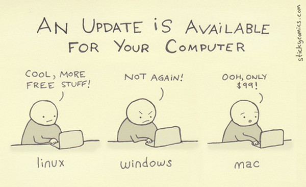

# [Bioinformatic Notes](https://www.bowo.digital/)

Oleh [Agus Wibowo](https://www.bowo-aq.cc/)

     

## Selamat datang 👋

### 🔬 Latar belakang akademis dan perjalanan ke Bioinformatika

Hai, perkenalkan, saya **Agus Wibowo**, saat ini sedang melaksanakan studi pasca sarjana di James Cook University, Australia.

Sedikit tentang saya. Sejak SMA saya memang suka "ngoprek", mulai dari mempelajari berbagai bahasa pemrograman seperti C++, Ruby, Python, Bash, dan R (mungkin saya adalah pengguna R pertama di Jurusan Perikanan dan Kelautan, UNILA), otak-atik program komputer hingga bongkar-pasang laptop/komputer, termasuk ngoprek Arduino dan raspberry pi. Dalam hal teknologi, saya berkiblat pada 2 tokoh Indonesia: [pak Budi Rahardjo](https://github.com/rahard) (sekarang dosen STEI ITB) yang mengajari saya berbagai bahasa pemrograman lewat buku-buku nya, dan [pak Onno Widodo Purbo](https://onnocenter.or.id/) yang menginspirasi saya untuk menggunakan Linux dan belajar tentang sistem keamanan komputer dan jaringan. Tetapi takdir Allah membenamkan saya untuk terjun di bidang akuakultur dan akhirnya menemukan *passion* di persimpangan antara ilmu akuakultur dan komputer: **Bioinformatika**.

Bioinformatika adalah ilmu interdisipliner yang mengintegrasikan prinsip biologi, statistika, matematika, dan komputasi untuk menjawab tantangan biologi modern. Ketertarikan saya bermula dari perkembangan ilmu akuakultur yang kini tak lagi terbatas pada pemeliharaan ikan di kolam-kolam ataupun analisis di laboratorium basah (*wet lab*), tetapi merambah ke analisis data molekuler berskala besar. Di sinilah peran krusial bioinformatika, mengolah, menganalisis, dan memodelkan data biologis untuk mengungkap mekanisme kehidupan di tingkat molekuler. Ini seperti mempelajari suatu materi fisik, tetapi di level kuantum!

Yang menarik adalah, karena kita bermain dengan "ikan", eksplorasi biologi menjadi lebih *flexible* dan membuka banyak ruang inovasi. Misalnya, kita bisa menelusuri gen-gen yang terkait dengan pertumbuhan cepat, ketahanan terhadap penyakit, atau efisiensi pakan, semuanya hanya melalui data DNA. Bioinformatika memberi kita kacamata baru untuk melihat ikan bukan sekadar objek konsumsi, tetapi sebagai kumpulan informasi genetik yang bisa kita manfaatkan untuk perbaikan populasi secara presisi dan berkelanjutan, hingga akhirnya bisa menjadi model atau landasan penerapan untuk level yang lebih tinggi, seperti manusia.

Perkembangan mesin sekuensing generasi mutakhir seperti [Illumina](https://en.wikipedia.org/wiki/Illumina,_Inc.) (*short-read*) dan [PacBio](https://en.wikipedia.org/wiki/Pacific_Biosciences) (*long-read*) telah menghasilkan data biologis dalam volume yang luar biasa besar. Bioinformatika menjadi kunci untuk mengekstrak wawasan dari kompleksitas ini, terutama dalam [tiga bidang utama terkait dengan akuakultur](https://doi.org/10.1007/978-981-97-8553-7_11):

-   ***Genomics***: Bioinformatika digunakan untuk mempercepat program pemuliaan berbasis genom melalui identifikasi variasi berbagai marker polimorfik seperti [mikrosatelit](https://en.wikipedia.org/wiki/Microsatellite), [SNP](https://en.wikipedia.org/wiki/Single-nucleotide_polymorphism), atau bahkan yang terbaru, [mikrohaplotipe](https://pubmed.ncbi.nlm.nih.gov/30347322/). Yang paling dikejar adalah merancang *guide RNA* pada teknologi **CRISPR/Cas9** guna mengedit gen target (jika suatu sifat dikendalikan oleh sedikit gen, *non-polygenic*), seperti meningkatkan toleransi oksigen rendah pada udang atau ketahanan terhadap virus di ikan kerapu.

-   ***Metagenomics***: Bioinformatika dapat membantu menganalisis keragaman mikroba dalam ekosistem akuatik (misalnya, air tambak atau saluran pencernaan ikan) untuk mengidentifikasi komunitas bakteri menguntungkan. Dari data ini, kita dapat mendesain probiotik spesifik yang dapat meningkatkan kesehatan ikan, mengurangi ketergantungan pada antibiotik, dan mengoptimalkan kualitas air.

-   ***Transcriptomics***: Bioinformatika dapat memetakan ekspresi gen organisme akuatik di bawah kondisi tertentu (stres, penyakit, infeksi, perlakuan khusus, dll) untuk merancang program pemuliaan berbasis marker genetik. Contohnya, mengembangkan strain ikan dengan pertumbuhan cepat atau ketahanan terhadap patogen seperti *Vibrio*.

### 🎓 Tujuan website

Melalui website ini, saya ingin berbagi pengetahuan dan catatan tentang bioinformatika, terutama untuk rekan-rekan di Indonesia, mengingat potensi akuakultur kita sangatlah besar. Semua tutorial saya buat dalam bahasa Indonesia dan saya berusaha menyampaikan semua pemahaman terkait analisis data dan proses yang dijalankan dengan sesederhana mungkin. Semua ini bisa pelajari secara GRATIS!

Data yang digunakan dalam setiap tutorial bersifat *open access*, dengan fokus pada hasil-hasil penelitian di bidang akuakultur. Untuk perangkat lunaknya, kita akan menggunakan tools berbasis *open source*, sehingga siapapun dapat mengikuti dan menerapkan analisis *omics* serupa tanpa terbebani oleh keterbatasan pengetahuan bioinformatika atau kebutuhan akan software berbayar. Saya hanya ingin memastikan bahwa kita bisa bersama-sama mewujudkan dan mengembangkan akuakultur berkelanjutan di Indonesia tanpa batas apapun!

> "*We are a great nation - what we need are people willing to make a difference, even from behind a screen full of code.*"

## 💻 Catatan teknis

Karena sebagian besar tools bioinformatika dikembangkan dan dioptimalkan untuk berjalan di lingkungan UNIX terutama [LINUX](https://en.wikipedia.org/wiki/Linux) dan MACOS, saya sangat menyarankan rekan-rekan pengguna Windows untuk mempertimbangkan "bermigrasi" ke sistem operasi berbasis Linux, seperti [Ubuntu](https://ubuntu.com/), [Debian](https://www.debian.org/), atau [Fedora](https://fedoraproject.org/).

Mengapa demikian?

1.  **Kompatibilitas maksimal** – Tools seperti HISAT2, STAR, Salmon, dan RSEM berjalan lebih stabil dan langsung didukung di lingkungan UNIX. "Sangat mudah" dalam hal instalasi dan eksekusinya

2.  **Performa maksimal** – Linux cenderung menggunakan sumber daya sistem lebih efisien dibandingkan Windows, terutama dengan adanya sistem *swap* membuatnya ideal untuk komputasi bioinformatika, bahkan di perangkat berspesifikasi rendah.

3.  **Minim gangguan** – Sistem Linux jauh lebih tahan (bahkan hampir mustahil) terhadap malware, dan mendukung scripting otomatis yang efisien (Bash/Shell).

4.  **Ekosistem terbuka** – Hampir semua perangkat lunak bioinformatika bersifat *open-source* (gratis) dan dikembangkan di lingkungan Linux, membuat dokumentasi dan komunitas dukungannya jauh lebih luas.

Untuk perangkat keras, saya merancang semua tutorial agar dapat dijalankan pada komputer/laptop dengan spesifikasi medium (*laptop dana pelajar* 😁), selama menggunakan sistem operasi berbasis Linux [cek disini](docs/basic-linux-in-win.md). Hal ini memungkinkan siapapun tetap dapat mengikuti alur tutorial ini, mulai dari unduhan data, pra-pemrosesan, analisis, hingga visualisasi, tanpa memerlukan perangkat mahal!!! (meskipun lebih baik jika setiap kampus punya *High Performance Computing* - HPC, yuk bikin!)

## 🚀 Materi

Untuk mulai belajar, silahkan pilih tutorial mana yang anda inginkan.

### [1. Materi dasar](docs/part1.md)

-   [Linux di dalam Windows](docs/basic-linux-in-win.md)
-   [Memahami hierarki Linux](docs/basic-hierarki-linux.md)
<!--   [Instalasi tools bioinformatika](docs/basic-instalasi-tools.md) --->
<!--   [Pengenalan dasar-dasar Bash](docs/basic-bash.md) --->
<!--   [Pengenalan dasar-dasar R](docs/basic-R.md) --->
<!--   [Pengenalan dasar-dasar python](docs/basic-python.md) --->
<!--   [Dokumentasi melalui Markdown](docs/basic-markdown.md) --->
<!--   [Konsep<!--konsep dasar biologi molekuler](docs/basic-kosep-biomol.md) --->
<!--   [Eksplorasi database genomic](docs/basic-eksplorasi-database.md) --->
<!--   [Cara download file *sequencing*](docs/basic-curl-wget.md) --->
<!--   [Format file yang digunakan dalam bioinformatika](docs/basic-file_format.md) --->
<!--   [Cara kerja *sequencing*](docs/basic-sequencing.md) --->
<!--   [Mengenal tentang studi omics](docs/basic-omics.md) --->
<!--   [Kosep dasar *alignment*](docs/basic-alignment.md) --->
<!--   [Statistik untuk biologi modern](docs/basic-stats.md) --->

### [2. Materi lanjutan 1](docs/part2.md)

<!--   [Quality control hasil *sequencing*](docs/tutorial-quality-control.md) --->
<!--   [*Alignment*](docs/tutorial-alignment.md) --->
<!--   [Pipeline metagenomics](docs/tutorial-metagenomics.md) --->
<!--   [Pipeline RNA-Seq](docs/tutorial-RNA-Seq.md) --->
<!--   [Pipeline genomic varians - SNP discovery](docs/tutorial-SNP-discovery.md) --->
<!--   [Pipeline genomic varians - haplotype block discovery](docs/tutorial-haplotype.md) --->
<!--   [Pipeline genomic varians - microhaplotype discovery](docs/tutorial-microhaplotype.md) --->

### [3. Materi lanjutan 2](docs/part3.md)

<!--   [Genetika populasi](docs/adv-GWAS.md) --->
<!--   [Pemuliaan berbasis genomic - GWAS](docs/adv-GWAS.md) --->
<!--   [Pemuliaan berbasis genomic - estimasi nilai breeding](docs/adv-EBV.md) --->

<!-- komentar -->

## 💡 Kontribusi & kolaborasi

Saya terbuka untuk kolaborasi dan diskusi, terutama dalam proyek penelitian bioinformatika di bidang akuakultur atau genomik fungsional.

Silakan hubungi saya melalui:

[GitHub](https://github.com/bowo1698/) atau via [Email](mailto:agus.wibowo@my.jcu.edu.au)

Terima kasih telah mengunjungi halaman ini. Semoga konten di sini bermanfaat untuk pembelajaran dan eksplorasi Anda dalam bioinformatika!

> "*Science is the engine, and code is the fuel* !!"
>
> Agus Wibowo
