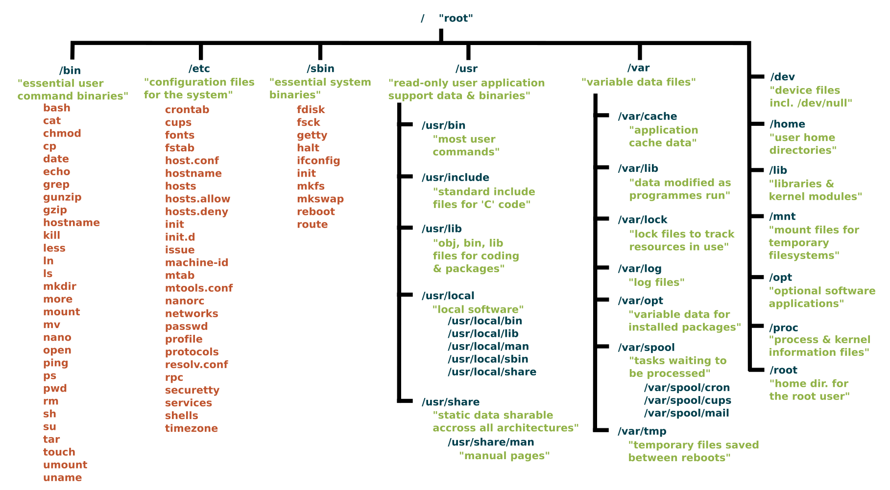

# Daftar isi

-   [Daftar isi](#daftar-isi)
-   [Linux file system](#linux-file-system-siapa-tinggal-di-mana)
-   [Tips navigasi](#tips-navigasi)

# Linux file system: Siapa tinggal di mana?

Sebelum melangkah lebih jauh tentang bioinformatika, penting untuk memahami dasar-dasar sistem operasi yang menjadi fondasinya, yaitu Linux. Sebagian besar tools bioinformatika memang dikembangkan untuk dijalankan di lingkungan Linux, sehingga mengenal struktur sistem filenya adalah langkah awal yang sangat fundamental.

Salah satu aspek penting adalah memahami hierarki berkas sistem (*system files*) di Linux. Struktur ini mengikuti standar yaitu *Filesystem Hierarchy Standard* (FHS), yang bertujuan agar semua distribusi Linux memiliki pola organisasi file yang seragam. Dengan standar ini, jika Anda sudah terbiasa dengan satu distro, maka akan jauh lebih mudah beradaptasi ketika menggunakan distro lainnya.

Bayangkan Anda masuk ke sebuah rumah besar yang tertata rapi dan canggih, ada ruang tamu, dapur, kamar tidur, gudang, dan sistem keamanan. Nah, Linux juga punya "rumah" seperti itu. Mari, kita menjelajahi bersama isi rumah Linux ini dan mengenali fungsi dari setiap bagiannya!

1.  `/` - Root ⚙️

    📊 Tingkat penting: 🔥🔥🔥 (KRITIKAL)

    👤 Akses: Semua, tapi modifikasi hanya oleh *superuser*

    Di Windows, kita mengenal direktori seperti `C:/` atau `D:/`. Tapi di Linux, semua file disatukan dalam satu struktur utama yang disebut `/` (dibaca *root*). Ini adalah direktori induk yang menjadi "rumah" bagi seluruh sistem.Karena menyimpan file-file penting, `/` hanya bisa dimodifikasi oleh *superuser*, pengguna dengan izin tertinggi. Jadi, tidak bisa diakses sembarangan untuk menjaga keamanan dan stabilitas sistem.

2.  `/bin` - Binary 🧰

    📊 Tingkat penting: 🔥🔥 (PENTING)

    👤 Akses: Semua user

    Ini seperti peralatan rumah yang isinya alat-alat penting untuk kebutuhan sehari-hari. Di sini Anda bisa menemukan perintah-perintah dasar seperti `ls`, `cp`, `mv`, dll. Jadi tanpa direktori `/bin` (peralatan masak), Anda mau buat makanan-pun gak akan bisa.

3.  `/sbin` - Binary tools 👨‍🔧

    📊 Tingkat penting: 🔥🔥 (PENTING)

    👤 Akses: Hanya *superuser*

    Nah, kalau `/bin` adalah peralatan sehari-hari, `/sbin` adalah lemari khusus yang isinya alat-alat berat yang cuma bisa dipakai oleh *superuser*, misalnya `fdisk`, `mkfs`, dll.

4.  `/etc` - File konfigurasi sistem 🧠

    📊 Tingkat penting: 🔥🔥🔥 (KRITIKAL)

    👤 Akses: Hanya *superuser*    

    Ini ruangan tempat menyimpan catatan penting dan pengaturan sistem. Anggap saja seperti laci arsip penting rumah tangga, seperti dokumen kepemilikan, tanah, surat hutang, ijazah ASLI dll. Di sini ada file konfigurasi seperti `/etc/passwd` untuk info user, `/etc/fstab` untuk mounting disk, dll. Jangan sembarangan otak-atik ruangan ini kalau tidak mau rumah Anda berantakan!

5.  `/home` - Direktori pribadi 🛏️

    📊 Tingkat penting: 🔥🔥 (PENTING)

    👤 Akses: Hanya pengguna masing-masing

    Nah ini kamar pribadi Anda! Setiap pengguna Linux punya kamarnya sendiri di sini, misalnya `/home/bowo` untuk user bernama "bowo". Di kamar ini Anda bebas naruh barang-barang pribadi seperti foto, dokumen, musik, dll. Ini "zona aman" buat menyimpan file-file pribadi, bebas tanpa hak akses *superuser*. 

6.  `/root` - Direktori *superuser* 👑

    📊 Tingkat penting: 🔥🔥 (PENTING)

    👤 Akses: Hanya *superuser*

    Ini kamar VIP khusus bagi pemilik rumah (*superuser*). Biasanya terkunci dan cuma bisa diakses jika Anda memang adalah pemiliknya atau memiliki izin khusus (*password*).

7.  `/var` - File yang sering berubah 🗃️

    📊 Tingkat penting: 🔥🔥 (PENTING)

    👤 Akses: Umumnya *superuser*

    Ruangan yang selalu berubah-ubah, isinya file-file yang ukurannya bisa berubah seperti log (`/var/log`), email (`/var/mail`), dan antrian printing (`/var/spool`). Data yang sangat dinamis ada di sini.

8.  `/tmp` - Direktori sementara 🧪

    📊 Tingkat penting: 🔥 (SEDANG)

    👤 Akses: Semua user

    Anggap ini seperti ruangan untuk menaruh barang yang hanya dipakai sebentar, kemudian dibersihkan secara otomatis saat komputer di-restart. Kalau Anda sedang mengerjakan proyek yang berantakan, Linux akan menyimpan semua file sementara pekerjaan itu di sini supaya tidak mengotori ruangan lain.

9.  `/usr` - Unix System Resources 🏬

    📊 Tingkat penting: 🔥🔥 (PENTING)

    👤 Akses: Umumnya *read-only* untuk user biasa dan full modifikasi untuk *superuser*

    Ini seperti Anda punya mall di dalam rumah, yang berisi pertokoan dan fasilitas lainnya untuk penghuni rumah. Di dalam `/usr`, ada sub direktori seperti:

    -   `/usr/bin`: Program-program tambahan (seperti toko barang mewah di mall)  
    -   `/usr/lib`: Library pendukung (toko buku) 
    -   `/usr/local`: Software yang Anda instal sendiri (toko perlengkapan harian)
    -   `/usr/share`: Data yang bisa dipakai bersama (tempat berkumpul atau makan gratis)

10. `/opt` - Optional 🛒

    📊 Tingkat penting: 🔥 (SEDANG)

    👤 Akses: Umumnya *read-only* untuk user biasa dan full modifikasi untuk *superuser*

    Ini semacam gudang untuk software tambahan yang biasanya diinstal sebagai satu paket lengkap. Misalnya, kalau Anda instal Firefox, semua file-nya akan disimpan rapi di /opt/firefox.

11. `/lib` - Library 📚

    📊 Tingkat penting: 🔥🔥 (PENTING)

    👤 Akses: Root

    Ruangan ini berisi "buku resep" yang dibutuhkan program-program di `/bin` dan `/sbin`. Misalnya file-file `.so` yang bisa dipakai bersama. Ibarat, ini seperti ruangan perpustakaan berisi buku-buku yang sering dibaca para penghuni rumah.

12. `/media` dan `/mnt` - Akses ke perangkat eksternal 💾

    📊 Tingkat penting: 🔥 (SEDANG)

    👤 Akses: Semua user (dengan izin)

    Ini seperti garasi rumah atau tempat parkir, di mana Anda "memasang" perangkat eksternal seperti *flashdisk* (`/media`) atau *hard disk* (`/mnt`). Bedanya, `/media` biasanya untuk perangkat yang bisa terbuka otomatis (auto-mount), sementara `/mnt` baru bisa dibuka ketika Anda memasukkan *password*.

13. `/proc` dan `/sys`  - Direktori virtual (informasi kernel) 🕵️‍♂️

    📊 Tingkat penting: 🔥🔥 (PENTING)

    👤 Akses: Semua user (read-only)

    Ruangan ajaib yang sebenernya tidak ada di hard disk. Ini seperti cermin yang memperlihatkan apa yang sedang terjadi di dalam komputer, yang mana Anda bisa lihat informasi tentang CPU, memori, dan proses yang sedang berjalan.

14. `/dev` - Device 🕹️

    📊 Tingkat penting: 🔥🔥🔥 (KRITIKAL)

    👤 Akses: Hanya *superuser* 

    Ini tempat Linux menyimpan "*remote control*" untuk semua perangkat keras, seperti AC, Televisi, dll. Setiap hardware di komputer punya file di sini. Misalnya `/dev/sda1`untuk *hard disk* pertama, `dev/sda2` untuk *hard disk* kedua, dst.

15. `/boot` - Booting 💻

    📊 Tingkat penting: 🔥🔥🔥 (KRITIKAL)

    👤 Akses: Hanya *superuser* 

    Ini seperti ruangan yang berisi file-file penting untuk memulai (*boot*) sistem, seperti saklar utama rumah dan panel listrik. Jadi jangan otak-atik sembarangan, kalo tidak komputer Anda tidak bisa "nyala"!

16. `/srv` - File server 🛢️

    📊 Tingkat penting: 🔥 (SEDANG)

    👤 Akses: Semua user (dengan izin)

    Ruangan yang menyimpan data untuk layanan yang disediakan sistem, seperti web server atau FTP server. Ibarat ini adalah tempat penyimpanan barang jualan kalau rumah Anda juga jadi toko.

# Tips navigasi

1.  Jangan takut tersesat

    Pakai perintah `pwd` untuk tahu Anda sedang di ruangan mana.

2.  Peta rumah

    Gunakan `ls` untuk lihat isi ruangan dan `ls -la` untuk lihat detail lengkapnya.

3.  Pindah ruangan

    Pakai `cd` untuk berpindah antar ruangan, misalnya `cd /home/bowo` atau jika ingin instan ke `/home`, bisa menggunakan `cd ~/`. Gunakan `cd ..` untuk kembali ke direktori sebelumnya.

4.  Mencari barang

    Pakai `find` atau `locate` jika Anda lupa taruh barang di ruangan mana.

5.  Perhatian

    Jangan sembarangan menggunakan `sudo` jika tidak tahu resikonya apa. Misal jangan jalankan `sudo rm /boot`, kecuali menginginkan sistem Linux Anda mati selamanya. 

Dengan memahami hierarki *file system* Linux ini, kita jadi tahu harus menyimpan atau mencari file di mana. Kita tahu di mana bisa mendapatkan sendok di rumah orang lain, karena biasanya ada di laci dapur, kita tau di mana seseorang menyimpan uang, karena biasanya di taruh di bawah kasur (oops). Jadi, meskipun awalnya seperti rumah yang sangat asing, lama kelamaan Anda akan familiar dan bisa dengan mudah bernavigasi di "rumahnya Linux" ini!