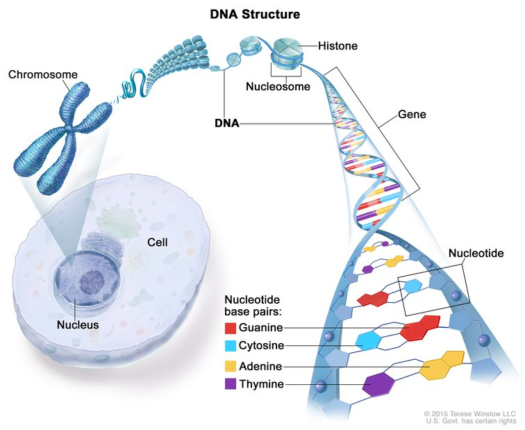
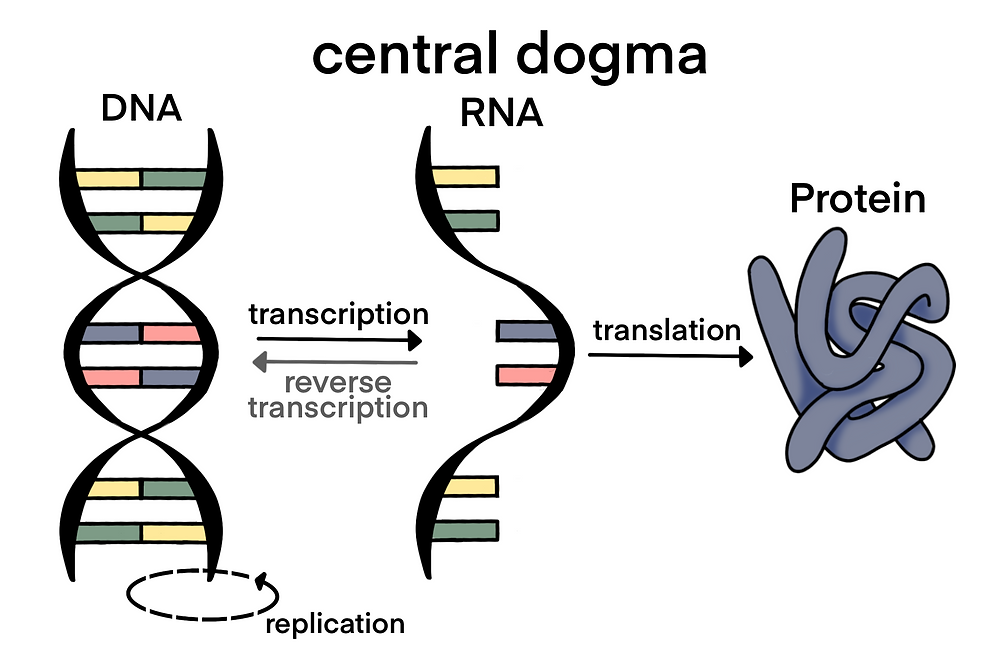
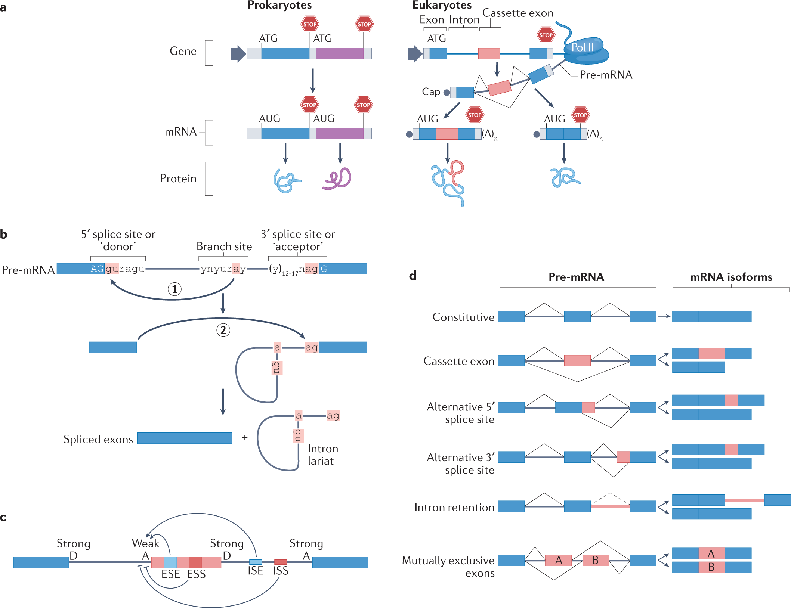
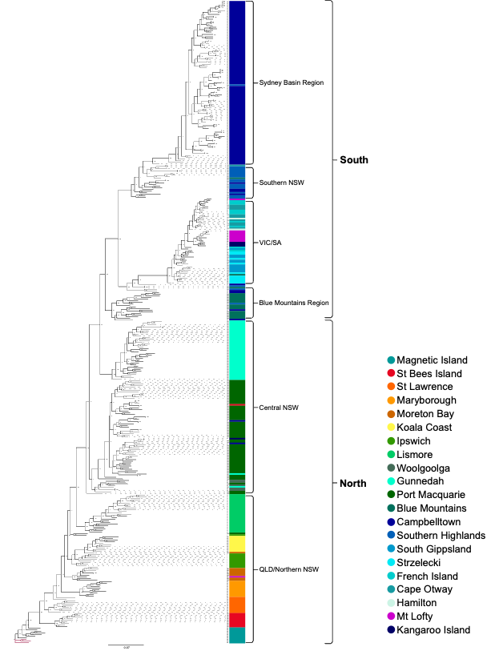

#### [Beranda](https://www.bowo.digital/)

# Daftar isi

-   [Pendahuluan](#pendahuluan)
-   [Gen, DNA dan Dogma sentral](#gen-dna-dan-dogma-sentral)
-   [Regulasi ekspresi gen](#regulasi-ekspresi-gen)
-   [Membentuk genome: Variasi sebagai kunci keragaman dan kelangsungan hidup](#membentuk-genome-variasi-sebagai-kunci-keragaman-dan-kelangsungan-hidup)

# Pendahuluan

Biologi molekuler adalah cabang ilmu biologi yang mempelajari struktur dan fungsi molekul biologis, terutama asam nukleat dan protein, serta interaksi antara molekul-molekul tersebut. Bidang ini berperan penting dalam memahami proses-proses dasar kehidupan pada tingkat molekuler. Biologi molekuler menjembatani kesenjangan antara biologi klasik dan bidang-bidang seperti biokimia, genetika, dan fisiologi, memberikan pemahaman mendalam tentang mekanisme seluler.

Perkembangan biologi molekuler dimulai dengan penemuan struktur DNA oleh James Watson dan Francis Crick pada tahun 1953, yang meletakkan dasar untuk memahami bagaimana informasi genetik disimpan, direplikasi, dan diterjemahkan menjadi protein. Sejak penemuan revolusioner ini, biologi molekuler telah berkembang pesat, menghasilkan teknik-teknik seperti kloning gen, sekuensing DNA, dan rekayasa genetika yang telah mengubah pendekatan kita dalam penelitian biologis.

Dalam beberapa dekade terakhir, kemajuan dalam teknologi sekuensing dan analisis genetik telah memungkinkan para ilmuwan untuk memetakan genom berbagai organisme, termasuk genom manusia yang selesai dipetakan pada tahun 2003 (*Human Genome Project*). Pencapaian ini membuka era baru dalam penelitian biologi, memungkinkan pendekatan sistematis untuk memahami hubungan antara gen dan fenotipe, serta pengembangan aplikasi praktis dalam bidang kesehatan, pangan, dan lingkungan.

Aplikasi biologi molekuler sangat luas dan terus berkembang. Di bidang kedokteran, biologi molekuler memungkinkan diagnosis yang lebih tepat untuk penyakit genetik, pengembangan terapi gen, dan pendekatan pengobatan yang dipersonalisasi (*precision medicine*). Di bidang pangan, akuakultur misalnya, teknologi DNA telah menghasilkan varian ikan dan udang dengan peningkatan performa pertumbuhan, ketahanan penyakit, dan nilai gizi. Di bidang lingkungan, pendekatan molekuler digunakan untuk memahami keanekaragaman hayati, mengembangkan bioremediasi, dan memantau ekosistem, misalnya penggunaan teknik eDNA (*environmental DNA*).

Keberhasilan biologi molekuler tidak lepas dari pendekatannya yang interdisipliner, menggabungkan prinsip dan teknik dari berbagai bidang seperti biologi, kimia, fisika, matematika, dan ilmu komputer. Pendekatan terintegrasi ini telah melahirkan bidang-bidang baru seperti genomika, proteomika, dan bioinformatika, yang bersama-sama memberikan pemahaman komprehensif tentang proses-proses biologis pada tingkat molekuler.

# Gen, DNA, dan Dogma sentral

## Gen: Unit dasar pewarisan sifat

Gen dapat diumpamakan sebagai resep dalam buku masak. Setiap resep (gen) berisi instruksi spesifik untuk membuat satu jenis hidangan, dalam hal ini adalah protein. Gen adalah unit fungsional terkecil dari materi genetik yang mengkode informasi untuk membentuk protein tertentu atau mengatur ekspresi gen lainnya.

<figure style="text-align: center;">
  
  <figcaption style="font-size: 0.95em; margin-top: 8px; text-align: right;">
    <strong>Struktur DNA dalam sel.</strong> DNA berada di dalam inti sel dan terorganisasi membentuk kromosom. DNA melilit protein histon membentuk nukleosom, yang kemudian berkontribusi pada struktur kromatin. Bagian spesifik dari DNA disebut gen, yang terdiri atas pasangan basa nukleotida: Adenin (A) berpasangan dengan Timin (T), dan Guanin (G) berpasangan dengan Sitosin (C). Struktur ini merupakan dasar penyimpanan informasi genetik dalam makhluk hidup.
     <em>Sumber gambar:</em> <a href="https://www.cancer.gov/publications/dictionaries/genetics-dictionary/def/dna" target="_blank">National Cancer Institute</a>
  </figcaption>
</figure>

Bayangkan jika tubuh kita adalah sebuah orkestra besar, maka gen-gen adalah partitur musiknya. Setiap gen memberi petunjuk kapan, di mana, dan bagaimana menghasilkan nada (protein) tertentu. Kombinasi dari ribuan "nada" inilah yang menciptakan "simfoni kehidupan" yang unik pada setiap individu.

Gen tidak bekerja sendirian. Mereka saling berinteraksi dalam jaringan kompleks, saling mengatur dan memengaruhi. Beberapa gen aktif sejak awal perkembangan embrio, sementara yang lain hanya aktif pada tahap tertentu atau di jaringan spesifik. Misalnya, gen yang bertanggung jawab untuk membentuk hemoglobin (protein pembawa oksigen dalam darah) sangat aktif di sel-sel darah merah, tetapi tidak aktif di sel kulit.

Manusia memiliki sekitar 20.000-25.000 gen yang tersebar di 23 pasang kromosom. Jumlah ini mungkin terdengar banyak, tetapi sebenarnya cukup sederhana dibandingkan dengan kompleksitas tubuh manusia itu sendiri. Ini karena satu gen dapat menghasilkan beberapa varian protein melalui proses yang disebut "*alternative splicing*", dan protein-protein ini kemudian berinteraksi dengan cara yang sangat kompleks.

## DNA: Bahan penyusun gen

Jika gen adalah resep, maka DNA (*Deoxyribonucleic Acid*) adalah kertas tempat resep tersebut ditulis. DNA adalah molekul kompleks berbentuk heliks ganda (*double helix*) yang menyimpan informasi genetik dalam bentuk kode kimia. Struktur DNA seperti tangga spiral, dengan dua untai yang terhubung oleh anak tangga berupa pasangan basa nitrogen.

Ada empat jenis basa nitrogen dalam DNA: Adenin (A), Guanin (G), Sitosin (C), dan Timin (T). Basa ini selalu berpasangan dengan aturan tertentu. Adenin selalu berpasangan dengan Timin, dan Guanin selalu berpasangan dengan Sitosin. Urutan basa inilah yang membentuk "kode genetik", sebuah bahasa universal kehidupan yang menentukan karakteristik setiap organisme.

Keindahan struktur DNA terletak pada kemampuannya untuk mereplikasi diri dengan akurat. Saat sel membelah, untai heliks ganda DNA terpisah, dan masing-masing untai menjadi cetakan (*template*) untuk membentuk untai komplementer baru. Hasilnya adalah dua molekul DNA identik untuk memastikan bahwa informasi genetik diteruskan dengan tepat ke sel-sel anak.

Meskipun 99,9% DNA manusia identik, variasi 0,1% itulah yang membuat kita unik. Perbedaan kecil dalam urutan DNA dapat menghasilkan variasi dalam sifat fisik, kerentanan terhadap penyakit, dan bahkan beberapa aspek kepribadian. Variasi ini terjadi melalui mutasi acak dan rekombinasi genetik selama reproduksi seksual.

DNA tidak hanya ditemukan di dalam inti sel (nukleus). Sebagian kecil DNA juga terdapat di mitokondria (generator energi di dalam sel), yang diwariskan secara eksklusif dari ibu (*maternal*). DNA mitokondria ini telah menjadi alat penting dalam studi evolusi manusia dan penelusuran garis keturunan.

## Dogma sentral: Aliran informasi genetik

Dogma sentral biologi molekuler (*central dogma*) menjelaskan bagaimana informasi genetik mengalir dari DNA ke protein, melalui perantara RNA (*Ribonucleic acid*), sebuah materi genetik dengan untai tunggal (*single helix*). Ini seperti proses penerjemahan buku dari bahasa asli (DNA) ke bahasa perantara (RNA), dan akhirnya menjadi produk akhir yang fungsional (protein). Proses ini terjadi dalam dua tahap utama:

**Transkripsi:** Pada tahap ini, sekuen DNA digunakan sebagai *template* untuk membentuk molekul *messenger* RNA (mRNA). Enzim RNA polimerase membaca kode DNA dan mensintesis mRNA komplementer, di mana terjadi di dalam nukleus. Jika DNA adalah *master copy* dari instruksi genetik, mRNA adalah salinan kerja yang dapat dibawa keluar dari nukleus.

**Translasi:** Setelah mRNA terbentuk dan bergerak keluar dari nukleus menuju sitoplasma, informasi genetik diterjemahkan menjadi protein. Ribosom, "pabrik protein" sel, membaca kode pada mRNA dan merangkai asam amino sesuai urutan yang ditentukan. Setiap tiga basa (disebut kodon) pada mRNA mengkode satu asam amino spesifik. Rangkaian asam amino inilah yang membentuk protein, dan protein inilah yang menjalankan hampir semua fungsi dalam tubuh.

Dogma sentral menyederhanakan proses yang sebenarnya sangat kompleks. Menariknya, dalam beberapa dekade terakhir, para ilmuwan telah menemukan beberapa "pengecualian" terhadap aliran informasi ini. Misalnya, beberapa virus (seperti HIV) memiliki enzim *reverse transcriptase* yang dapat mengubah RNA menjadi DNA, membalik arah normal aliran informasi. Penemuan non-coding RNA (ncRNA) yang memiliki fungsi regulasi juga telah memperluas pemahaman kita tentang peran RNA di luar sekadar perantara.

<figure style="text-align: center;">
  
  <figcaption style="font-size: 0.95em; margin-top: 8px; text-align: right;">
    <strong>Dogma sentral.</strong> DNA mengalami replikasi untuk menggandakan dirinya, kemudian ditranskripsi menjadi RNA. RNA selanjutnya diterjemahkan (translasi) menjadi protein. Dalam kasus tertentu, RNA juga dapat ditranskripsi balik (reverse transcription) menjadi DNA, seperti yang terjadi pada virus retro.
     <em>Sumber gambar:</em> <a href="https://www.scienceholic.org/post/the-exception-to-the-central-dogma" target="_blank">scienceholic</a>
  </figcaption>
</figure>

# Regulasi ekspresi gen

Bayangkan jika semua lampu di rumah Anda menyala sepanjang waktu, bahkan ketika tidak dibutuhkan. Bukan hanya pemborosan energi, tapi juga sangat tidak efisien. Sel-sel dalam tubuh kita bekerja dengan prinsip yang mirip, mereka perlu "menyalakan" dan "mematikan" gen-gen tertentu pada waktu yang tepat. Inilah yang disebut sebagai regulasi ekspresi gen.

Regulasi ekspresi gen adalah proses kompleks yang mengontrol kapan, di mana, dan seberapa banyak protein yang akan diproduksi dari suatu gen. Tidak semua gen aktif setiap saat di setiap sel. Sebagai contoh, sel-sel di mata kita mengaktifkan gen-gen yang membuat protein untuk penglihatan, sementara sel-sel di pankreas mengaktifkan gen-gen untuk produksi insulin. Regulasi ini memungkinkan sel-sel yang berbeda untuk memiliki fungsi yang berbeda meskipun mereka memiliki materi genetik yang sama.

Secara umum, regulasi ekspresi gen terjadi pada tiga tingkatan:

## Regulasi transkripsi

Proses transkripsi adalah langkah pertama dan paling krusial dalam ekspresi gen, yang mana informasi genetik pada DNA diubah menjadi RNA. Regulasi pada tahap ini sangat menentukan apakah suatu gen akan "dinyalakan" atau "dimatikan", ini seperti sakelar yang mengontrol aliran informasi genetik. Ada beberapa "sakelar" yang perlu kita pahami, yaitu:

### Regulasi oleh faktor transkripsi melalui daerah regulator

Faktor transkripsi (*transcription factor*) adalah protein spesial yang bisa mengenali dan mengikat sekuens DNA tertentu. Mereka bertindak seperti "sakelar" molekuler yang menentukan kapan dan seberapa banyak RNA yang akan diproduksi dari suatu gen. Faktor transkripsi ini berinteraksi dengan berbagai daerah regulator pada DNA diantaranya:

1.  ***Core promoter***

    *Core promoter* merupakan sekuens DNA minimal yang diperlukan untuk memulai transkripsi. Terletak sekitar 35 pasang basa di sekitar titik awal transkripsi, daerah ini berisi elemen-elemen seperti TATA box yang dikenali oleh faktor transkripsi basal. Ketika faktor transkripsi basal seperti TFIID mengikat TATA box, mereka merekrut RNA polimerase II untuk memulai transkripsi. Ini seperti kunci kontak yang harus diputar agar mesin mobil bisa menyala.

2.  ***Proksimal promoter*** 

    *Proksimal promoter* berada sedikit lebih jauh dari titik awal transkripsi, biasanya dalam jarak ratusan pasang basa. Daerah ini mengandung elemen respon yang dikenali oleh faktor transkripsi spesifik. Interaksi antara faktor transkripsi dengan *proksimal promoter* dapat meningkatkan atau mengurangi tingkat transkripsi dasar. Misalnya, pada gen yang terlibat dalam respons terhadap stres panas, faktor transkripsi HSF (*Heat Shock Factor*) mengikat elemen respons panas di *proksimal promoter* untuk mengaktifkan transkripsi.

3.  ***Enhancer*** 

    *Enhancer* adalah sekuens DNA yang dapat meningkatkan tingkat transkripsi secara signifikan. Uniknya adalah lokasinya bisa sangat jauh dari gen yang diaturnya, bisa ribuan atau bahkan jutaan pasang basa, baik di hulu, di hilir, atau bahkan di dalam intron gen. *Enhancer* bekerja melalui pembentukan loop DNA, yang memungkinkan faktor transkripsi yang terikat pada *enhancer* berinteraksi dengan mesin transkripsi di promoter. Bayangkan *enhancer* sebagai mesin *turbocharger* yang mempercepat produksi RNA ketika diperlukan.

4.  ***Silencer***

    Kebalikan dari *enhancer*, *silencer* adalah sekuens DNA yang mengurangi atau menekan transkripsi. Ketika protein *represor* mengikat *silencer*, mereka dapat mencegah interaksi antara *enhancer* dan promoter atau menghalangi perekrutan RNA polimerase. Ini seperti rem yang memperlambat atau menghentikan produksi RNA. *Silencer* membantu memastikan bahwa gen tidak diekspresikan pada waktu atau tempat yang tidak tepat.

5.  ***Insulator***

    Insulator adalah elemen pengatur yang bertindak sebagai penghalang, mencegah *enhancer* atau *silencer* mempengaruhi promoter gen yang tidak seharusnya. Mereka menciptakan domain kromatin yang terisolasi, sehingga aktivitas pengatur tetap terbatas pada gen target yang tepat. Protein CTCF sering terlibat dalam fungsi insulator. Bayangkan insulator sebagai dinding pemisah yang mencegah "gangguan tetangga" dalam regulasi gen.

6.  ***Locus Control Region (LCR)*** 

    LCR adalah kumpulan elemen pengatur yang mengkoordinasikan ekspresi sekelompok gen terkait. LCR dapat mengatur pembukaan struktur kromatin, memungkinkan akses ke semua gen dalam cluster. Contoh klasik adalah LCR pada cluster gen globin, yang memastikan ekspresi gen globin yang tepat selama perkembangan. LCR berfungsi seperti panel kontrol master yang mengatur sekelompok gen terkait.

### Regulasi oleh epigenetik

Epigenetik merujuk pada berbagai faktor selain urutan DNA, seperti struktur kromatin dan metilasi DNA yang berperan dalam pengaturan gen. Intinya, regulasi epigenetik berkaitan dengan bagaimana DNA dikemas dan dibentuk, yang pada akhirnya memengaruhi tingkat ekspresi gen. Salah satu contohnya adalah bahwa cara DNA dikemas di dalam inti sel dapat menentukan apakah suatu wilayah DNA dapat diakses oleh faktor transkripsi yang diperlukan untuk mengaktifkan gen. Secara umum, ada dua mekanisme utama dalam regulasi epigenetik: (i) DNA metilasi dan (ii) modifikasi pada protein histon.

1.  **DNA metilasi**

    DNA metilasi adalah penambahan gugus metil (CH3) pada basa sitosin dalam DNA, biasanya pada dinukleotida CpG (*CpG island*). Metilasi DNA umumnya terkait dengan penurunan ekspresi gen. Ketika promoter suatu gen mengalami metilasi, faktor transkripsi sering kali tidak dapat mengikat, menyebabkan "keheningan" gen tersebut. DNA metilasi berperan penting dalam inaktivasi kromosom X, imprinting gen, dan perlindungan terhadap elemen transposon. Enzim DNA *metiltransferase* (DNMTs) bertanggung jawab untuk menambahkan gugus metil ini.

2.  **Modifikasi Histon** 

    Histon adalah protein yang membungkus DNA, membentuk struktur seperti manik-manik yang disebut *nukleosom*. Ekor histon yang menonjol dapat mengalami berbagai modifikasi, termasuk asetilasi, metilasi, fosforilasi, dan ubiquitinasi. Modifikasi ini membentuk "kode histon" yang mempengaruhi struktur kromatin dan aksesibilitas gen.

    Pada asetilasi histon, penambahan gugus asetil pada residu lisin di ekor histon umumnya terkait dengan aktivasi transkripsi. Asetilasi mengurangi muatan positif histon, melemahkan interaksinya dengan DNA bermuatan negatif, dan menghasilkan struktur kromatin yang lebih terbuka (*eukromatin*). Enzim *histon asetiltransferase* (HATs) menambahkan gugus asetil, sementara *histon deasetilase* (HDACs) menghilangkannya.

    Sementara itu, metilasi histon dapat mengaktifkan atau menekan transkripsi, tergantung pada residu mana yang termetilasi. Misalnya, trimetilasi pada lisin 4 histon H3 (H3K4me3) terkait dengan aktivasi transkripsi, sementara trimetilasi pada lisin 27 histon H3 (H3K27me3) biasanya menandakan represi gen, modifikasi histon terangkum pada tabel 1. Protein yang mengandung kromodomain dapat "membaca" modifikasi histon spesifik dan merekrut faktor tambahan untuk mengubah ekspresi gen.

**Tabel 1**: Modifikasi Histon dan Efeknya  
(Jika lebih dari satu modifikasi memiliki efek yang sama, dipisahkan dengan koma)

| Modifikasi Histon                   | Efek                                                                 |
|-------------------------------------|----------------------------------------------------------------------|
| H3K9ac                              | Promotor dan enhancer aktif                                          |
| H3K14ac                             | Transkripsi aktif                                                    |
| H3K4me3, H3K4me2, H3K4me1           | Promotor dan enhancer aktif                                          |
| H3K4me1, H3K27ac                    | Spesifik untuk enhancer                                              |
| H3K27ac                             | Spesifik untuk enhancer                                              |
| H3K36me3                            | Wilayah transkripsi aktif                                            |
| H3K27me3, H3K27me2, H3K27me1        | Promotor yang tidak aktif (silent)                                   |
| H3K9me3, H3K9me2, H3K9me1           | Promotor yang tidak aktif (silent)

Saat ini, studi tentang epigenetik menjadi topik yang sangat menarik, karena membuka pemahaman baru tentang bagaimana ekspresi gen dapat diatur tanpa mengubah urutan DNA itu sendiri. Penelitian di bidang ini memiliki implikasi luas, mulai dari pemahaman mekanisme dasar perkembangan embrionik hingga peran epigenetik dalam berbagai penyakit, termasuk kanker, gangguan neurodegeneratif, dan penyakit autoimun. Selain itu, epigenetik juga menjanjikan pendekatan terapeutik baru, seperti terapi epigenetik yang menargetkan enzim pengubah kromatin untuk memodulasi ekspresi gen secara spesifik. Pemahaman yang lebih mendalam tentang epigenetik berpotensi merevolusi pengobatan presisi dan membuka peluang besar dalam bioteknologi dan rekayasa genetik.

<figure style="text-align: center;">
  
  <figcaption style="font-size: 0.95em; margin-top: 8px; text-align: right;">
    <strong>Mekanisme epigenetik.</strong> Mekanisme ini meliputi metilasi DNA (penambahan gugus metil yang dapat menonaktifkan gen) dan modifikasi histon (pengikatan faktor epigenetik pada ekor histon yang mempengaruhi keterbukaan DNA). 
     <em>Sumber gambar:</em> <a href="https://en.wikipedia.org/wiki/Epigenetics" target="_blank">Wikipedia</a>
  </figcaption>
</figure>

## Regulasi pasca transkripsi

Setelah mRNA diproduksi melalui transkripsi, masih ada banyak titik kontrol sebelum akhirnya diterjemahkan menjadi protein. Regulasi pasca transkripsi memungkinkan respons yang lebih cepat dan lebih halus terhadap perubahan kebutuhan sel.

### Regulasi oleh Non-coding RNA (ncRNA)

ncRNA adalah molekul RNA yang tidak diterjemahkan menjadi protein tetapi berfungsi sebagai regulator penting. Bayangkan mereka sebagai petugas lalu lintas yang mengatur arus informasi genetik. ncRNA terbagi menjadi beberapa jenis, diantaranya:

1.  MicroRNA (miRNA)

    miRNA adalah RNA non-coding pendek (sekitar 22 nukleotida) yang mengatur ekspresi gen dengan mengikat pada daerah 3' UTR (*untranslated region*) dari mRNA target. Ketika miRNA mengikat mRNA dengan komplementaritas yang sempurna atau hampir sempurna, mereka dapat memicu degradasi mRNA atau menghambat translasi. Satu miRNA dapat mengatur ratusan mRNA target, menciptakan jaringan regulasi yang kompleks (si kecil cabe rawit). Proses biogenesis miRNA melibatkan enzim *Drosha* di nukleus dan *Dicer* di sitoplasma, yang memotong prekursor miRNA menjadi miRNA matang.

2.  Long non-coding RNA (lncRNA)

    lncRNA adalah RNA non-coding yang panjangnya lebih dari 200 nukleotida. Mereka memiliki berbagai fungsi regulasi, termasuk mengatur modifikasi kromatin, memfasilitasi interaksi enhancer-promoter, dan bertindak sebagai "sponge" untuk miRNA (menyerap miRNA sehingga tidak dapat mengikat mRNA target mereka). XIST adalah lncRNA terkenal yang berperan dalam inaktivasi kromosom X pada mamalia betina, "melapisi" kromosom X dan merekrut kompleks penekan.

3.  Small interfering RNA (siRNA)

    mirip dengan miRNA tetapi biasanya berasal dari RNA untai ganda eksogen atau elemen genetik seperti transposon. siRNA mengikat mRNA target dengan komplementaritas sempurna dan memicu degradasi mRNA melalui mekanisme RNA interference (RNAi). Ini berfungsi sebagai sistem pertahanan seluler terhadap virus dan elemen genetik bergerak.

4.  Piwi-interacting RNA (piRNA) 

    piRNA diekspresikan dalam sel germline dan melindungi integritas genom dengan menekan transposon. Mereka berasosiasi dengan protein Piwi dan dapat memicu metilasi DNA pada sekuens transposon untuk mencegah transkripsi mereka.

### Regulasi *splicing*

RNA Splicing adalah proses penting dalam pemrosesan transkrip RNA, di mana intron (bagian non-koding) dibuang dari pre-mRNA, dan ekson (bagian pengkode protein) disambungkan untuk membentuk mRNA matang. Proses ini memungkinkan gen untuk mengekspresikan informasi genetik secara tepat dan efisien.

Salah satu aspek paling menarik dari splicing adalah *alternative splicing*, yaitu mekanisme di mana satu gen dapat menghasilkan beberapa varian mRNA dan, pada akhirnya, berbagai isoform protein. Hal ini memungkinkan diversifikasi produk protein tanpa harus menambah jumlah gen.

<figure style="text-align: center;">
  
  <figcaption style="font-size: 0.95em; margin-top: 8px; text-align: right;">
    <strong>Mekanisme alternative splicing pada eukariota.</strong> Perbedaan ekspresi gen antara prokariota dan eukariota, di mana eukariota membentuk pre-mRNA yang mengandung intron dan ekson (a). Proses pemotongan intron dari pre-mRNA melalui situs donor (5'), situs akseptor (3'), dan branch site, menghasilkan ekson yang tersambung dan intron lariat (b). Regulasi splicing dipengaruhi oleh elemen penguat dan penghambat seperti ESE (Exonic Splicing Enhancer), ESS (Exonic Splicing Silencer), ISE (Intronic Splicing Enhancer), dan ISS (Intronic Splicing Silencer) (c). Berbagai jenis splicing alternatif menghasilkan variasi isoform mRNA, termasuk cassette exon, alternative splice site (5'/3'), intron retention, dan mutually exclusive exons, yang berkontribusi terhadap keberagaman protein dari satu gen (d).
     <em>Sumber gambar:</em> <a href="https://doi.org/10.1038/s41580-022-00545-z" target="_blank">Marasco & Kornblihtt 2022</a>
  </figcaption>
</figure>

Ada beberapa jenis *alternative splicing*, seperti:

-   *Exon skipping* – dimana suatu ekson dilewatkan dan tidak dimasukkan dalam mRNA akhir.

-   *Alternative splice site selection* – situs pemotongan (splice site) pada ekson atau intron bervariasi, menghasilkan panjang ekson/intron yang berbeda.

-   *Intron retention* – intron tidak dibuang dan tetap berada dalam mRNA akhir.

-   *Mutually exclusive exons* – dua atau lebih ekson yang saling eksklusif, hanya satu yang dimasukkan dalam satu transkrip.

Diperkirakan bahwa lebih dari 95% gen penyandi protein pada manusia mengalami *alternative splicing*, sehingga secara signifikan memperluas kompleksitas proteom dari jumlah gen yang relatif terbatas. Ini seperti kopi Arabica yang punya banyak sekali varian tergantung berasal dari daerah mana dan diolah dengan cara apa.

Splicing dilakukan oleh kompleks besar yang disebut *spliceosom*, yang terdiri dari ribonukleoprotein kecil (snRNPs). Spesifisitas dan efisiensi splicing juga dikendalikan oleh protein regulator yang berinteraksi dengan elemen-elemen regulasi pada pre-mRNA seperti:

1.  Enhancer

    *Exonic Splicing Enhancers* (ESEs) dan *Intronic Splicing Enhancers* (ISEs) adalah sekuens RNA yang meningkatkan efisiensi splicing. Mereka dapat dikenali oleh protein SR (*serine/arginine-rich*) yang membantu merekrut spliceosom ke situs yang tepat.

2.  Silencer

    *Exonic Splicing Silencers* (ESSs) dan *Intronic Splicing Silencers* (ISSs) adalah sekuens yang menghambat splicing. Umumnya dikenali oleh hnRNPs (*heterogeneous nuclear ribonucleoproteins*), yang mencegah pembentukan spliceosom di lokasi tersebut.

Regulasi *splicing* memainkan peran penting dalam perkembangan, diferensiasi sel, dan fungsi jaringan. Sebagai contoh, faktor *trans-acting* seperti NOVA mengatur pola *splicing* spesifik di neuron, yang berdampak pada fungsi sinaps.

Kesalahan dalam *splicing* sering dikaitkan dengan penyakit genetik dan kanker. Mutasi pada splice site, elemen regulator cis, atau faktor *trans-acting* dapat menyebabkan bentuk mRNA abnormal dan menghasilkan protein yang disfungsional.

Proses *splicing* juga dipengaruhi oleh dinamika transkripsi. Menurut model *kinetic coupling*, kecepatan RNA polimerase II saat mensintesis pre-mRNA dapat memengaruhi pilihan splice site. Transkripsi yang lebih lambat memberi lebih banyak waktu bagi faktor *splicing* untuk mengenali dan menggunakan splice site yang lemah, meningkatkan kemungkinan terjadinya *alternative splicing*. Struktur kromatin dan modifikasi histon juga dapat memodulasi aksesibilitas dan efisiensi *splicing*.

# Membentuk genome: Variasi sebagai kunci keragaman dan kelangsungan hidup

## Mutasi

DNA merupakan molekul yang luar biasa. Seperti halnya buku resep keluarga yang diturunkan dari generasi ke generasi yang berisi instruksi lengkap untuk membuat makanan. Namun terkadang, buku resep juga bisa mengalami perubahan, entah karena catatan tambahan di pinggir halaman atau noda saus yang menutupi angka dalam takaran. DNA juga mengalami perubahan yang kemudian kita sebut sebagai **mutasi**. 

Mutasi terjadi ketika ada perubahan dalam urutan basa DNA. Seperti kita bahasa sebelumnya, basa DNA terdiri dari empat jenis: Adenin (A), Timin (T), Guanin (G), dan Sitosin (C). Urutan basa ini mirip seperti huruf dalam kalimat, dan jika ada huruf yang berubah, dihapus, atau ditambahkan, makna kalimat tersebut bisa berubah. Misalnya, kalimat "Ibu pergi naik motor" akan memiliki arti berbeda jika berubah menjadi "Ibu pergi naik haji". Begitu pula dengan mutasi DNA, perubahan kecil mungkin bisa membawa dampak yang sangat besar.

Mutasi bisa terjadi karena berbagai sebab. Penyebab alami termasuk kesalahan saat DNA bereplikasi sebelum pembelahan sel. Bayangkan menyalin buku resep setebal 1000 halaman dengan tangan, tentu saja bisa terjadi kesalahan penulisan. Selain itu, faktor lingkungan seperti paparan radiasi ultraviolet dari sinar matahari atau bahan kimia tertentu juga bisa merusak DNA dan menyebabkan mutasi. Beberapa virus bahkan bisa menyisipkan materi genetiknya ke dalam DNA kita, menambahkan "resep baru" yang sebenarnya tidak kita butuhkan.

Terdapat beberapa jenis mutasi utama yang perlu dipahami.

1.  Substitusi 

    Subtitusi terjadi ketika satu basa diganti dengan basa lain, seperti A berubah menjadi G. Ini mirip seperti mengganti kata "SANDI" menjadi "CANDI". 
    
2.  Insersi 
    
    Insersi terjadi ketika basa baru ditambahkan ke dalam urutan DNA. Misalnya penambahan basa G pada sekuen ACTTTCC, sehingga menjadi ACTTTCCG. Sama seperti "TUA" menjadi "TUNA".
    
3.  Delesi

    Delesi terjadi dimana satu atau lebih basa dihapus dari urutan DNA. Misalnya pada sekuen ACTTTCC, basa TT dihapus menjadi ACTCC. Sama seperti kata "BISA" menjadi "BIS"

Tidak semua mutasi memberikan dampak yang sama. Beberapa mutasi bersifat "diam" atau *silent mutation* karena meskipun urutan DNA berubah, protein yang dihasilkan tetap sama. Ini bisa terjadi karena sifat degeneratif kode genetik, dimana beberapa asam amino bisa dikodekan oleh lebih dari satu kodon (tiga basa DNA). Mutasi lain bisa bersifat *missense*, dimana perubahan DNA menyebabkan perubahan asam amino dalam protein, atau *nonsense* yang menciptakan sinyal berhenti prematur dan menghasilkan protein terpotong.

## Variasi genetik dalam populasi

Variasi genetik dalam populasi terjadi akibat akumulasi mutasi selama beberapa generasi. Bayangkan jika setiap salinan buku resep masakan memiliki sedikit perubahan, setelah ratusan tahun, buku-buku itu akan memiliki variasi yang cukup besar meskipun berasal dari satu sumber. Proses ini menciptakan keragaman genetik yang kita lihat dalam populasi manusia dan semua spesies. Variasi ini dapat kita observasi dalam bentuk *Single Nucleotide Polymorphisms* (SNPs), dimana satu basa berbeda antar individu, atau variasi jumlah salinan (*Copy Number Variations*) dimana segmen DNA tertentu memiliki jumlah salinan berbeda.

### Rekombinasi genetik: Mencampur kartu genetik

Rekombinasi genetik merupakan mekanisme penting lain yang meningkatkan variasi DNA. Selama pembentukan sel kelamin (gamet), kromosom dari ibu dan ayah saling bertukar segmen DNA dalam proses *crossing over*. Proses ini menciptakan kombinasi genetik baru yang berbeda dari kedua orangtua. Ini mirip seperti mengambil beberapa halaman dari buku resep satu keluarga dan menukarnya dengan halaman dari buku resep keluarga lain, menciptakan koleksi resep yang unik.

### Seleksi alam dan evolusi

Seleksi alam bekerja pada variasi genetik di mana memfavoritkan mutasi yang menguntungkan dan mengeliminasi yang merugikan. Mutasi yang meningkatkan ketahanan terhadap penyakit atau kemampuan beradaptasi dengan lingkungan akan cenderung diteruskan ke generasi berikutnya. Sebaliknya, mutasi yang menyebabkan penyakit serius mungkin akan berkurang frekuensinya dalam populasi karena individu pembawa mutasi tersebut mungkin memiliki kesempatan lebih rendah untuk bereproduksi.

### *Genetic drift*: Kebetulan dalam evolusi

*Genetic drift* atau pergeseran genetik juga memainkan peran penting dalam evolusi, terutama pada populasi kecil. Berbeda dengan seleksi alam yang bekerja berdasarkan keuntungan adaptif, *genetic drift* terjadi secara acak. Bayangkan mengocok kartu dan mengambil beberapa secara acak, beberapa kartu (atau gen) mungkin lebih sering terambil daripada yang lain bukan karena nilainya lebih baik, tetapi karena "kebetulan". Dalam populasi kecil, beberapa alel (varian gen) bisa hilang atau menjadi dominan hanya karena faktor kebetulan, bukan karena memberikan keuntungan yang evolusioner.

### *Gene flow*: Pertukaran materi genetik antar populasi

Migrasi genetik atau *gene flow* terjadi ketika individu berpindah dari satu populasi ke populasi lain dan berkontribusi pada kumpulan gen yang baru. Proses ini meningkatkan variasi genetik dalam populasi penerima dan bisa mengurangi perbedaan genetik antar populasi yang sering bertukar materi genetik. Jika kita kembali ke analogi buku resep, ini seperti keluarga dari daerah berbeda yang bertemu dan berbagi resep, menciptakan fusi kuliner baru yang menggabungkan ciri khas berbagai daerah. Koala di Australia misalnya, menunjukkan bagaimana *gene flow* membantu mereka beradaptasi di berbagai lingkungan berbeda meskipun memiliki spesialisasi makanan. Adanya *gene flow* yang alami memungkinkan populasi koala untuk mempertahankan tingkat keanekaragaman genetik yang sehat, meningkatkan potensi evolusi adaptif, dan mengurangi risiko akibat inbreeding (perkawinan sesama keluarga). Hal ini juga memungkinkan penyebaran adaptasi lokal yang menguntungkan antar populasi, membantu spesies secara keseluruhan untuk merespon perubahan lingkungan, termasuk akibat aktivitas manusia.

<figure style="text-align: center;">
  
  <figcaption style="font-size: 0.95em; margin-top: 8px; text-align: right;">
    <strong>Analisis filogenomik Koala dari beberapa populasi berbeda di Australia.</strong> Analisis filogenomik menunjukkan dua klade utama yang memisahkan populasi koala utara dan selatan. Sebagian besar populasi mengelompok sesuai wilayah, kecuali individu dari Campbelltown dan Kangaroo Island yang tergabung dalam klade utara. Cabang yang lebih pendek di wilayah selatan mengindikasikan keragaman genetik yang lebih rendah. Dukungan bootstrap kuat terlihat pada klade utama, meskipun simpul antar kelompok menunjukkan adanya percampuran populasi, terutama di wilayah selatan.
     <em>Sumber gambar:</em> <a href="" target="_blank">Penelitian penulis</a>
  </figcaption>
</figure>

Melalui kombinasi mutasi, rekombinasi, seleksi alam, *genetic drift*, dan *gene flow*, variasi DNA terus terbentuk dan berubah sepanjang waktu. Semua proses ini bersama-sama membentuk cetak biru kehidupan yang terus berkembang, menciptakan keragaman luar biasa yang kita lihat pada seluruh bentuk kehidupan di planet ini.

# Referensi

-   Lodish, H. F. (2008). Molecular cell biology. Macmillan.
-   Stearns, S. C., & Hoekstra, R. F. (2000). Evolution, an introduction. Oxford University Press.
-   [Bartel. (2004). “MicroRNAs: Genomics, Biogenesis, Mechanism, and Function.” Cell 116 (2): 281–97.](https://doi.org/10.1016/s0092-8674(04)00045-5)
-   [Strahl, and Allis. (2000). “The Language of Covalent Histone Modifications.” Nature 403 (6765): 41–45.](https://www.nature.com/articles/47412)
-   [Veltman, J., Brunner, H. (2012) De novo mutations in human genetic disease. Nat Rev Genet 13, 565–575.](https://www.nature.com/articles/nrg3241)
-   [Marasco, L.E., Kornblihtt, A.R. (2023). The physiology of alternative splicing. Nat Rev Mol Cell Biol 24, 242–254.](https://www.nature.com/articles/s41580-022-00545-z)
-   [Kjeldsen, S.R., Raadsma, H.W., Leigh, K.A. et al. (2019). Genomic comparisons reveal biogeographic and anthropogenic impacts in the koala (Phascolarctos cinereus): a dietary-specialist species distributed across heterogeneous environments. Heredity 122, 525–544.](https://www.nature.com/articles/s41437-018-0144-4)