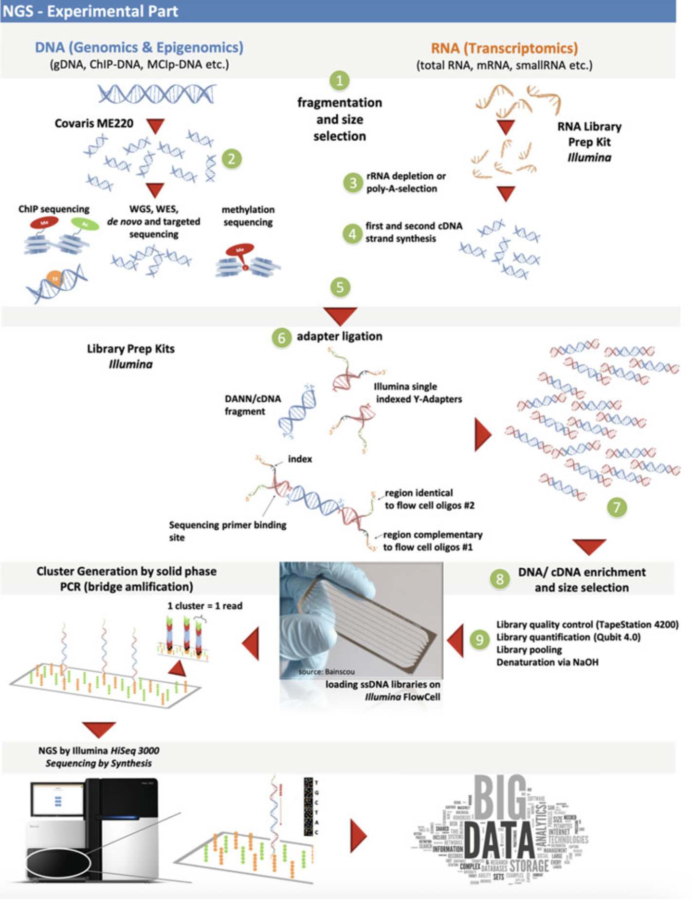

  <a href="https://www.bowo.digital/" style="font-weight: bold;">← Beranda</a>
  &nbsp;&nbsp;|&nbsp;&nbsp;
  <a href="https://www.bowo.digital/docs/part1.html" style="font-weight: bold;">Pilih materi →</a>

<h1 style="text-align: center; font-size: 2.5rem; font-weight: bold; margin-bottom: 0.5rem;">
  <a href="https://www.bowo.digital/docs/basic-library-preparation.html" style="text-decoration: none; color: inherit;">
    Library preparation
  </a>
</h1>

  Oleh <a href="https://www.bowo.digital/docs/bio.html" target="_blank">Agus Wibowo</a>

  

 

# Daftar isi

-   [Pendahuluan](#pendahuluan)
-   [Prinsip dasar library preparation](#prinsip-dasar-library-preparation)
-   [Tahapan utama library preparation](#tahapan-utama-library-preparation)
-   [Jenis-jenis library preparation](#jenis-jenis-library-preparation)
-   [Faktor yang mempengaruhi kualitas library](#faktor-yang-mempengaruhi-kualitas-library)
-   [Library preparation untuk berbagai jenis sekuensing](#library-preparation-untuk-berbagai-jenis-sekuensing)
-   [Otomatisasi dalam library preparation](#otomatisasi-dalam-library-preparation)
-   [Panduan praktis memilih metode](#panduan-praktis-memilih-metode)
-   [Tips praktis untuk optimasi *library preparation*](#tips-praktis-untuk-optimasi-library-preparation)

# Pendahuluan

Dalam beberapa tahun terakhir, perkembangan teknologi sekuensing terutama *Next-Generation Sequencing* (NGS) telah merevolusi cara kita memahami genom organisme dan menganalisis materi genetik. Di antara tahapan kunci dalam proses ini, *library preparation* (persiapan perpustakaan) memegang peran sentral karena menentukan kualitas hasil sekuensing. Proses ini melibatkan modifikasi DNA/RNA melalui serangkaian langkah biokimia untuk menghasilkan fragmen genetik terorganisir yang siap dibaca oleh mesin sekuensing, mirip seperti buku yang disusun rapi di perpustakaan.

*Library preparation* menjadi penghubung vital antara sampel biologis mentah dan data genetik yang dapat dianalisis. Tingkat keberhasilan proyek sekuensing sangat bergantung pada kualitas library, sehingga pemahaman mendalam tentang tahapan ini penting bagi peneliti genomik. Artikel ini akan mengulas prinsip dasar, tahapan teknis, variasi metode, serta inovasi terkini dalam *library preparation*. Pembahasan juga mencakup faktor penentu kualitas library dan strategi optimasi untuk memastikan hasil sekuensing yang akurat dan efisien.

# Prinsip dasar *library preparation*

Library preparation pada dasarnya adalah proses mengubah asam nukleat (DNA atau RNA) menjadi bentuk yang kompatibel dengan platform sekuensing. Tujuan utamanya adalah menciptakan kumpulan fragmen asam nukleat yang mewakili sampel asli dengan akurat, sekaligus memiliki struktur yang bisa dikenali dan diproses oleh mesin sekuensing.

## Mengapa *library preparation* diperlukan?

Teknologi sekuensing modern tidak dapat langsung membaca molekul DNA/RNA dalam ukuran penuh. Sebagai contoh, genome manusia terdiri dari sekitar 3 miliar pasang basa, sementara kemampuan teknologi sekuensing saat ini hanya mampu membaca beberapa ratus hingga beberapa ribu basa dalam satu kali proses (tergantung platform yang digunakan). Oleh karena itu, materi genetik perlu dipecah menjadi fragmen-fragmen yang lebih kecil.

Selain itu, mesin sekuensing membutuhkan struktur khusus pada ujung-ujung fragmen DNA/RNA, seperti adapter (penghubung) dan barcode (penanda). Adapter berfungsi untuk menempelkan fragmen DNA ke permukaan *flow cell* pada mesin sekuensing, sementara barcode memungkinkan identifikasi sampel ketika beberapa library digabungkan dalam satu run sekuensing (*multiplexing*).

<figure style="text-align: center;">
  
  <figcaption style="font-size: 0.95em; margin-top: 8px; text-align: left;">
    <strong>Struktur library DNA pada platform Illumina.</strong> Setiap fragmen DNA target memiliki adaptor khusus di kedua ujungnya: adaptor P5 dan P7. Adaptor ini memungkinkan fragmen menempel ke flow cell dan dikenali oleh mesin sekuensing. Selain itu, ada elemen-elemen penting lainnya, seperti primer Rd1 dan Rd2 yang digunakan untuk inisiasi proses sekuensing, Index (barcoding) untuk mengidentifikasi sampel berbeda dalam satu run sekuensing (multiplexing), dan primer index seq untuk membaca bagian index selama sekuensing.
     <em>Sumber gambar:</em> <a href="https://nextgen.mgh.harvard.edu/" target="_blank">Nextgen.mgh.harvard.edu</a>
  </figcaption>
</figure>

Kualitas *library* sangat menentukan kualitas data sekuensing yang dihasilkan. *Library preparation* yang baik akan menghasilkan fragmen dengan ukuran yang sesuai, distribusi yang merata, dan *coverage* yang cukup di seluruh genom. Sebaliknya, *library preparation* yang buruk dapat menyebabkan bias dalam representasi beberapa region genom, coverage yang tidak merata, atau bahkan hilangnya informasi dari region genom tertentu.

# Tahapan utama library preparation

Meskipun detail proses library preparation bervariasi tergantung pada jenis sampel dan platform sekuensing yang digunakan, secara umum terdapat 7 tahapannya yaitu:

## Ekstraksi dan purifikasi asam nukleat

Tahap pertama adalah mendapatkan DNA atau RNA berkualitas tinggi dari sampel biologis. Ini melibatkan pemecahan sel (lisis), pemisahan asam nukleat dari komponen sel lainnya, dan pemurnian untuk menghilangkan kontaminan. Kualitas materi genetik awal sangat memengaruhi keberhasilan tahapan selanjutnya.

## Fragmentasi DNA/RNA

Pada tahap ini, DNA/RNA dipecah menjadi potongan-potongan yang lebih kecil dengan ukuran yang sesuai untuk platform sekuensing yang digunakan. Fragmentasi dapat dilakukan dengan beberapa metode:

-   **Fragmentasi fisik**: Menggunakan sonikasi, nebulisasi, atau *shearing* hidrodinamik.
-   **Fragmentasi enzimatik**: Menggunakan enzim seperti *DNase I* atau *endonuklease* pembatas lainnya.
-   **Fragmentasi kimia**: Menggunakan panas dan kation divalen.

Misalnya, pada protokol persiapan library Illumina, fragmentasi biasanya menghasilkan potongan DNA berukuran 200-800bp yang merupakan ukuran ideal untuk sekuensing jangka pendek (*short-read sequencing*).

## End repair dan dA-tailing

Fragmentasi sering kali menghasilkan ujung DNA yang tidak rata, sehingga perbaikan (*end repairing*) pada ujung-ujung DNA ini diperlukan. Tahap *end repair* melibatkan proses pemotongan dan pengisian untuk menghasilkan ujung tumpul (blunt ends). Selanjutnya, proses dA-tailing dikerjakan untuk menambahkan nukleotida adenin (A) ke ujung 3' fragmen, yang nantinya akan berpasangan dengan nukleotida timin (T) pada adapter.

## Ligasi adapter

Adapter, yang merupakan oligonukleotida pendek dengan sekuens khusus, ditambahkan ke kedua ujung fragmen DNA. Adapter ini berfungsi sebagai:

1.  Tempat menempelnya primer untuk amplifikasi PCR
2.  Tempat pengikatan fragmen ke flow cell
3.  Tempat inisiasi reaksi sekuensing

## Seleksi ukuran

Tahap ini memastikan bahwa fragmen yang akan disekuensing memiliki ukuran yang seragam dan optimal. Seleksi ukuran biasanya dilakukan menggunakan elektroforesis gel, AMPure XP beads, atau metode lainnya. Misalnya, protokol Illumina DNA Prep biasanya menyertakan tahap purifikasi menggunakan AMPure beads untuk memilih fragmen dalam rentang ukuran tertentu.

## Amplifikasi PCR (opsional)

Untuk meningkatkan jumlah materi yang tersedia untuk sekuensing, *library* sering diamplifikasi menggunakan PCR. Tahap ini juga dapat digunakan untuk menambahkan barcode atau indeks ke *library*, yang memungkinkan *multiplexing* sampel dalam satu run sekuensing.

## Validasi *Library*

Sebelum sekuensing, kualitas dan kuantitas *library* perlu diperiksa menggunakan metode seperti elektroforesis kapiler (Bioanalyzer/TapeStation) dan kuantifikasi fluorometrik (Qubit). Validasi ini memastikan bahwa *library* memiliki konsentrasi yang cukup, ukuran fragmen yang sesuai, dan tidak mengandung kontaminan seperti dimer adapter.

Rangkuman proses-proses penting dari *library preparation* diilustrasikan pada gambar berikut.

<figure style="text-align: center;">
  
  <figcaption style="font-size: 0.95em; margin-top: 8px; text-align: left;">
    <strong>Ilustrasi proses library preparation.</strong>.
     <em>Sumber gambar:</em> <a href="https://link.springer.com/book/10.1007/978-3-030-62490-3" target="_blank">NGS and Data Analysis</a>
  </figcaption>
</figure>

# Jenis-jenis library preparation

Berbagai metode library preparation telah dikembangkan untuk menyesuaikan dengan jenis sampel dan tujuan sekuensing. Beberapa jenis utama meliputi:

## Berdasarkan metode fragmentasi

### *Mechanical fragmentation libraries*

Menggunakan metode fisik seperti sonikasi (misalnya Covaris) untuk memecah DNA, metode ini menghasilkan fragmen acak dengan ukuran yang relatif seragam tapi membutuhkan peralatan khusus.

### *Enzymatic fragmentation libraries*

Menggunakan enzim seperti transposase [(Nextera)](https://sapac.illumina.com/products/by-type/sequencing-kits/library-prep-kits/nextera-xt-dna.html) atau endonuklease [(NEBNext)](https://www.neb.com/en-au/products/restriction-endonucleases) untuk memotong DNA, metode ini lebih sederhana dan cepat, serta memerlukan input DNA yang lebih sedikit, tetapi kemungkinan bias pada sekuens tertentu bisa saja muncul.

## Berdasarkan teknologi sekuensing

### *Short-read sequencing libraries*

Dioptimalkan untuk platform seperti [Illumina](https://emea.illumina.com/science/technology/next-generation-sequencing/sequencing-technology.html) yang membaca fragmen pendek (biasanya 75-300bp). *Library* jenis ini biasanya melibatkan fragmen berukuran 200-800bp dengan adapter di kedua ujungnya.

### *Long-read sequencing libraries*

Untuk platform seperti [PacBio](https://www.pacb.com/technology/hifi-sequencing/how-it-works/) atau [Oxford Nanopore](https://nanoporetech.com/platform/technology) yang mampu membaca fragmen panjang (>10kb). Protokol *library preparation* untuk teknologi ini biasanya lebih sederhana karena menghindari fragmentasi ekstensif, namun sering membutuhkan DNA input dengan kualitas sangat tinggi. Selain itu, tingkat error reads yang dihasilkan jauh lebih tinggi daripada short-reads meskipun masih bisa ditangani dengan teknik trimming.

### *Single-stranded libraries*

Digunakan terutama untuk sampel dengan DNA/RNA yang sangat terdegradasi, seperti sampel *ancient* DNA atau *formalin-fixed paraffin-embedded* (FFPE). Metode ini, seperti yang dikembangkan oleh [Gansauge et al. (2020)](https://doi.org/10.1038/s41596-020-0338-0), bekerja dengan DNA untai tunggal, meningkatkan recovery dari sampel berkualitas rendah.

# Faktor yang mempengaruhi kualitas *library* 

Beberapa faktor kunci yang memengaruhi kualitas library DNA/RNA meliputi:

## Kualitas dan kuantitas sampel awal

DNA/RNA berkualitas tinggi dengan integritas baik adalah kunci keberhasilan *library preparation*. Sampel yang terdegradasi dapat menyebabkan *coverage* yang tidak merata dan representasi yang bias. Jumlah material awal juga penting, karena terlalu sedikit input dapat menghasilkan library dengan kompleksitas rendah, sementara input berlebihan dapat menyebabkan masalah dalam tahapan purifikasi.

## Metode fragmentasi

Metode fragmentasi yang berbeda bisa menghasilkan bias berbeda. Sonikasi cenderung menghasilkan fragmentasi yang lebih acak, sementara metode enzimatik mungkin lebih bias terhadap sekuens tertentu. Misalnya, transposase yang digunakan dalam library preparation Nextera cenderung memiliki preferensi terhadap region dengan kandungan GC tertentu.

## Siklus PCR

Terlalu banyak siklus PCR dapat meningkatkan bias dan duplikasi artifisial. Sehingga, jumlah siklus PCR harus dioptimalkan berdasarkan jumlah input DNA dan sensitivitas metode sekuensing. Beberapa protokol bahkan berusaha menghindari amplifikasi PCR sama sekali untuk mengurangi bias ([PCR-*free libraries*](https://sapac.illumina.com/products/by-type/sequencing-kits/library-prep-kits/dna-pcr-free-prep.html)).

## Kandungan GC sampel

Sampel dengan kandungan GC ekstrem (terlalu tinggi atau terlalu rendah) bisa mengalami bias saat amplifikasi PCR atau selama sekuensing. Sebagai contoh, penelitian menunjukkan bahwa library preparation menggunakan protokol Nextera XT menghasilkan bias terutama untuk bakteri dengan kandungan GC rendah, sementara protokol enzimatik seperti [KAPA HyperPlus](https://rochesequencingstore.com/catalog/kapa-hyper-plus-kit/) dan NEBNext Ultra II FS menunjukkan bias GC yang lebih rendah.

## Kontaminan dan inhibitor

Kehadiran kontaminan seperti fenol, etanol, EDTA, atau protein bisa mengganggu efisiensi enzim yang digunakan dalam *library preparation*. Pemurnian sampel yang baik sangat penting untuk menghindari masalah ini.

# *Library* preparation untuk berbagai jenis sekuensing

## Library untuk DNA sekuensing

Library untuk DNA sequencing dirancang untuk menangkap informasi dari seluruh genom atau region target. Untuk whole genome sequencing (WGS), fragmentasi acak diikuti dengan ligasi adapter adalah pendekatan umum. Untuk targeted sequencing, tahap pengayaan (enrichment) diperlukan, baik melalui PCR multiplex atau capture hybridization.

Salah satu contoh *library preparation* kit yang populer untuk DNA sequencing adalah Illumina DNA Prep (sebelumnya dikenal sebagai Nextera DNA Flex), yang menggunakan teknologi [*bead-linked transposase*](https://doi.org/10.1186/s12864-018-5096-9) untuk fragmentasi dan tagmentasi DNA secara bersamaan, menyederhanakan workflow dan mengurangi bias.

## Library untuk RNA sekuensing

RNA sequencing (RNA-seq) memerlukan konversi RNA menjadi cDNA melalui transkripsi balik. Tergantung pada aplikasi, *library preparation* untuk RNA-seq bisa difokuskan pada:

-   mRNA: Menggunakan seleksi poly-A untuk memperkaya mRNA
-   Total RNA: Menggunakan deplesi rRNA untuk menghilangkan RNA ribosomal yang berlimpah
-   Small RNA: Menggunakan seleksi ukuran untuk menangkap microRNA dan RNA kecil lainnya

Salah satu inovasi baru dalam *library preparation* untuk RNA-seq adalah TIRE-seq (*Turbocapture Integrated RNA Expression Sequencing*) yang mengintegrasikan purifikasi mRNA langsung ke dalam persiapan *library*, menghilangkan kebutuhan untuk langkah ekstraksi RNA terpisah. Pendekatan yang diperkenalkan oleh [O'Keeffe et al. (2025)](https://doi.org/10.1038/s41598-025-98282-8) ini menyederhanakan alur kerja, mengurangi waktu, dan meminimalkan kehilangan sampel.

## *Library* untuk single-cell sekuensing

*Single-cell sequencing* memerlukan pendekatan khusus karena jumlah material genetik yang sangat terbatas dari sel tunggal. Teknologi seperti [10x Genomics Chromium](https://www.10xgenomics.com/blog/the-next-generation-of-single-cell-rna-seq-an-introduction-to-gem-x-technology) menggunakan *droplet-based microfluidics* untuk mengisolasi sel individual dan menghasilkan *library* dengan barcode unik untuk setiap sel.

Kemudian, protocol seperti [Smart-seq2](https://doi.org/10.1038/nprot.2014.006) dirancang khusus untuk sensitivitas tinggi dengan input sangat rendah, ideal untuk aplikasi single-cell. Protocol ini menggunakan *template-switching oligo* (TSO) untuk menangkap transkriptom lengkap dari sel individual.

## *Library* untuk long-read Ssekuensing

Teknologi *long-read* seperti PacBio dan Oxford Nanopore memerlukan pendekatan *library preparation* yang berbeda. Fragmen DNA panjang dipertahankan, dengan fragmentasi minimal atau tanpa fragmentasi sama sekali. *Library preparation* untuk Oxford Nanopore, misalnya, bisa sesederhana menambahkan adapter ke ujung fragmen DNA panjang menggunakan motor protein khusus.

# Otomatisasi dalam *library* preparation

Otomatisasi telah menjadi tren penting dalam *library preparation*, terutama untuk laboratorium dengan *throughput* tinggi. Sistem otomatis dapat meningkatkan repreducibility, mengurangi variasi antar operator, dan menghemat waktu.

Beberapa platform otomatisasi yang populer untuk *library preparation* meliputi:

-   Hamilton dan Tecan: Robot canggih yang mendukung otomatisasi penuh untuk berbagai protokol *library preparation*
-   Flowbot ONE: Sistem modular yang mengotomatisasi protokol Illumina DNA Prep, mengurangi waktu *hands-on* hingga 80% dibandingkan persiapan manual
-   Microfluidic Platforms: Sistem lab-on-a-chip seperti Vivalytic cartridge yang mengintegrasikan pemurnian DNA dan persiapan library dalam alat kompak

Sebuah studi oleh [Meijers et al. (2024)](https://doi.org/10.1038/s41598-024-58963-2) menunjukkan bahwa protokol Illumina DNA Prep yang diautomasi pada robot [*liquid handler flowbot ONE*](https://flow-robotics.com/products/flowbot-one/#read-more) menghasilkan kualitas data yang sebanding dengan protokol manual, dengan pengurangan drastis pada waktu *hands-on* (25 menit vs 125 menit untuk 8 sampel). Otomatisasi juga menunjukkan reprodusibilitas yang sangat baik, dengan variasi minimal dalam hasil antar run.

Meskipun menawarkan banyak keuntungan, otomatisasi *library preparation* juga memiliki tantangan, misalnya:

-   Biaya awal: Sistem otomatisasi biasanya memerlukan investasi awal yang signifikan
-   Fleksibilitas: Beberapa sistem sulit beradaptasi dengan protokol baru atau non-standar
-   Volume sampel minimum: Platform otomatisasi mungkin memerlukan volume minimum yang lebih tinggi dibandingkan protokol manual

# Panduan praktis memilih metode

*Library preparation* merupakan langkah krusial dalam analisis genomik yang menentukan keberhasilan dan kualitas data yang dihasilkan. Pemilihan metode yang tepat perlu disesuaikan dengan kebutuhan spesifik studi dan karakteristik sampel. Berikut panduan komprehensif untuk memilih metode *library preparation* yang optimal untuk berbagai aplikasi genomik.

## Pertimbangan sampel dalam pemilihan metode

Jenis dan kualitas sampel sangat memengaruhi pemilihan metode *library preparation*. Untuk DNA genomik berkualitas tinggi, metode seperti PCR-*free library preparation* dapat menjadi pilihan ideal karena meminimalkan bias amplifikasi dan menghasilkan cakupan yang lebih seragam pada genom. Sementara itu, sampel terdegradasi seperti FFPE memerlukan protokol khusus dengan fragmentasi minimal dan tahap perbaikan DNA untuk memaksimalkan recovery.

Kuantitas sampel juga menjadi faktor penentu. Sampel dengan jumlah nanogram hingga mikrogram dapat menggunakan protokol standar, sedangkan sampel dengan jumlah pikogram memerlukan metode dengan amplifikasi khusus seperti MALBAC (*Multiple Annealing and Looping-Based Amplification Cycles*) atau metode berbasis tagmentasi untuk memaksimalkan efisiensi konversi *library*.

## Aplikasi *reference genome* dan *de novo assembly*

Untuk studi *reference genome* dan *de novo assembly*, dibutuhkan metode *library preparation* yang menghasilkan cakupan seragam dengan bias minimal. Pendekatan PCR-free sangat direkomendasikan untuk menghindari distorsi pada representasi sekuens, terutama di daerah yang kaya GC atau AT. Kombinasi antara *library short-read* (seperti Illumina PCR-free) dan *long-read* (PacBio HiFi atau Oxford Nanopore) sudah terbukti sangat efektif untuk menghasilkan *assembly* berkualitas tinggi.

*Long-read* *library preparation* seperti SMRTbell (PacBio) atau *ligation-based library* (Oxford Nanopore) memungkinkan resolusi region berulang dan struktural varian yang sulit dideteksi dengan *short-read* saja. Hal ini penting untuk menghasilkan *assembly* yang akurat dan berkelanjutan, terutama untuk genom kompleks dengan banyak elemen berulang.

## RNA-seq dan analisis transkriptom

Studi transkriptom memerlukan metode *library preparation* yang menjaga integritas dan representasi proporsional dari transkrip. Untuk RNA-Seq standar, metode berbasis rRNA-*depletion* cocok untuk semua jenis RNA termasuk *non-coding* RNA, sementara seleksi poly-A berfokus pada mRNA dan ekonomis untuk studi ekspresi gen. *Library preparation stranded* sangat direkomendasikan karena memberikan informasi orientasi transkrip, penting untuk identifikasi *antisense transcription* dan *overlapping genes*.

Untuk transkriptom lengkap, metode yang menjaga *full-length* mRNA seperti TruSeq Stranded Total RNA dengan Ribo-Zero atau NEBNext Ultra II Directional RNA sangat berguna. Hal ini memfasilitasi identifikasi isoform alternatif dan splice variants, memberikan pemahaman yang lebih komprehensif tentang kompleksitas transkriptom.

## Metagenomics dan analisis komunitas mikroba

Studi metagenomik membutuhkan metode *library preparation* yang mampu menangkap keragaman genetik dari komunitas mikroba secara proporsional. Metode berbasis PCR-free sangat direkomendasikan untuk menghindari bias amplifikasi terhadap taksa tertentu. Untuk sampel dengan biomassa rendah, pendekatan tagmentasi seperti Nextera XT dapat memaksimalkan jumlah DNA yang dikonversi menjadi library.

Kombinasi sekuensing shotgun dan amplikon (seperti 16S rRNA untuk bakteri atau ITS untuk fungi) memberikan resolusi taksonomi yang lebih baik. Di sisi lain, protokol seperti SMRTbell dari PacBio untuk *long-read sequencing* memungkinkan perakitan genom mikroba lengkap dari sampel metagenomik, memfasilitasi analisis fungsional yang lebih mendalam dan pemahaman tentang interaksi antar mikroba dalam komunitas.

## Epigenetics dan modifikasi DNA/Histon

Untuk studi epigenetik, metode *library preparation* harus mempertahankan modifikasi DNA atau pola protein histon yang menjadi target analisis. Untuk *bisulfite sequencing* yang menganalisis metilasi DNA, protokol *post-bisulfite adaptor tagging* (PBAT) atau Zymo Pico Methyl-Seq sangat efektif untuk sampel dengan input rendah, sementara metode seperti WGBS (*Whole Genome Bisulfite Sequencing*) memberikan resolusi tingkat basa untuk metilasi genom lengkap.

Untuk ChIP-Seq yang menganalisis interaksi protein-DNA, metode seperti ThruPLEX atau NEBNext Ultra II DNA menawarkan sensitivitas tinggi untuk input rendah dari *immunoprecipitated* DNA. Kemudian, protokol ATAC-Seq untuk analisis aksesibilitas kromatin menggunakan tagmentasi untuk secara simultan memfragmentasi DNA dan menambahkan adaptor, memberikan efisiensi tinggi untuk sampel dengan jumlah sel terbatas.

## *Selective breeding* dan *genomic selection*

Program pemuliaan selektif memerlukan genotipe yang akurat dan murah untuk seleksi berbasis genom. Metode *library preparation* seperti GBS (*Genotyping-by-Sequencing*) atau RAD-Seq sangat cocok karena mengurangi kompleksitas genom dengan menyekat fragmen DNA menggunakan enzim restriksi, memungkinkan genotipe berbiaya rendah pada populasi besar untuk program pemuliaan.

Untuk studi transmisi alel dalam keluarga atau populasi, pendekatan *parent-progeny sequencing* memerlukan metode *library preparation* dengan *error rate* rendah seperti TruSeq DNA PCR-free untuk meminimalkan genotyping error. Konsistensi metode dalam seluruh cohort penting untuk menghindari *batch effect* yang dapat mengaburkan sinyal seleksi dalam analisis genetik populasi.

## GWAS (*genome wide association study*)

Studi GWAS memerlukan genotipe berkualitas tinggi pada ribuan hingga jutaan varian dalam populasi besar. Untuk *low-coverage sequencing* GWAS, metode *library preparation* dengan biaya rendah dan *multiplexing* tinggi seperti Illumina DNA Prep dengan Nextera technology atau metode berbasis enzim seperti KAPA HyperPlus sangat efisien.

Di sisi lain, konsistensi dalam persiapan sampel sangat penting untuk menghindari stratifikasi populasi artifisial yang dapat menyebabkan asosiasi palsu. Metode berbasis panel seperti Illumina Infinium atau Affymetrix Axiom dapat lebih hemat biaya untuk studi skala besar, namun memiliki keterbatasan dalam hal fleksibilitas varian yang dapat dideteksi.

## Single-cell RNA-seq study

Analisis tingkat sel tunggal memerlukan metode *library preparation* khusus yang dapat menangani jumlah RNA sangat rendah sambil mempertahankan kompleksitas transkriptom. Protokol seperti Smart-seq2 atau Smart-seq3 sangat baik untuk sensitivitas tinggi dan cakupan *full-length transcript*, ideal untuk mendeteksi varian splicing dan isoform pada tingkat sel tunggal.

Untuk throughput tinggi, metode berbasis droplet seperti 10x Genomics Chromium menggunakan barcode sel untuk secara simultan memproses ribuan sel, cocok untuk pemetaan heterogenitas populasi sel dalam jaringan. Sementara itu, metode dengan molecular barcoding seperti CITE-seq memungkinkan deteksi simultan RNA dan protein permukaan sel, memperkaya karakterisasi fenotipik sel.

## Pertimbangan *platform* sekuensing

Pemilihan *platform* sekuensing harus diintegrasikan dalam keputusan metode *library preparation*. Illumina memerlukan adaptor P5/P7 dan ukuran *insert* yang optimal (biasanya 300-500 bp), sementara PacBio SMRT sequencing membutuhkan *prepcircular* SMRTbell *templates*. Oxford Nanopore membutuhkan adaptor khusus dengan motor protein untuk translokasi molekul DNA melalui nanopore.

Panjang *reads* juga memengaruhi pilihan metode. *Short-read sequencing* (Illumina) memerlukan fragmentasi yang terkontrol untuk ukuran *insert* yang konsisten, sementara *long-read sequencing* (PacBio, Oxford Nanopore) membutuhkan metode isolasi DNA dengan *shearing* minimal untuk memaksimalkan panjang fragmen.

| **Kebutuhan Studi** | **Pertimbangan** | **Metode Library Preparation yang Direkomendasikan** |
|----------------------|------------------|--------------------------------------------------------|
| **Reference Genome & Assembly** | Assembly genom kompleks | Kombinasi Illumina PCR-free + PacBio/Nanopore |
| | Resolusi region berulang/SVs | SMRTbell (PacBio), ligation-based (Nanopore) |
| **RNA-Seq & Transkriptom** | RNA total/non-coding | rRNA depletion |
| | Ekspresi gen (mRNA) | Poly-A selection |
| | Orientasi transkrip | Stranded library |
| | Isoform & splice variant | Full-length RNA-seq (TruSeq, NEBNext Ultra II) |
| **Metagenomik** | Keragaman komunitas mikroba | PCR-free library |
| | Biomassa rendah | Tagmentasi (Nextera XT) |
| | Resolusi taksonomi tinggi | Shotgun + amplicon (16S/ITS), SMRTbell |
| **Epigenetika** | DNA metilasi (bisulfite seq) | PBAT, Zymo Pico Methyl-Seq, WGBS |
| | Interaksi protein-DNA (ChIP-Seq) | ThruPLEX, NEBNext Ultra II DNA |
| | Aksesibilitas kromatin (ATAC-Seq) | Tagmentasi (integrasi fragmentasi & adaptor) |
| **Selective Breeding & Genomic Selection** | Genotyping populasi besar | GBS, RAD-Seq |
| | Error rate rendah | TruSeq DNA PCR-free |
| | Konsistensi cohort | Protokol seragam hindari batch effect |
| **GWAS** | Low-cost high-throughput | Illumina DNA Prep (Nextera), KAPA HyperPlus |
| | Skala besar, varian tetap | Array-based (Infinium, Axiom) |
| **Single-cell RNA-Seq** | Sensitivitas & full-length | Smart-seq2, Smart-seq3 |
| | Throughput tinggi | 10x Genomics Chromium (barcode sel) |
| | Multi-omik (RNA + protein) | CITE-seq (molecular barcoding) |
| **Platform Sekuensing** | Kompatibilitas adaptor | Illumina: P5/P7, PacBio: SMRTbell, Nanopore: motor adaptor |
| | Panjang baca | Illumina: short-read (300–500 bp insert); PacBio/Nanopore: long-read (shearing minimal) |

# Tips praktis untuk optimasi *library preparation*

*Quality control* yang ketat pada setiap tahap persiapan *library* sangat penting, termasuk validasi integritas DNA/RNA input, pengukuran distribusi ukuran fragmen, dan kuantifikasi *library* akhir menggunakan metode sensitif seperti qPCR. Minimalisasi siklus PCR sangat direkomendasikan untuk mengurangi error rate dan bias amplifikasi.

Otomatisasi persiapan *library* menggunakan platform seperti Hamilton, Beckman, atau Agilent Bravo dapat meningkatkan konsistensi dan throughput untuk studi skala besar. Pilot study untuk membandingkan beberapa metode *library preparation* di sisi lain akan sangat berguna untuk mengoptimalkan protokol sebelum menginvestasikan sumber daya penuh dalam proyek sekuensing berskala besar.

Dengan mempertimbangkan faktor-faktor di atas dan mencocokkan metode *library preparation* dengan kebutuhan spesifik studi, peneliti dapat memaksimalkan kualitas dan kegunaan data genomik yang dihasilkan, memfasilitasi penemuan biologis yang bermakna dan aplikasi klinis yang berdampak.

--- Sekian ---

# Referensi

-   [Melanie Kappelmann-Fenzl. (2021). NGS and Data Analysis. Springer Cham](https://doi.org/10.1007/978-3-030-62490-3)
-   [Bearzatto, B., et al. Rapid, user-friendly, cost-effective DNA and library Preparation methods for whole-genome sequencing of bacteria with varying cell wall composition and GC content using minimal DNA on the illumina platform. BMC Genomics 2025;26(1):396.](https://doi.org/10.1186/s12864-025-11598-7)
-   [Bruinsma, S., et al. Bead-linked transposomes enable a normalization-free workflow for NGS library preparation. BMC Genomics 2018;19(1):722.](https://doi.org/10.1186/s12864-018-5096-9)
-   [Gansauge, M.-T., et al. Manual and automated preparation of single-stranded DNA libraries for the sequencing of DNA from ancient biological remains and other sources of highly degraded DNA. Nature Protocols 2020;15(8):2279-2300.](https://doi.org/10.1038/s41596-020-0338-0)
-   [Gansauge, M.-T. and Meyer, M. Single-stranded DNA library preparation for the sequencing of ancient or damaged DNA. Nature Protocols 2013;8(4):737-748.](https://doi.org/10.1038/nprot.2013.038)
-   [Head, S.R., et al. Library construction for next-generation sequencing: Overviews and challenges. BioTechniques 2014;56(2):61-77.](https://doi.org/10.2144/000114133)
-   [Henneberger, K., et al. A method for PCR-free library preparation for sequencing palaeogenomes. PLOS ONE 2025;20(3):e0319573.](https://doi.org/10.1371/journal.pone.0319573)
-   [Hoffmann, A., et al. Automation of customizable library preparation for next-generation sequencing into an open microfluidic platform. Scientific Reports 2024;14(1):17150.](https://doi.org/10.1038/s41598-024-67950-6)
-   [Huptas, C., Scherer, S. and Wenning, M. Optimized Illumina PCR-free library preparation for bacterial whole genome sequencing and analysis of factors influencing de novo assembly. BMC Research Notes 2016;9(1):269.](https://doi.org/10.1186/s13104-016-2072-9)
-   [Kozarewa, I., et al. Amplification-free Illumina sequencing-library preparation facilitates improved mapping and assembly of (G+C)-biased genomes. Nature Methods 2009;6(4):291-295.](https://doi.org/10.1038/nmeth.1311)
-   [Meijers, E., et al. Automating the Illumina DNA library preparation kit for whole genome sequencing applications on the flowbot ONE liquid handler robot. Scientific Reports 2024;14(1):8159.](https://doi.org/10.1038/s41598-024-58963-2)
-   [O’Keeffe, P., et al. TIRE-seq simplifies transcriptomics via integrated RNA capture and library preparation. Scientific Reports 2025;15(1):15385.](https://doi.org/10.1038/s41598-025-98282-8)
-   [Picelli, S., et al. Full-length RNA-seq from single cells using Smart-seq2. Nature Protocols 2014;9(1):171-181.](https://doi.org/10.1038/nprot.2014.006)
-   [Quail, M.A., et al. A large genome center's improvements to the Illumina sequencing system. Nature Methods 2008;5(12):1005-1010.](https://doi.org/10.1038/nmeth.1270)
-   [Segerman, B., et al. The efficiency of Nextera XT tagmentation depends on G and C bases in the binding motif leading to uneven coverage in bacterial species with low and neutral GC-content. Frontiers in Microbiology 2022;Volume 13 - 2022.](https://www.frontiersin.org/journals/microbiology/articles/10.3389/fmicb.2022.944770)
