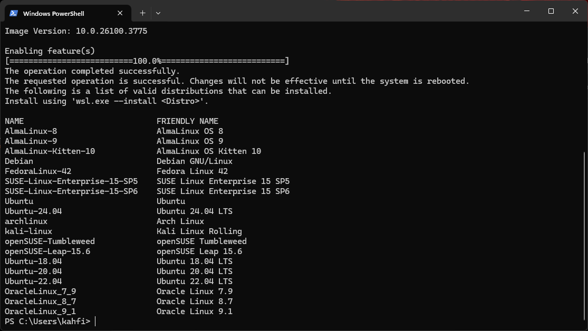
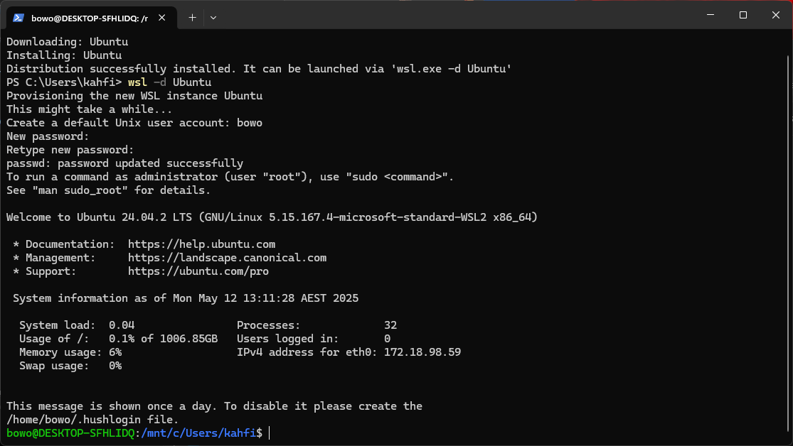
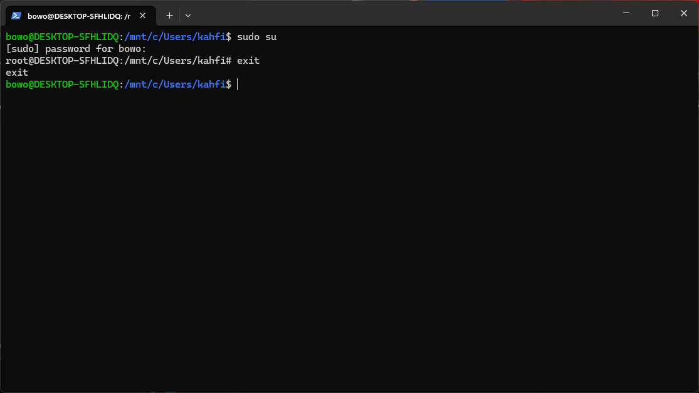
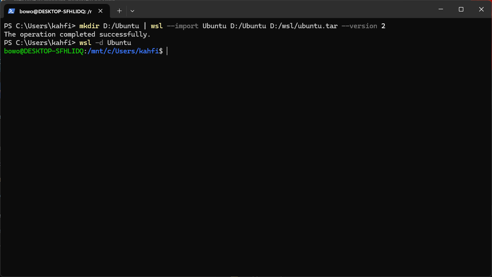
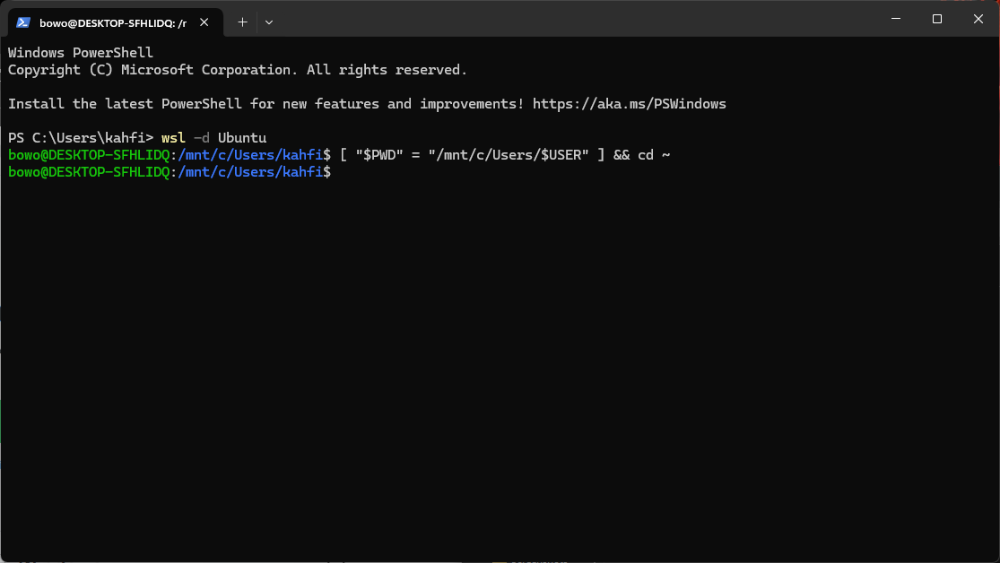
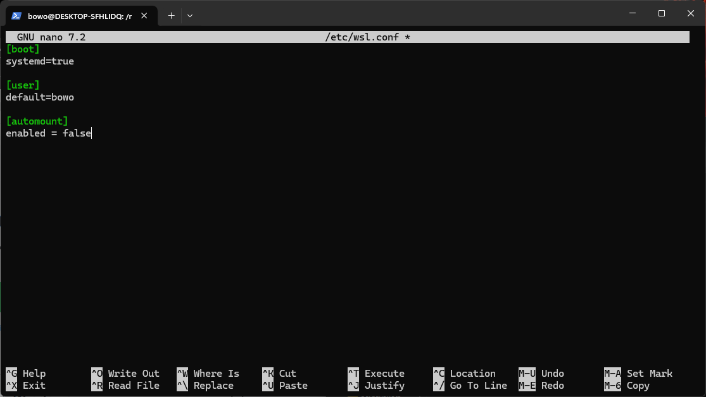

<p style="text-align: right; font-size: 0.9rem;">
  <a href="https://www.bowo.digital/" style="font-weight: bold;">← Beranda</a>
  &nbsp;&nbsp;|&nbsp;&nbsp;
  <a href="https://www.bowo.digital/docs/basic-hierarki-linux.html" style="font-weight: bold;">Konten berikutnya →</a>
</p>

<h1 style="text-align: center; font-size: 2.5rem; font-weight: bold; margin-bottom: 0.5rem;">
  <a href="https://www.bowo.digital/docs/basic-linux-in-win.html" style="text-decoration: none; color: inherit;">
    Linux di dalam Windows
  </a>
</h1>

<p style="text-align: center; font-size: 1.2rem;">
  Oleh <a href="https://www.bowo.digital/docs/bio.html" target="_blank">Agus Wibowo</a>
</p>

<div style="text-align: center; margin-bottom: 1.5rem;">
  
</div>

# Daftar isi

-   [Pendahuluan](#pendahuluan)
-   [Spesifikasi minimal komputer](#spesifikasi-minimal-komputer)
-   [Mengenal dan memilih distro Linux](#memilih-distro-linux)
-   [Instalasi Linux via WSL](#instalasi-linux-via-wsl)
-   [Migrasi WSL Linux ke direktori non-C](#migrasi-wsl-linux-ke-direktori-non-c)

# Pendahuluan

Sebagian besar tools bioinformatika dikembangkan untuk lingkungan UNIX karena fleksibilitas, kompatibilitas tinggi, dan sifatnya yang *open source* (pengembangan dapat dilakukan oleh siapapun). Karena itu, memahami dan menggunakan sistem operasi UNIX, terutama Linux, sangat penting bagi siapa pun yang ingin mendalami bioinformatika.

Sayangnya, banyak pelajar dan peneliti di Indonesia sangat asing dengan sistem operasi berbasis UNIX, lebih familiar menggunakan Windows yang kurang kompatibel dengan tools berbasis *command line*. Namun jangan khawatir, tutorial ini akan memandu Anda menjalankan Linux langsung di dalam Windows, agar tetap bisa mengakses berbagai tools bioinformatika secara optimal. Dalam hal ini, ada beberapa pilihan:

1.  **WSL (*Windows Subsystem for Linux*)** – solusi termudah dan paling ringan;

2.  ***Virtual Machine*** – cocok untuk uji coba sistem penuh, tapi membutuhkan spesifikasi komputer dengan RAM tinggi;

3.  ***Dual-boot*** – solusi performa terbaik, tapi butuh penyimpanan banyak dan sedikit teknis.

Pilihan metode ini tergantung dengan spesifikasi komputer/laptop yang anda miliki. Namun pada tutorial ini, saya hanya akan memberikan panduan untuk pilihan pertama (Instalasi Linux via WSL), karena merupakan pilihan paling cepat dan mudah untuk siapapun. Sementara itu, virtual machine dan dual boot anda bisa cari tutorialnya di youtube.

# Spesifikasi minimal komputer {#spesifikasi-minimal-komputer}

Pada dasarnya, analisis bioinformatika, terutama yang melibatkan data genomik berskala besar membutuhkan spesifikasi komputer dengan performa tinggi, terutama infrastruktur seperti [HPC (*High Performance Computing*)](https://cloud.google.com/discover/what-is-high-performance-computing). Namun karena tujuan utama website ini adalah edukasi, maka fokusnya adalah pada pemahaman konsep-konsep dasar dan metode analisis bioinformatika. Untuk itu, komputer atau laptop dengan spesifikasi menengah masih cukup memadai, asalkan dapat menjalankan sistem operasi berbasis UNIX.

Berikut ini adalah spesifikasi minimal yang disarankan:

| Komponen             | Minimum               | Disarankan            |
|----------------------|-----------------------|-----------------------|
| RAM                  | 4 GB                  | \> 8 GB               |
| Processor            | Dual-core (Intel/AMD) | Quad-core (Intel/AMD) |
| Arsitektur           | x64 (64-bit) / ARM64  | x64 (64-bit) / ARM64  |
| Penyimpanan          | 128 GB (HDD)          | 256 GB - 1 TB (SSD)   |
| Sistem operasi       | Windows 10            | Windows 11            |

> **Catatan:** Di luar dari spesifikasi ini, komputer/laptop dengan full instalasi Linux atau dual boot akan jauh lebih baik, karena penggunaan RAM akan lebih efisien dibandingkan menjalan windows dan Linux dalam satu waktu.
>
> Untuk pengguna Mac-OSX baik dengan arsitektur x64 maupun ARM (M1-M4) masih cukup kompatible dalam menjalankan tools bioinformatika, tanpa harus install Linux. Karena Mac-OSX memang pada dasarnya adalah UNIX-*based operating system*. Namun perlu dicatat, Mac-OSX berbasis ARM terbilang sangat baru, dan ada beberapa tools belum dikembangkan untuk berjalan pada arsitektur ini, seperti `RSEM` dan `STAR`, sehingga memerlukan sedikit *tweak*. Mungkin saya akan menjelaskan ini pada tutorial lainnya.

# Mengenal dan memilih distro Linux {#memilih-distro-linux}

Hingga saat ini, ada sekitar 250 lebih distribusi Linux aktif (*distro*) yang tercatat di [DistroWatch](https://distrowatch.com/). Sebagian besar distro tersebut merupakan hasil pengembangan atau turunan dari 5 distro induk utama, yaitu: **Debian, Red Hat, Arch Linux, Slackware,** dan **Gentoo**. Banyaknya varian Linux ini muncul dari keinginan komunitas dan pengembang untuk menciptakan sistem operasi yang sesuai dengan kebutuhan spesifik, mulai dari penggunaan sehari-hari, keperluan keamanan, hingga komputasi ilmiah.

Sebagai contoh, [Ubuntu](https://ubuntu.com/) dikembangkan dari Debian dengan fokus pada kemudahan penggunaan sehari-hari; [Kali Linux](https://www.kali.org/) dibangun untuk kebutuhan pengujian keamanan siber (*penetration testing*); sedangkan [Manjaro](https://manjaro.org/), turunan Arch, dibuat untuk menghadirkan kemudahan instalasi dan manajemen sistem *rolling release*. Dalam hal ini, ekosistem Linux bisa dianalogikan seperti tabel periodik unsur, di mana setiap distro mewakili elemen dengan karakteristik unik yang dapat disesuaikan dengan kebutuhan pengguna.


Untuk kebutuhan analisis bioinformatika, distro turunan Debian seperti Ubuntu adalah yang paling direkomendasikan. Kemudahan, stabilitas, dan jaringan komunitas yang luas pada Debian memungkinankan kita untuk menginstal berbagai tools bioinformatika dengan cepat, mendapatkan dukungan dari dokumentasi yang melimpah, serta memecahkan masalah teknis dengan lebih mudah melalui forum atau repositori publik.

# Instalasi Linux via WSL {#instalasi-linux-via-wsl}

*Windows subsystem for Linux* (WSL) merupakan fitur baru pada sistem operasi windows, dimana menungkinkan kita untuk menginstall distro Linux dan menggunakan semua aplikasi termasuk Bash command-line secara langsung. Berikut tahapan instalasi Linux dengan WSL.

> **Catatan:** Instalasi Linux membutuhkan koneksi internet yang stabil.

1.  Buka powershell dengan cara tekan tombol `Windows + R` pada keyboard dan ketikkan "*powershell*", maka jendela hitam powershell akan terbuka.

2.  Untuk melihat distro Linux yang tersedia, cukup jalankan perintah

    ``` powershell
    # powershell
    wsl --list --online
    ```

    Perintah ini akan menginstal WSL terlebih dahulu, cukup tekan enter untuk menginstall WSL, maka setelah instalasi, akan muncul list distro Linux yang tersedia seperti gambar berikut.

    

3.  Dari list ini, pada dasarnya kita bisa memilih distro manapun, namun untuk kebutuhan bioinformatika, saya merekomendasikan Debian atau Ubuntu. Namun sebelum menginstall distro Linux, restart komputer diperlukan. Maka restart komputer anda sebelum melanjutkan ke proses instalasi distro Linux pada WSL.

4.  Setelah restart kita bisa menjalankan proses instalasi Linux dengan perintah dasar `wsl --install <nama distro>`. Misalnya kita memilih distro `Ubuntu`, maka jalankan perintah berikut untuk mendownload dan menginstalnya.

    ``` powershell
    # powershell
    wsl --install Ubuntu
    ```

5.  Setelah sukses akan muncul pesan "*Distribution successfully installed*...". Maka anda bisa menggunakan Linux dengan menjalankan perintah:

    ``` powershell
    # powershell
    wsl -d Ubuntu
    ```

6.  Perintah di atas akan memuat permintaan untuk mengatur Linux, seperti nama user, password, dll. Maka isi semua permintaan yang diminta.

    

    > **Catatan:** ketika menulis password, secara default tidak akan muncul apa yang kita ketik. Jadi pastikan anda mengingat password yang anda buat.

7.  Indikasi utama bahwa Anda berhasil masuk ke *command line* Linux adalah adanya simbol `$` setelah nama komputer anda (Seperti contoh gambar di atas). Sampai tahap ini anda berhasil menginstall Linux dalam windows.

    > **Catatan:** Linux memiliki 2 hak akses; user biasa (disimbolkan dengan `$` pada terminal) dan superuser (disimbolkan dengan `#` pada terminal). User biasa memungkinkan anda mengakses utilitas umum seperti membaca file, menghapus, dll. Sementara Superuser memberikan anda akses penuh terhadap sistem operasi, terutama dalam hal menginstal setiap tools. Perlu diingat juga bahwa kita tidak bisa sembarangan menggunakan Superuser, karena sekali kesalahan terjadi, maka akan berdampak sangat besar pada sistem operasi Linux secara keseluruhan.

Untuk mengakses Superuser, anda bisa menjalankan perintah `sudo su` diikuti dengan mengisi password, maka hak akses akan berubah ke `root #` . Dan untuk keluar dari Superuser, hanya perlu mengetikkan `exit`.



Untuk keluar dari Linux, anda hanya perlu ketikkan `exit` dan kembali ke powershell windows.

# Migrasi WSL Linux ke direktori non-C

Untuk banyak kasus, drive C biasanya tersisa sedikit ruang, sementara bioinformatika membutuhkan penyimpanan yang cukup untuk menanpung data-data genomic. Sehingga migrasi WSL-Linux dari drive C/ ke drive lain yang masih memiliki banyak ruang mungkin menjadi solusi yang baik. Berikut langkah-langkahnya.

1.  Buka powershell dan jalankan perintah berikut:

    ``` powershell
    # powershell
    mkdir D:/wsl | wsl --export Ubuntu D:/wsl/ubuntu.tar
    ```

    Perintah ini akan membuat direktori baru di drive `D:/` bernama `wsl` kemudian akan meng-copy Linux `Ubuntu` (distro yang sebelumnya kita buat dalam tutorial ini) menggunakan perintah `wsl --export` sehingga menghasilkan file distro cadangan bernama `ubuntu.tar`. Anda bisa mengganti direktori `D:/` dengan direktori apapun di komputer Anda yang masih menyisakan ruang yang banyak.

2.  Hapus distro Linux dari WSL dengan cara menjalankan perintah:

    ``` powershell
    # powershell
    wsl --unregister Ubuntu
    ```

    Penghapusan distro pada direktori lama diperlukan untuk mencegah konflik dalam perintah `wsl -d`.

3.  Import file distro yang sudah dicadangkan sebelumnya (`ubuntu.tar`) dengan perintah berikut:

    ``` powershell
    # powershell
    mkdir D:/Ubuntu | wsl --import Ubuntu D:/Ubuntu D:/wsl/ubuntu.tar --version 2
    ```

    Perintah ini akan membuat direktori target lokasi penyimpanan Linux di `D:/Ubuntu` dan mengimport file Linux yang sudah dicadangkan.

    

4.  Atur *mounting* Linux dengan cara menjalankan perintah berikut:

    ```powershell
    # powershell
    [ "$PWD" = "/mnt/c/Users/$USER" ] && cd ~
    ```

        

5.  Nonaktifkan otomatis mount Linux ke drive `C:/` dengan cara menjalankan perintah berikut:

    ```powershell
    # bash
    sudo nano /etc/wsl.conf
    ```

    Ini akan membuka jendela nano, dan tambahkan konfigurasi berikut:

    ```ini
    [automount]
    enabled = false
    ```

    Kemudian simpan dengan menekan tombol `CTRL X` dilanjutkan dengan memilih `Y` untuk mengkonfirmasi perubahan

    

    Close jendela termial, dan aktifkan kembali wsl dengan `wsl -d Ubuntu`

Sekarang semua file Linux sudah berpindah ke direktori yang baru dan dapat dijalankan seperti biasa tanpa harus mengatur dan menginstall semua file dari awal.

> "*Knowledge thrives when shared, not stored - and in open source, we build not just code, but a collective future"*
>
> **Agus Wibowo**