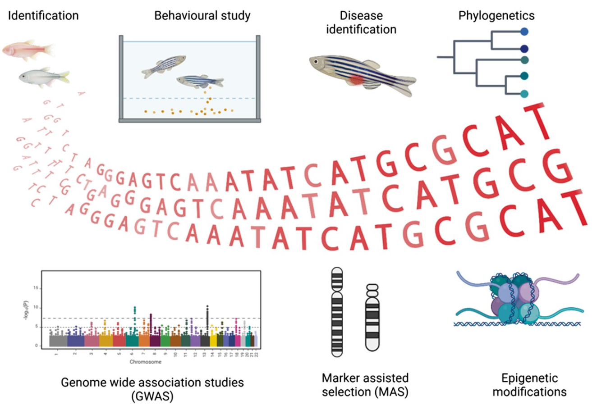
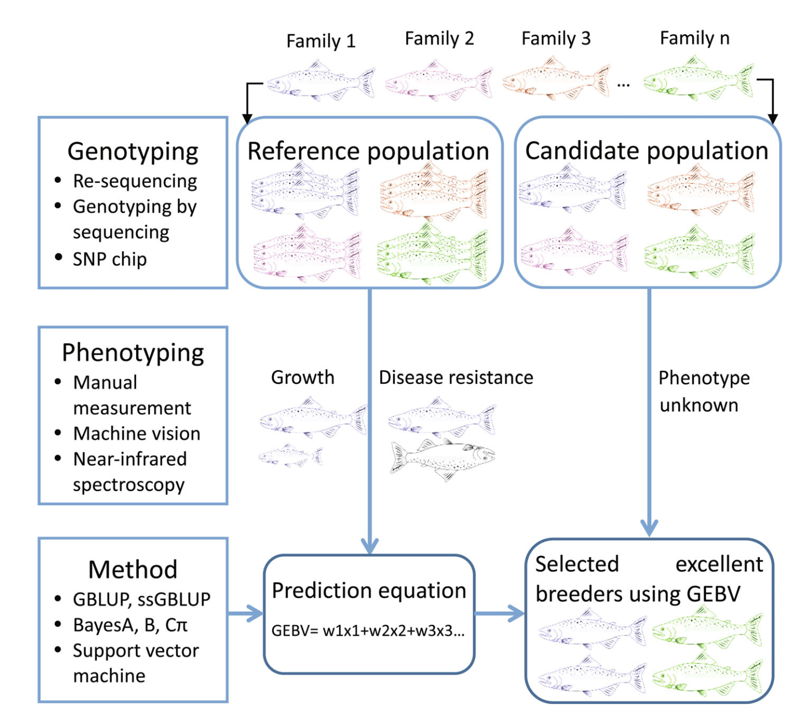
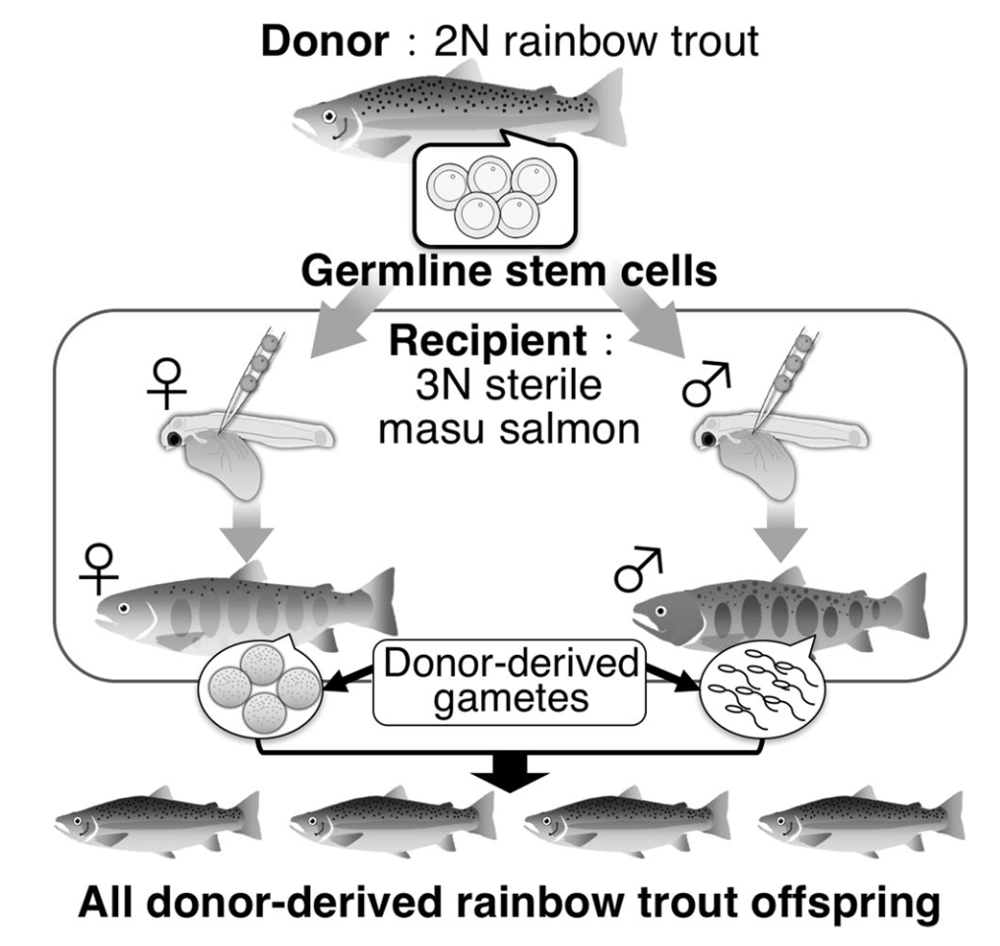

#### [Beranda](https://www.bowo.digital/)

# Daftar isi

-   [Pendahuluan](#)
-   [Teknologi sekuensing dalam konteks akuakultur](#)
-   [Seleksi genomik: Revolusi dalam pemuliaan](#)
-   [Teknologi induk pengganti (*surrogate broodstock*)](#memilih-distro-linux)
-   [Aplikasi multi-omics dalam analisis sifat produksi](#)
-   [Deteksi dan monitoring patogen melalui *Metatranscriptomics*](#)
-   [Tantangan dan arah masa depan](#)

# Pendahuluan

Seiring dengan meningkatnya permintaan protein hewani dari sumber perairan dan tantangan dalam industri akuakultur, aplikasi biologi molekuler dan bioinformatika telah menjadi komponen penting dalam pengembangan dan keberlanjutan sektor ini. Teknologi-teknologi mutakhir terbaru memungkinkan pemahaman yang lebih mendalam tentang genetika spesies akuakultur, mengoptimalkan *breeding program*, dan meningkatkan resistensi terhadap penyakit. Pada tulisan ini, kita akan mengeksplorasi berbagai aspek aplikasi biologi molekuler dan bioinformatika dalam akuakultur modern.

<figure style="text-align: center;">
  
  <figcaption style="font-size: 0.95em; margin-top: 8px; text-align: right;">
    <strong>Aplikasi genomik dalam akuakultur.</strong> Penerapan teknologi genomik dalam akuakultur mencakup identifikasi spesies, studi perilaku, deteksi penyakit, analisis filogenetik, studi asosiasi genom menyeluruh (GWAS), seleksi berbasis penanda (MAS), dan modifikasi epigenetik. Pendekatan ini mendukung pemahaman mendalam tentang genetika ikan dan peningkatan program pemuliaan.
     <em>Sumber gambar:</em> <a href="https://link.springer.com/chapter/10.1007/978-981-97-8553-7_11" target="_blank">Khatei et al. 2025</a>
  </figcaption>
</figure>

# Teknologi sekuensing dalam konteks akuakultur

Kemajuan teknologi sekuensing telah mendorong perkembangan pesat dalam pemetaan genom spesies akuakultur. Saat ini, banyak spesies budidaya penting telah memiliki genom referensi berkualitas tinggi, seperti Atlantic salmon, ikan mas, tilapia, dan udang vaname. Genom referensi ini menjadi fondasi penting untuk berbagai aplikasi biologi molekuler lebih lanjut.

Kualitas sekuensing genom juga terus meningkat. Yang mana saat ini definisi genom berkualitas tinggi kini mencakup beberapa kriteria: (1) kelengkapan tinggi, (2) akurasi tinggi, (3) kontinuitas tinggi, (4) sekuens yang terhubung ke kromosom, (5) sekuens kromosom seks (jika ada), dan (6) haplotype yang terselesaikan. Bahkan saat ini, banyak proyek yang mengarah pada inisiatif "telomere-to-telomere" (T2T) untuk menghasilkan genom diploid yang lengkap dan bebas gap.

Teknologi-teknologi baru berperan penting dalam kemajuan ini. Sequencing generasi ketiga (*long-read sequencing*) seperti PacBio dan Oxford Nanopore memungkinkan pembacaan fragmen DNA yang lebih panjang dan cepat sehingga mempermudah perakitan genom kompleks (*genom assembly*). Menariknya, dengan perkembangan teknologi saat ini, beberapa genom referensi bahkan langsung mencapai kriteria "berkualitas tinggi" saat pertama kali dirakit, seperti pada ikan sablefish (*Anoplopoma fimbria*).

Selain teknologi sekuensing, pengembangan *single nucleotide polymorphism* (SNP) chip juga menjadi komponen penting dalam kemajuan genomik akuakultur. Contohnya seperti *low-density* Pacific Oyster Illumina GoldenGate 1K chip, *medium-density* Atlantic salmon Affymetrix Axiom 50K chip, dan *high-density* catfish Affymetrix Axiom 690K chip. Alat-alat ini memudahkan karakterisasi genetik populasi budidaya dengan biaya yang lebih rendah dibandingkan dengan sekuensing penuh.

# Seleksi genomik: Revolusi dalam pemuliaan

Seleksi genomik (*genomic selection* - GS) merupakan pendekatan pemuliaan revolusioner yang diperkenalkan oleh Meuwissen pada tahun 2001. Berbeda dengan seleksi konvensional yang mengandalkan silsilah dan data fenotip, atau *marker-assisted selection* (MAS) yang berfokus pada QTL (*Quantitative Trait Loci*) dengan efek besar, seleksi genomik menggunakan marker yang tersebar di seluruh genom untuk memprediksi nilai pemuliaan.

Prinsip dasar GS adalah mengasumsikan bahwa setiap QTL atau gen yang mempengaruhi sifat kuantitatif berada dalam *linkage disequilibrium* (LD), yang merupakan kondisi di mana alel pada dua lokus berbeda cenderung muncul bersama lebih sering (atau lebih jarang) dari yang diharapkan secara acak dengan setidaknya satu marker molekuler di seluruh genom. Proses GS melibatkan pembentukan populasi referensi dengan informasi genotip dan fenotip, pengembangan model prediksi, dan penerapan model tersebut pada kandidat seleksi yang hanya memiliki data genotip, misalnya microsatelit atau SNP.

Keunggulan GS dibandingkan metode konvensional diantaranya: (1) tidak bergantung pada informasi fenotip untuk individu kandidat, (2) dapat menjelaskan semua variasi genetik dalam genom, (3) dapat menetralisir efek interaksi genotipe dengan lingkungan, dan (4) dapat mengurangi inbreeding. Metode ini juga mempersingkat interval generasi, meningkatkan intensitas seleksi, dan sangat cocok untuk sifat yang sulit diukur seperti resistensi penyakit dan kualitas daging.

Dalam akuakultur, GS telah diterapkan pada berbagai spesies dan sifat. Contohnya termasuk resistensi terhadap kutu laut (*sea lice*) pada salmon, resistensi terhadap *bacterial cold water disease* pada rainbow trout, dan pertumbuhan pada tilapia. Studi menunjukkan bahwa akurasi GS biasanya lebih tinggi dibandingkan dengan metode berbasis silsilah konvensional (*pedigree-based selection*), dengan peningkatan rata-rata sebesar 22% untuk sifat resistensi penyakit dan 24% untuk sifat pertumbuhan.

Metode perhitungan nilai pemuliaan genomik (*genomic estimated breeding values* - GEBV) dalam GS dapat dibagi menjadi tiga kategori: (1) berdasarkan teori BLUP (*best linear unbiased prediction*), seperti GBLUP, ssGBLUP, dan variasinya; (2) berdasarkan teori Bayesian, seperti BayesA, BayesB, BayesC, dan BayesR; dan (3) berdasarkan algoritma machine learning, seperti SVM, random forest, dan deep learning (masih tahap pengembangan). Masing-masing metode memiliki kelebihan dan kelemahan, dan pemilihan metode tergantung pada karakteristik sifat dan struktur populasi.

<figure style="text-align: center;">
  
  <figcaption style="font-size: 0.95em; margin-top: 8px; text-align: right;">
    <strong>Alur genomic selection.</strong> Genomic selection dimulai dari genotyping dan phenotyping populasi referensi, dilanjutkan dengan pemodelan prediksi nilai pemuliaan genomik (GEBV) yang digunakan untuk menyeleksi induk unggul dari populasi kandidat yang belum diketahui fenotipenya.
     <em>Sumber gambar:</em> <a href="https://doi.org/10.1111/raq.12716" target="_blank">Song et al. 2022</a>
  </figcaption>
</figure>

Secara umum, akurasi prediksi nilai GEBV ini dipengaruhi oleh beberapa faktor, seperti ukuran populasi referensi, densitas marker, metode estimasi GEBV, dan hubungan antara populasi referensi dan populasi kandidat. Sehingga riset-riset GS saat ini berfokus pada penentuan strategi untuk meningkatkan akurasi dan mengurangi biaya *genotyping*, seperti pengembangan panel SNP berdensitas rendah dikombinasikan dengan imputasi genotip, *low-coverage sequencing*, dan pencarian alternative marker informatif selain SNPs.

# Teknologi induk pengganti (*surrogate broodstock*)

Teknologi *surrogate broodstock* (SB) merupakan inovasi menarik yang memungkinkan produksi gamet dari donor menggunakan ikan pengganti (*surrogate*). Teknologi ini melibatkan transplantasi sel germline dari donor ke resipien strain atau spesies yang berbeda. Prinsipnya, sel induk germline yang ditransplantasikan akan bermigrasi ke gonad resipien, berintegrasi, dan menghasilkan gamet yang berasal dari donor.

Keunikan teknologi ini adalah bahwa sel induk spermatogonia dari testis donor dapat menghasilkan telur fungsional jika ditransplantasikan ke resipien betina, dan sel induk oogonia dari ovarium donor dapat menghasilkan sperma fungsional jika ditransplantasikan ke resipien jantan. Ini menunjukkan bahwa sel germline menghasilkan gamet berdasarkan jenis kelamin resipien, bukan jenis kelamin asalnya.

<figure style="text-align: center;">
  
  <figcaption style="font-size: 0.95em; margin-top: 8px; text-align: right;">
    <strong>Produksi induk pengganti salmon masu dan generasi berikutnya dari trout pelangi melalui transplantasi sel punca germinal.</strong> Sel punca spermatogonia dari trout pelangi jantan ditransplantasikan ke dalam rongga peritoneum larva salmon masu triploid mandul yang baru menetas. Sel spermatogonia trout tersebut kemudian berhasil berkolonisasi di gonad ikan penerima, yang selanjutnya mampu menghasilkan sel telur atau sperma yang berasal dari donor, tergantung pada jenis kelamin ikan penerima.
     <em>Sumber gambar:</em> <a href="https://doi.org/10.1007/s12562-019-01299-y" target="_blank">Yoshizaki & Yazawa. 2019</a>
  </figcaption>
</figure>

Saat ini aplikasi *surrogate broodstock* dalam akuakultur masih dalam tahap awal yang meliputi:

1.  Peningkatan efisiensi breeding: Memungkinkan produksi banyak offspring yang membawa sifat unggul dari satu ikan donor terpilih melalui transplantasi ke banyak ikan resipien.
2.  Pengurangan waktu generasi: Menggunakan spesies dengan waktu generasi pendek sebagai resipien untuk memproduksi gamet dari spesies dengan waktu generasi panjang, mempercepat proses pemuliaan.
3.  Penyimpanan jangka panjang sumber daya genetik: Kriopreservasi sel germline untuk transplantasi di masa depan, akan lebih mudah dilakukan dibandingkan kriopreservasi telur ikan.
4.  Produksi ikan steril secara genetik: Menghasilkan populasi ikan steril melalui transplantasi sel germline dari donor dengan mutasi sterilitas ke resipien normal.

Meskipun menjanjikan, teknologi ini masih menghadapi tantangan, terutama dalam hal konsentrasi sel germline yang rendah pada beberapa spesies ikan dan efisiensi transplantasi yang bervariasi berdasarkan musim. Namun, dengan pengembangan metode untuk memperkaya sel induk germline dan optimalisasi waktu transplantasi, teknologi SB berpotensi memberikan dampak signifikan pada industri akuakultur.

# Aplikasi multi-omics dalam analisis sifat produksi

Pendekatan multi-omics merujuk pada pengintegrasian berbagai lapisan data "omics untuk memberikan pemahaman yang lebih komprehensif tentang mekanisme molekuler yang mendasari sifat-sifat penting dalam akuakultur. Lapisan-lapisan ini meliputi genomik, epigenomik, transkriptomik, proteomik, metabolomik, microbiomik, dan metagenomik.

1.  Transkriptomik.

    Studi transkriptomik telah membantu mengidentifikasi gen-gen yang terkait dengan respons terhadap stres lingkungan, seperti respons terhadap oksigen rendah pada *channel catfish* dan resistensi terhadap patogen. Analisis pasca-transkripsi, seperti splicing RNA dan poliadenilasi, juga memberikan wawasan tentang pengaruh lingkungan terhadap regulasi genetik.

2.  Epigenomik

    Epigenomik juga muncul sebagai bidang yang menjanjikan. Studi terkini telah mengidentifikasi modifikasi epigenetik yang terkait dengan penentuan jenis kelamin pada *channel catfish*, kesuburan pada striped bass, dan respons imun pada *eastern oyster* setelah infeksi parasit. Pemanipulasian lingkungan untuk mempengaruhi memori epigenetik juga dapat digunakan untuk meningkatkan performa dalam akuakultur.

3.  Mikrobiomik dan metagenomik
    
    Baik Microbiomik dan metagenomik berfokus pada dua area utama: mikrobiota usus/intestinal untuk memeriksa kesehatan ikan, stress, pencernaan, dan respons imun; dan sampel lingkungan untuk meningkatkan kesehatan ikan dan efisiensi produksi. Studi terbaru menunjukkan adanya hubungan antara mikrobiom usus dan pertumbuhan pada rainbow trout, perbedaan mikrobiom yang mempengaruhi pertumbuhan pada kerang, dan perbedaan dalam bertahan hidup terhadap invasi virus.

Selain itu, beberapa studi terkini telah mengintegrasikan data transkriptomik, proteomik, dan/atau metabolomik dengan algoritma machine learning, dengan tujuan untuk menentukan penanda omik pertumbuhan dan ukuran tubuh, memprediksi kualitas telur, mengidentifikasi respons terhadap paparan kimia atau kondisi perkembangan, memprediksi resistensi penyakit, dan termasuk mendeteksi penanda ketertelusuran makanan laut.

Meskipun menjanjikan, integrasi data multi-omics menghadapi beberapa tantangan seperti standardisasi data, kompatibilitas lintas platform, penanganan data dan metadata yang tidak lengkap, dan keragaman metode analisis. Namun demikian, pengembangan alur kerja (*workflow*) dan aplikasi untuk mengintegrasikan data multi-omics terus berlangsung, misalnya MOMIC, OmicsSuite, IDARE2, dan integrator berbasis AI/ML.

# Deteksi dan monitoring patogen melalui *Metatranscriptomics*

Penyakit menular merupakan ancaman serius bagi produksi akuakultur global. Metode konvensional untuk identifikasi patogen, seperti *polymerase chain reaction* (PCR), kultur sel, dan histopatologi, memiliki keterbatasan, terutama saat menghadapi patogen baru atau yang bermutasi. Dalam konteks ini, *metatranscriptomics* (sekuensing RNA total) muncul sebagai pendekatan revolusioner untuk karakterisasi patogen.

*Metatranscriptomics* menyediakan tampilan taksonomi yang tidak bias terhadap virus RNA, virus DNA, bakteri, dan eukariota dalam sampel. Teknik ini menawarkan beberapa keunggulan, seperti (1) hemat biaya karena dapat mengungkap genom beberapa patogen dalam satu tes; (2) tidak memerlukan urutan DNA yang diketahui dari patogen; (3) dapat mendeteksi patogen pada tingkat varian; dan (4) dapat mengidentifikasi patogen bersamaan dengan ekspresi gen inang.

Aplikasi *metatranscriptomics* dalam mengidentifikasi patogen ikan telah terbukti efektif dalam beberapa kasus penting. Contohnya identifikasi *piscine orthoreovirus* sebagai agen penyebab *heart and skeletal muscle inflammation* (HSMI) pada salmon, identifikasi *tilapia lake virus* (TiLV) sebagai penyebab wabah penyakit pada tilapia, dan identifikasi *scale drop disease virus* pada ikan sea bass Asia.

*Metatranscriptomics* juga dapat digunakan untuk surveilans pasif dan pemantauan ekosistem melalui analisis sampel dari hewan asimptomatik atau lingkungan (misalnya, air). Ini memungkinkan deteksi dini patogen sebelum wabah terjadi dan pemahaman yang lebih baik tentang keragaman patogen di lingkungan perairan.

Proses investigasi wabah dengan *metatranscriptomics* melibatkan beberapa tahap diantaranya (1) definisi kasus dan pengecualian penyebab lingkungan; (2) pengujian dengan prosedur diagnostik tradisional; dan jika agen etiologi tidak sepenuhnya ditentukan, (3) analisis dengan *metatranscriptomics*, diikuti oleh validasi melalui studi in vitro atau in vivo.

Meskipun menjanjikan, masih terdapat tantangan dalam penerapan *metatranscriptomics*, seperti kebutuhan akan kerangka pelaporan yang jelas dengan pedoman analitis untuk mengidentifikasi patogen yang dicurigai, serta kekhawatiran tentang dampak pada perdagangan dan kepentingan industri akuakultur.

# Tantangan dan arah masa depan

Meskipun kemajuan signifikan telah dicapai dalam aplikasi biologi molekuler dan bioinformatika untuk akuakultur, beberapa tantangan dan peluang masa depan perlu dipertimbangkan, diantaranya:

1.  Pengembangan teknik fenotipe akurat

    Memperoleh fenotipe yang akurat sangat penting dalam program pemuliaan karena akurasi pengukuran sifat langsung mempengaruhi akurasi seleksi genomik. Teknologi kamera dengan pengolahan gambar berbasis *machine learning* dengan akurasi tinggi (>97%) untuk analisis gambar dan pengukuran fenotipik masih perlu dikembangkan, bersama dengan teknologi seperti pencitraan hyperspectral dan spektroskopi inframerah untuk mengukur atribut fisik dan kimia hewan budidaya.

2.  Pengembangan strategi untuk mengurangi biaya seleksi genomik

    Tantangan utama implementasi seleksi genomik adalah biaya genotipe. Sehingga strategi untuk mengurangi biaya sangatlah penting, misalnya pengembangan panel SNP densitas rendah, imputasi genotipe, sekuensing dengan coverage rendah, serta pencarian alternatif marker genetik yang lebih informatif masih perlu dikembangkan kedepannya.

3.  Pertimbangan interaksi genotipe dengan lingkungan (G×E)
    
    Sifat ekonomis penting biasanya dipengaruhi oleh gen, lingkungan, dan interaksi diantaranya (GxE). Mengabaikan interaksi G×E dapat mengurangi kemajuan genetik. Sehingga pengembangan dan inovasi motode terbaik untuk mempertimbangkan GxE sangatlah penting. Sampai saat ini, *model multi-trait* dan *reaction norm* merupakan dua metode umum untuk menangani interaksi G×E dalam evaluasi genetik.

4.  Pertimbangan dosis alel dalam prediksi genomik untuk ikan poliploid

    Ikan memiliki poliploidisasi yang melimpah, dengan tingkat ploidi yang bervariasi antarspesies. Parameterisasi ploidi yang tepat dalam prediksi genomik untuk spesies poliploid dapat meningkatkan akurasi prediksi.

5.  Integrasi data multi-omics dan pengeditan genom ke dalam seleksi genomik

    Strategi seleksi genomik saat ini mengandalkan analisis asosiasi langsung antara fenotipe dan SNP. Integrasi data multi-omics dan teknologi pengeditan genom, seperti CRISPR/Cas9, berpeluang dapat mempercepat pemahaman mekanisme genetik yang mendasari sifat kompleks dan meningkatkan kemajuan genetik.

6.  Pengembangan tenaga kerja terampil

    Pengembangan dan penerapan teknologi genomik dalam akuakultur membutuhkan tenaga kerja dengan keterampilan interdisipliner dalam genomik, breeding, dan bioinformatika. Program pelatihan yang komprehensif diperlukan untuk memenuhi kebutuhan ini.

Dengan mengatasi tantangan ini dan memanfaatkan peluang yang ada, aplikasi biologi molekuler dan bioinformatika diharapkan dapat berkontribusi secara signifikan terhadap keberlanjutan dan produktivitas industri akuakultur di masa depan.

# Referensi

-   [Meuwissen, T. H., Hayes, B. J., & Goddard, M. E. (2001). Prediction of total genetic value using genome-wide dense marker maps. Genetics, 157(4), 1819-1829.](https://doi.org/10.1093/genetics/157.4.1819)
-   [Houston, R. D., Bean, T. P., Macqueen, D. J., et al. (2020). Harnessing genomics to fast-track genetic improvement in aquaculture. Nature Reviews Genetics, 21(7), 389-409.](https://doi.org/10.1038/s41576-020-0227-y)
-   [Yoshizaki, G., & Yazawa, R. (2019). Application of surrogate broodstock technology in aquaculture. Fisheries Science, 85, 429-437.](https://doi.org/10.1007/s12562-019-01299-y)
-   [Robledo, D., Palaiokostas, C., Bargelloni, L., et al. (2018). Applications of genotyping by sequencing in aquaculture breeding and genetics. Reviews in Aquaculture, 10(3), 670-682.](https://doi.org/10.1111/raq.12193)
-   [Costa, V. A., Whittington, R. J., Caraguel, C., et al. (2025). Optimising outbreak investigation, surveillance and discovery of pathogens in aquaculture using unbiased metatranscriptomics. Reviews in Aquaculture, 17, e13002.](https://doi.org/10.1111/raq.13002)
-   [Verbyla, K. L., Kube, P. D., & Evans, B. S. (2022). Commercial implementation of genomic selection in Tasmanian Atlantic salmon: Scheme evolution and validation. Evolutionary Applications, 15(4), 631-644.](https://doi.org/10.1111/eva.13304)
-   [Song, H., Dong, T., Yan, X., et al. (2023). Genomic selection and its research progress in aquaculture breeding. Reviews in Aquaculture, 15, 274-291.](https://doi.org/10.1111/raq.12716)
-   [Gavery, M. R., & Roberts, S. B. (2017). Epigenetic considerations in aquaculture. PeerJ, 5, e4147.](https://doi.org/10.7717/peerj.4147)
-   [Andersen, L. K., Thompson, N. F., Abernathy, J. W., et al. (2025). Advancing genetic improvement in the omics era: status and priorities for United States aquaculture. BMC Genomics, 26, 155.](https://doi.org/10.1186/s12864-025-11247-z)
-   [Tai, Y., Liu, L., Zeng, Y., et al. (2025). Integrated GWAS and transcriptome analysis reveals regulatory networks underlying growth in improved grass carp. Aquaculture, 603, 742393.](https://doi.org/10.1016/j.aquaculture.2025.742393)