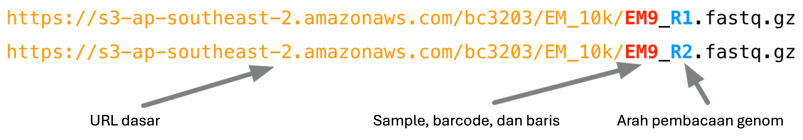

<p style="text-align: right; font-size: 0.9rem;">
  <a href="https://www.bowo.digital/" style="font-weight: bold;">← Beranda</a>
  &nbsp;&nbsp;|&nbsp;&nbsp;
  <a href="https://www.bowo.digital/docs/part2.html" style="font-weight: bold;">Pilih materi →</a>
</p>

<h1 style="text-align: center; font-size: 2.5rem; font-weight: bold; margin-bottom: 0.5rem;">
  <a href="https://www.bowo.digital/docs/lanjutan-curl-wget.html" style="text-decoration: none; color: inherit;">
    Variabel, loop, dan izin akses
  </a>
</h1>

<p style="text-align: center; font-size: 1.2rem;">
  Oleh <a href="https://www.bowo.digital/docs/bio.html" target="_blank">Agus Wibowo</a>
</p>

<div style="text-align: center; margin-bottom: 1.5rem;">
  
</div>

# Daftar isi

-   [Pendahuluan](#pendahuluan)
-   [Memahami nama file dan ekstensi](#memahami-nama-file-dan-ekstensi)
-   [Aplikasi loop untuk mendownload file sekuen](#aplikasi-loop-untuk-mendownload-file-sekuen)
-   [Mendownload file sekuen](#mendownload-file-sekuen)
-   [Mengamankan data sekuen](#mengamankan-data-sekuen)

>   **Catatan**: Dalam tutorial ini, kita akan bekerja menggunakan pemrograman Bash dalam lingkungan Linux. Anda dapat menggunakan VS code baik untuk membuat script bash maupun menjalankan script tersebut via terminal.

# Pendahuluan

Dalam tutorial ini, kita akan bekerja dengan dataset dari sebuah studi yang menganalisis transkriptom Gurita Cincin Biru (*Hapalochlaena maculosa*) dari berbagai jaringan tubuh. Studi ini merupakan bagian dari proyek sekuensing genom Gurita Cincin Biru yang dipublikasikan di [Giga Science](https://pubs.acs.org/doi/abs/10.1021/acs.jproteome.6b00452) pada tahun 2020. Proyek tersebut dipimpin oleh mahasiswa doktoral Brooke Whitelaw yang merupakan anggota dari kelompok riset [Marine Omics](http://marine-omics.net/) di James Cook University (JCU).

Tutorial ini mencerminkan tahapan umum yang sering dilakukan untuk mengunduh data dari pusat sekuensing. Selain itu, tutorial ini juga memperkenalkan konsep dasar seperti loop dan variabel, yang sangat berguna dalam berbagai konteks, terutama saat bekerja dengan banyak berkas input.

Memahami nama file dan ekstensi

# Memahami nama file dan ekstensi

Pusat sekuensing baru saja mengirimkan email yang menginformasikan bahwa data sudah tersedia. Dalam email tersebut, mereka menyebutkan bahwa terdapat 24 berkas terpisah yang siap diunduh. Mengunduh satu per satu tentu akan memakan waktu dan rentan terhadap kesalahan. Untungnya, nama berkas dan URL unduhan mengikuti pola tertentu, sehingga proses ini dapat diotomatisasi.

Dalam proyek nyata, kita sering kali harus menangani ratusan hingga ribuan berkas hasil sekuensing. Oleh karena itu, melakukan proses ini secara manual bukanlah pilihan yang realistis, sehingga otomatisasi menjadi keharusan.

Pusat sekuensing juga memberikan contoh pola URL untuk mengunduh berkas-berkas tersebut, yaitu sebagai berikut:

<div style="text-align: center;">
  
</div>

Saat kita mengirimkan sampel ke pusat sekuensing, maka kita akan menyertakan kode sampel, misalnya dalam kasus ini berasal dari dua belas jaringan yang diambil dari satu individu hewan (lihat tabel di bawah). Proses sekuensing dilakukan dengan metode *paired-end*, sehingga untuk setiap sampel akan tersedia dua berkas: satu berkas `R1` yang berisi `forward reads` dan satu berkas `R2` yang berisi `reverse reads`.

| Kode Sampel | Jaringan                                                                 |
|-------------|--------------------------------------------------------------------------|
| EM1         | Kulit bagian dorsal mantel                                               |
| EM2         | Bola mata                                                                |
| EM3         | Insang (termasuk kelenjar brankial)                                      |
| EM4         | Jantung brankial                                                         |
| EM5         | Apendiks renal                                                           |
| EM6         | Jantung sistemik                                                         |
| EM7         | Saluran reproduksi jantan (belum matang)                                |
| EM8         | Kelenjar ludah posterior                                                 |
| EM9         | Otot mantel ventral (termasuk kulit)                                     |
| EM10        | Otak                                                                     |
| EM11        | Kelenjar ludah anterior                                                  |
| EM12        | Kelenjar pencernaan                                                      |

Tugas kita kali ini adalah membuat sebuah skrip sederhana untuk mengunduh seluruh data. Untuk menyelesaikan tugas ini, kita akan mempelajari beberapa konsep baru yang penting. Kita akan membangunnya secara bertahap agar prosesnya mudah diikuti dan dipahami.

## Variabel

Variabel adalah penampung sementara untuk menyimpan informasi. Konsep ini digunakan dalam semua bahasa pemrograman, termasuk *Bash*. Sebagai contoh, kita dapat membuat sebuah variabel bernama `sample` dan menetapkan nilainya dengan salah satu nama sampel kita, seperti berikut:

```bash
# bash
sample="EM1"
```

Jika kita ingin mengambil kembali nilai yang disimpan dalam sebuah variabel, kita cukup menggunakan operator `$`. Misalnya untuk menampilkan isi dari variabel `sample`, kita cukup menuliskan:

```bash
# bash
sample="EM1"
echo $sample
```

Perintah di atas akan mencetak nilai yang tersimpan dalam variabel `sample`, dalam contoh ini, yaitu `EM1`.

Perintah `echo` juga memungkinkan kita untuk menggabungkan variabel dengan teks tetap (*fixed strings*). Misalnya:

```bash
# bash
sample="EM1"
echo $sample
echo "File yang diproses adalah ${sample}_R1.fastq.gz" # _R1.fastq.gz adalah contoh fixed strings
```

Kemampuan ini sangat berguna saat kita ingin membuat pesan yang informatif selama skrip berjalan, misalnya untuk memantau proses unduhan atau debugging.

>   Perhatikan penggunaan kurung kurawal `{}` di sekitar nama variabel pada contoh kedua, seperti `${sample}`. Penggunaan kurung kurawal ini penting karena tanpa mereka, *interpreter* (penerjemah perintah) tidak akan tahu bagian mana dari teks yang merupakan variabel dan mana yang merupakan teks biasa.

Perhatikan bagaimana perintah terakhir di bawah ini menyisipkan isi dari `${sample}` ke dalam bagian tertentu dari sebuah string yang lebih panjang. Teknik ini sangat berguna dalam proses otomatisasi, karena kode yang sama dapat menghasilkan string yang berbeda tergantung pada nilai yang disimpan dalam variabel `${sample}`. Sebagai contoh:

```bash
# bash
sample=EM1
echo "Mengunduh file untuk sampel ${sample}_R1.fastq"

sample=EM2
echo "Mengunduh file untuk sampel ${sample}_R1.fastq"
```

Output dari perintah-perintah tersebut akan menjadi:

```yaml
Mengunduh file untuk sampel EM1_R1.fastq
Mengunduh file untuk sampel EM2_R1.fastq
```

Dengan cara ini, kita bisa menghindari penulisan perintah yang sama berulang kali, dan cukup mengubah nilai variabel untuk memproses banyak file secara otomatis.

Tapi sejauh ini, cara tersebut belum terlalu berguna, bukan? Bayangkan jika kita bisa mengotomatisasi proses pemberian nilai baru ke variabel `sample`, sehingga secara otomatis bisa memproses seluruh daftar 12 sampel kita. Nah, itu baru benar-benar berguna!

Di sinilah konsep *loop* (perulangan) mulai berperan.

## Loop

Loop memungkinkan kita untuk melakukan tugas yang sama secara berulang dalam konteks yang berbeda, misalnya pada berbagai berkas, nama-nama dalam daftar, kolom dalam sebuah tabel, dan sebagainya.

Hampir semua bahasa pemrograman mendukung konsep perulangan (loop) dalam berbagai bentuk. Di dalam bash, sintaks dasar untuk sebuah *for loop* adalah seperti ini:

```bash
for placeholder in <list>
do
  <commands>
done
```

Perulangan ini akan mengambil setiap item dalam `<list>` dan secara sementara menetapkannya ke sebuah variabel yang disebut `placeholder`. Bagian antara `do` dan `done` dapat berisi sebanyak mungkin perintah yang kita butuhkan. Selama perulangan berlangsung, kita bisa menggunakan nilai dari `placeholder` untuk menjalankan perintah-perintah tersebut.

Sebagai contoh, kita bisa menuliskan seperti ini:

```bash
# bash
for sample in EM1 EM2 EM3
do
  echo "Mengunduh file ${sample}_R1.fastq"
  echo "Mengunduh file ${sample}_R2.fastq"
done
```

Hasil dari skrip ini adalah:

```yaml
Mengunduh file EM1_R1.fastq
Mengunduh file EM1_R2.fastq
Mengunduh file EM2_R1.fastq
Mengunduh file EM2_R2.fastq
Mengunduh file EM3_R1.fastq
Mengunduh file EM3_R2.fastq
```

Anda bisa mengekplorasi konsep loop ini sembari menjawab pertanyaan berikut:

-   Apa yang terjadi jika Anda mengubah nama variabel `placeholder`?
-   Apa yang terjadi jika Anda mengubah item dalam `<list>`?
-   Apa yang terjadi jika Anda menambahkan lebih banyak atau perintah yang berbeda di antara do dan done?

# Aplikasi loop untuk mendownload file sekuen

Pada contoh *for loop* sebelumnya, kita harus mengetik secara manual semua nama sampel seperti "EM1", "EM2", "EM3", dan seterusnya. Pola yang berulang seperti ini sebenarnya sangat mudah untuk diotomatisasi.

Dalam kasus ini, kita memiliki urutan kode sampel yang hanya berupa angka 1 sampai 12 dengan awalan “EM”. Untuk membuat deretan angka tersebut, kita bisa menggunakan perintah seq di bash.

Sebagai contoh:

```bash
# bash
seq 1 3
```

Perintah di atas akan menghasilkan:

```
1
2
3
```

Sering kali, saat kita menjalankan sebuah perintah di terminal, hasilnya akan langsung ditampilkan di layar. Sebelumnya, kita telah melihat bahwa hasil keluaran (*output*) ini bisa diarahkan ke sebuah berkas menggunakan simbol `>` (untuk menimpa) atau `>>` (untuk menambahkan).

Namun, sebagai alternatif lain, keluaran dari sebuah perintah juga bisa ditangkap dan disimpan ke dalam sebuah variabel. Ini dilakukan dengan sintaks berikut:

```bash
# bash
variable=$(<command>)
```

Misalnya:

```bash
# bash
angka=$(seq 1 5)
echo "Urutan angka: $angka"
```

Outputnya:

```yaml
Urutan angka: 1 2 3 4 5
```

Output yang telah ditangkap dalam sebuah variabel juga bisa digunakan untuk membuat daftar (list) dalam perulangan. Misalnya, kita bisa membuat sebuah *loop* untuk mencetak semua nama file yang diinginkan pada 12 sampel yang ada, mulai dari EM1, EM2 EM3, dst secara berurutan.

```bash
# bash
samples=$(seq 1 12)
for n in $samples
do
  a="EM${n}"  
  echo "Memproses sampel: EM${a}_R1.fastq.gz"
  echo "Memproses sampel: EM${a}_R2.fastq.gz"
done
```

Penjelasan:

-   `seq 1 12` menghasilkan angka 1 hingga 12.

-   Hasilnya disimpan ke dalam variabel `samples`.

-   Kemudian, *loop* `for` berjalan pada setiap angka dalam variabel tersebut.

-   Di dalam perulangan, kita menyisipkan angka tersebut ke dalam nama sampel menggunakan `EM${i}`.

Output yang dihasilkan akan berupa:

```yaml
Memproses sampel: EM1_R1.fastq.gz
Memproses sampel: EM2_R1.fastq.gz
...
Memproses sampel: EM12_R1.fastq.gz
```

Dengan pendekatan ini, kita dapat menghemat waktu dan menghindari kesalahan pengetikan saat bekerja dengan pola nama yang berulang.

# Mendownload file sekuen

[wget](https://en.wikipedia.org/wiki/Wget) merupakan perintah yang sangat *powerful* untuk mengunduh berkas dari internet. `wget` mendukung berbagai protokol jaringan, metode autentikasi, serta menyediakan banyak opsi untuk menyesuaikan cara kerjanya.

Untuk mendapatkan gambaran seberapa fleksibel dan canggih perintah ini, kita bisa melihat halaman manualnya dengan menjalankan perintah berikut di terminal:

```bash
# bash
man wget
```

Halaman manual ini akan menampilkan seluruh dokumentasi `wget`, termasuk berbagai opsi yang bisa digunakan seperti melanjutkan unduhan yang terputus, menyimpan berkas dengan nama tertentu, mengatur kecepatan unduh, dan banyak lagi.

Kita akan menggunakan perintah `wget` untuk mengunduh berkas-berkas sekuensing kita. Karena jumlah berkasnya cukup banyak, sebaiknya kita menatanya dalam direktori khusus agar lebih terorganisir dengan perintah `mkdir -p` untuk disimpan dalam direktori `data/sequencing`

```bash
# bash
mkdir -p data/sequencing
```

*Option* `-p` disini digunakan untuk membuat folder `data/sequencing` tanpa menimbulkan error jika folder dengan nama yang sama sudah tersedia.

Sekarang, coba kita download satu berkas saja dengan perintah `wget`

```bash
# bash
wget https://s3-ap-southeast-2.amazonaws.com/bc3203/EM_10k/EM10_R1.fastq.gz -O data/sequencing/EM10_R1.fastq.gz
```

**Catatan:** *option* -O disini digunakan untuk menspesifikasi lokasi tempat kita akan menaruh output hasil download. Tanpa option ini, berkas yang didownload tidak akan disimpan di direktori `data/sequencing`.

Sampai titik ini, kita bisa mengkombinasikan pemahaman tentang loop dan wget untuk mendownload semua berkas sekuensing (24 berkas) dalam sekali running.

```bash
# bash
mkdir -p data/sequencing
for n in $(seq 1 12)
	do 
	s="EM${n}"
	wget https://s3-ap-southeast-2.amazonaws.com/bc3203/EM_10k/${s}_R1.fastq.gz -O data/sequencing/${s}_R1.fastq.gz
	wget https://s3-ap-southeast-2.amazonaws.com/bc3203/EM_10k/${s}_R2.fastq.gz -O data/sequencing/${s}_R2.fastq.gz
done
```

# Mengamankan data sekuen

Data sekuensing umumnya mahal dan memerlukan waktu lama untuk dihasilkan. Seiring berjalannya berbagai analisis, kita akan menghasilkan banyak data turunan (*derived data*), yaitu hasil dari analisis yang dilakukan. Dengan menggunakan alat seperti Vscode dan menjalankan analisis melalui *command line*, data turunan ini biasanya bisa diregenerasi dengan cukup mudah.

Namun, data mentah (*raw data*) hasil sekuensing tidak bisa dibuat ulang begitu saja. Oleh karena itu, setelah mengunduh data mentah, kita selalu disarankan untuk menjadikannya hanya-baca (*read-only*). Langkah ini membantu melindungi data dari kesalahan seperti menimpanya secara tidak sengaja, atau menghapusnya dengan perintah `rm`.

Tentu saja, ini bukan perlindungan penuh, membuat salinan cadangan (*backup*) tetap sangat penting tetapi menjadikan berkas *read-only* adalah langkah awal yang sangat disarankan.

Semua berkas di sistem Unix memiliki informasi izin akses (*permissions*) yang mengatur siapa yang bisa membaca, menulis, atau mengeksekusi berkas tersebut. Gambar berikut ini memberikan ringkasan singkat tentang cara kerja sistem izin tersebut:

<div style="text-align: center;">
  
</div>

Izin akses untuk sebuah berkas dapat dilihat menggunakan perintah `ls` dengan opsi `-l`. Perintah ini akan menampilkan daftar berkas dalam format yang lebih rinci, termasuk informasi tentang siapa yang dapat membaca, menulis, atau mengeksekusi berkas tersebut.

Sebagai contoh, untuk melihat izin dari salah satu berkas hasil unduhan, kita bisa menggunakan perintah:

```bash
# bash
ls -l data/sequencing/EM1_R1.fastq.gz
```

Output-nya mungkin akan serupa seperti contoh berikut:

```csharp
total 56
-rwxr-xr-x@ 1 aguswibowo  staff  25900 12 Jun  2018 EM1_R1.fastq
```

Perhatikan hasil dari perintah `ls -l` tersebut. Kemungkinan besar Anda akan melihat bahwa pengguna (user), yaitu Anda sendiri, memiliki izin membaca (r) dan menulis (w) terhadap berkas. Pengguna lain dalam grup yang sama biasanya memiliki izin membaca (r) saja, dan pengguna lain di luar grup juga hanya bisa membaca (r).

Dalam kasus saya, simbol seperti `@` ini umum ditemui di macOS, dan digunakan untuk fitur-fitur khusus sistem seperti sandboxing atau metadata. Untuk saat ini, Anda tidak perlu khawatir mengenai hal tersebut. 

Perintah `chmod` digunakan untuk mengubah izin akses pada sebuah berkas. Salah satu cara termudah menggunakan `chmod` adalah dengan sintaks berikut:

```bash
chmod <ugo><+-><rwx> file
```

Bagian pertama dari sintaks `chmod`, yaitu `ugo`, ini menentukan siapa yang akan terpengaruh oleh perubahan izin:

-   `u` = user (pemilik berkas)

-   `g` = group (grup pemilik)

-   `o` = others (pengguna lain di luar user dan grup)

Kita juga bisa menggabungkannya, misalnya:

-   `ug` berarti perubahan akan diterapkan ke user dan group

Bagian kedua adalah simbol `+` atau `-`, yang menunjukkan apakah kita akan menambahkan (`+`) atau menghapus (`-`) izin.

Bagian terakhir menunjukkan jenis izin yang akan diubah:

-   `r` = read (membaca)

-   `w` = write (menulis)

-   `x` = execute (menjalankan)

Contoh, kita bisa menghapus akses *write* dan *execute* untuk semua user, sebagai contoh berikut:

```bash
# bash
chmod ugo-w data/sequencing/EM1_R1.fastq.gz
```

Cek lagi status hak akses dengan `ls -l`.

```bash
# bash
ls -l data/sequencing/EM1_R1.fastq.gz
```

Sehingga hasilnya akan seperti contoh berikut:

```csharp
total 56
-r--r--r--@ 1 aguswibowo  staff  25900 12 Jun  2018 EM1_R1.fastq
```

--Sekian--

<p style="text-align: right; font-size: 0.9rem;">
  <a href="https://www.bowo.digital/" style="font-weight: bold;">← Beranda</a>
  &nbsp;&nbsp;|&nbsp;&nbsp;
  <a href="https://www.bowo.digital/docs/part2.html" style="font-weight: bold;">Pilih materi →</a>
</p>