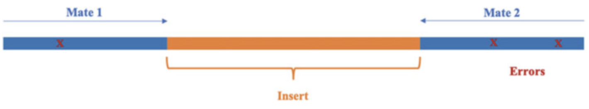

<p style="text-align: right; font-size: 0.9rem;">
  <a href="https://www.bowo.digital/" style="font-weight: bold;">← Beranda</a>
  &nbsp;&nbsp;|&nbsp;&nbsp;
  <a href="https://www.bowo.digital/docs/part1.html" style="font-weight: bold;">Pilih materi →</a>
</p>

<h1 style="text-align: center; font-size: 2.5rem; font-weight: bold; margin-bottom: 0.5rem;">
  <a href="https://www.bowo.digital/docs/lanjutan-file-format.html" style="text-decoration: none; color: inherit;">
    Mengenal berbagai format file Next Generation Sequencing
  </a>
</h1>

<p style="text-align: center; font-size: 1.2rem;">
  Oleh <a href="https://www.bowo.digital/docs/bio.html" target="_blank">Agus Wibowo</a>
</p>

<div style="text-align: center; margin-bottom: 1.5rem;">
  
</div>

# Daftar isi

-   [Pendahuluan]()
-   [Apa itu read, mate, dan coverage?]()
-   [FASTA & FASTQ: Format dasar NGS dan kualitasnya]()
-   [SAM & BAM: Dari read ke posisi di genom]()
-   [GFF/GTF & BED: Menyematkan makna pada genom]()
-   [VCF: Menyimpan informasi variasi genetik]()
-   [SRA: Gudangnya data NGS dunia]()
-   [BedGraph & BigWig: Visualisasi dari data kuantitatif]()
-   [Memahami format = Menguasai analisis]()

# Pendahuluan

Bayangkan kita baru saja mendapatkan data hasil sekuensing dari laboratorium. Dan befikir pikir: “Wah, sebentar lagi saya bisa tahu gen apa yang rusak atau SNP apa yang unik.” Tapi, begitu buka foldernya… jeng jeng kita dihadapkan dengan berbagai file berakhiran .fastq, .bam, .gff, .vcf, dan entah apa lagi. “mumet wes” 😵‍💫

Yup, dunia *Next-Generation Sequencing* (NGS) memang penuh dengan format file yang bagi pemula bisa sangat membingungkan, berukuran besar, dan bahkan diantaranya tidak bisa dibaca. Tapi jangan khawatir, setiap format punya fungsinya sendiri dan punya cara unik dalam penangananya. Seperti alat-alat di toolbox, mereka bekerja bersama untuk menjawab pertanyaan besar di biologi molekuler: variasi genetik, ekspresi gen, struktur genom, dan banyak lagi.

Jadi dalam materi ini, kita akan berkenalan dengan “bahasa” NGS: format file yang menjadi jembatan antara data mentah dan hasil analisis ilmiah.

# Apa itu read, mate, dan coverage?

Sebelum terjun lebih jauh, mari kita luruskan beberapa istilah kunci:

-   ***Read*** - adalah potongan sekuens DNA hasil dari satu kali pembacaan oleh mesin sekuenser.

-   ***Mate*** - mengacu pada pasangan *read* dalam *paired-end* sequencing; satu dari ujung 5', satunya lagi dari 3'.

-   ***Fragment*** - adalah molekul DNA asli yang disekuens.

-   ***Coverage*** - adalah ukuran seberapa dalam sebuah lokasi pada genom dibaca ulang oleh *read*.



**Rumus *coverage*:**

$$
\text{Coverage} = \frac{L \times N}{G}
$$

di mana:

$𝐿$ = panjang read,

$𝑁$ = jumlah read,

$𝐺$ = ukuran genom.

Misalnya, jika kita punya 30 juta read, masing-masing sepanjang 100 bp, dan genomnya 3 miliar bp, maka coveragenya:

$$
\frac{100 \times 30\,000\,000}{3\,000\,000\,000} = 1X
$$

Artinya, rata-rata tiap posisi hanya dibaca sekali dan terlalu dangkal (*low depth*) untuk analisis varian, misalnya.

# FASTA & FASTQ: Format dasar NGS dan kualitasnya

Format FASTA adalah format berbasis teks untuk merepresentasikan sekuens nukleotida atau peptida, di mana nukleotida atau asam amino direpresentasikan menggunakan kode satu huruf. Kesederhanaan format FASTA membuatnya mudah dimanipulasi dan diurai menggunakan alat pemrosesan teks dan bahasa skrip seperti R, Python, Ruby, dan Perl.

Setiap sekuens dalam format FASTA dimulai dengan baris deskripsi tunggal, diikuti oleh baris-baris data sekuens. Baris deskripsi, yang sering disebut sebagai "*defline*", dimulai dengan simbol ">" untuk membedakan antar data sekuens. Defline biasanya berisi pengidentifikasi unik dan informasi tentang sekuens tersebut.

Contoh format FASTA sederhana:

```shell
>NM_001276760.1 Homo sapiens tumor protein p53 (TP53), transcript variant 1, mRNA
GTGGAGTATTTGGATGACAGAAACACTTTTCGACATAGTGTGGTGGTGCCCTATGAGCCGCCTGAGG
TTGGCTCTGACTGTACCACCATCCACTACAACTACATGTGTAACAGTTCCTGCATGGGCGGCATGAA
CCGGAGGCCCATCCTCACCATCATCACACTGGAAGACTCCAGTGGTAATCTACTGGGACGGAACAGC
```

Meskipun sangat sederhana, FASTA tidak memiliki informasi tentang kualitas sekuens atau metadata lainnya yang sangat penting untuk analisis lebih lanjut. Nah, disinilah FASTQ berperan.

Format FASTQ adalah format standar berbasis teks untuk menyimpan sekuens DNA dan skor kualitas yang sesuai dari NGS. Setiap sekuens pembacaan terdiri dari empat baris. 

Contohnya:

```shell
@HWI-K00288_BSF_0436:4:1101:10003:10669
GTGGAGTATTTGGATGACAGAAACACTTTTCGACATAGTGTGGTGGTGC
+
#4!DBDDDHFHFFHIGHIII
```

Pada contoh di atas, 

-   Baris pertama adalah *identifier* sekuens yang dimulai dengan '@'. Identifier ini sering berisi informasi tentang instrumen sekuensing, posisi flow cell, dan koordinat cluster.
-   Baris kedua adalah sekuens DNA itu sendiri. 
-   Baris ketiga dimulai dengan '+' dan berfungsi sebagai pemisah. 
-   Baris keempat berisi skor kualitas untuk setiap basa dalam sekuens, yang direpresentasikan sebagai karakter ASCII.

Proses inferensi basa (A, C, G, atau T) pada posisi spesifik dari fragmen DNA yang disekuensing selama proses sekuensing disebut *base calling*. Perlu dicatat bahwa, platform sekuensing tidaklah sempurna dan kesalahan dapat terjadi selama proses sekuensing ketika mesin mencoba menginferensikan basa dari setiap sinyal yang diukur. Untuk semua platform, kekuatan sinyal dan fitur karakteristik lainnya diukur dan diinterpretasikan oleh software *base caller*. Kesalahan mempengaruhi data sekuens secara langsung dan membuatnya kurang dapat diandalkan. Oleh karena itu, penting untuk mengetahui probabilitas kesalahan tersebut agar pengguna dapat mengetahui kualitas data sekuens mereka dan dapat mencari cara untuk menangani kesalahan kualitas tersebut.

Sebagian besar platform dilengkapi dengan program *base calling* yang memberikan skor kualitas **Phred** untuk mengukur akurasi setiap basa yang dipanggil. Skor kualitas Phred (Q-score) ini dapat mengubah probabilitas kesalahan pemanggilan basa menjadi skor integer yang mudah diinterpretasikan. 

Skor Phred didefinisikan sebagai: 

$$
Q = -10 \cdot \log_{10}(p)
$$

Dimana $p$ adalah probabilitas kesalahan pemanggilan basa yang diestimasi oleh software caller.

Skor kualitas Phred diencode menggunakan karakter ASCII tunggal. Semua karakter ASCII memiliki angka desimal yang terkait dengannya. Encoding ini memungkinkan penyimpanan nilai kualitas yang kompak dalam format teks.

Skor Q yang lebih tinggi menunjukkan probabilitas kesalahan yang lebih kecil dan skor Q yang lebih rendah menunjukkan kualitas basa yang rendah yang lebih mungkin bahwa basa tersebut dipanggil secara salah. Misalnya, skor kualitas 20 menunjukkan tingkat kesalahan 1 dalam 100, yang sesuai dengan akurasi panggilan 99%. Secara umum, skor Q 30 dianggap sebagai tolok ukur yang menunjukkan akurasi panggilan 99,9%.

# SAM & BAM: Dari read ke posisi di genom

SAM (Sequence Alignment/Map format), merupakan file yang kita dapatkan setelah memetakan file fastq ke genom referensi. Isi dari file ini memiliki 2 bagian utama:

-   ***Header*** (opsional), dimulai dengan `@`

-   ***Alignment section***: 11 kolom wajib + kolom opsional

Karena file SAM sangatlah besar, biasanya tools alignment mengkompresinya ke format yang lebih sederhana. Dalam hal ini adalah BAM, yang merupakan versi Biner (0 1) dari SAM yang lebih sederhana, sekaligus bentuk standar untuk menyimpan dan mendistribusikan data alignment sekuens. Format ini digunakan secara luas dalam alur kerja NGS, terutama untuk visualisasi dan analisis lebih lanjut seperti variant calling.

Namun, file berformat .bam tidak dapat dibuka secara langsung dengan text editor, harus menggunakan tools seperti Samtools dari Conda-Python. Jika kita menggunakan samtools dengan perintah di terminal bash misalnya.

```bash
# bash
samtools view data/normal.bam | head -n5
```

> **Catatan**: Anda bisa mendownload contoh file .bam <a href="/assets/data/normal.bam" download>di sini</a>

Maka output yang dihasilkan akan sangat panjang. Alternatifnya, kita bisa menggunakan `GenomicAlignments` dari R-Bioconductor dan menspesifikasikan kolom informasi apa yang diinginkan, dengan menulis script di VScode sebagai berikut:

```r
# r
# install Rsamtools dan GenomicAlignments
if (!requireNamespace("GenomicAlignments", quietly = TRUE))
  BiocManager::install(c("GenomicAlignments", "Rsamtools"))

library(Rsamtools)
library(GenomicAlignments)

# path file
file_path <- "data/normal.bam"

# menentukan parameter informasi. Anda bisa menambahkan atau mengurangi parameter, misalnya "seq" dan "qual"
param <- ScanBamParam(what=c("flag", "pos", "mapq"))

# membaca file BAM dengan parameter
bam <- readGAlignments(file_path, param = param)

# mengkonversi ke data frame
bam_df <- as.data.frame(bam)

# menampilkan 5 baris pertama
head(bam_df, 5)
```

Berikut adalah contoh isi dari file .bam. 

<div style="text-align: center;">
  
</div>

File .bam pada dasarnya memiliki 11 parameter, diantaranya:

| Kolom | Parameter | Tipe Data | Deskripsi Singkat                                                                 |
|-------|-------------|------------|----------------------------------------------------------------------------------|
| 1     | QNAME       | String     | Nama dari kueri atau *read* (template)                                          |
| 2     | FLAG        | Integer    | Nilai bitwise yang menjelaskan status pemetaan *read*                           |
| 3     | RNAME       | String     | Nama sekuens referensi tempat *read* dipetakan                                  |
| 4     | POS         | Integer    | Posisi paling kiri (berbasis 1) dari pemetaan pada referensi                    |
| 5     | MAPQ        | Integer    | Nilai kualitas pemetaan                                                         |
| 6     | CIGAR       | String     | String CIGAR yang menunjukkan cara *read* dipetakan ke referensi                |
| 7     | RNEXT       | String     | Nama referensi pasangan *read* berikutnya (mate)                                |
| 8     | PNEXT       | Integer    | Posisi pasangan *read* berikutnya pada referensi                                |
| 9     | TLEN        | Integer    | Panjang fragmen yang diamati (template length)                                  |
| 10    | SEQ         | String     | Urutan nukleotida dari segmen *read*                                            |
| 11    | QUAL        | String     | Kualitas basis dalam format ASCII (Phred+33)                                    |

Selain ukuran yang lebih sederhana, format file BAM memiliki akses yang lebih cepat ke data karena indeksing. File BAM dapat diindeks menggunakan file indeks (*.bai), yang memungkinkan program untuk melompat langsung ke bagian tertentu dari file BAM tanpa membaca semua sekuens.

