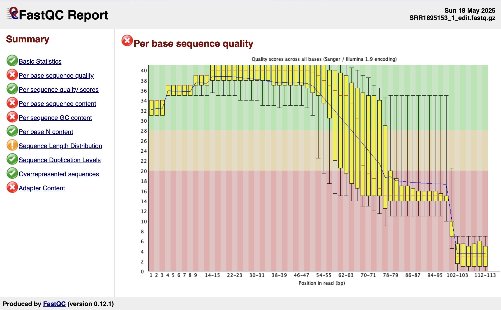
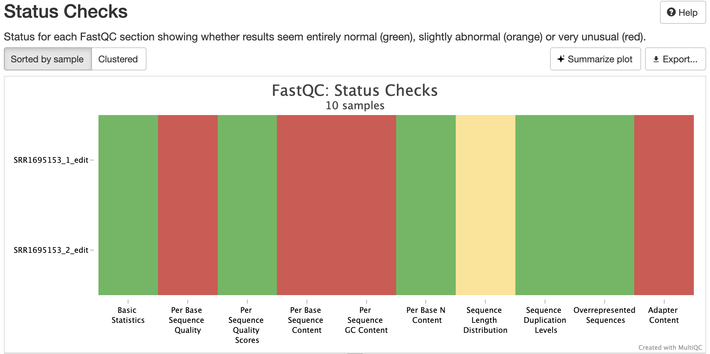
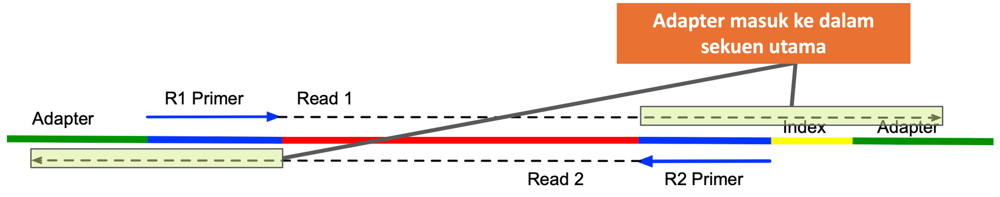

<p style="text-align: right; font-size: 0.9rem;">
  <a href="https://www.bowo.digital/" style="font-weight: bold;">← Beranda</a>
  &nbsp;&nbsp;|&nbsp;&nbsp;
  <a href="https://www.bowo.digital/docs/part1.html" style="font-weight: bold;">Pilih materi →</a>
</p>

<h1 style="text-align: center; font-size: 2.5rem; font-weight: bold; margin-bottom: 0.5rem;">
  <a href="https://www.bowo.digital/docs/teknis-quality-control.html" style="text-decoration: none; color: inherit;">
    Quality control hasil sequencing
  </a>
</h1>

<p style="text-align: center; font-size: 1.2rem;">
  Oleh <a href="https://www.bowo.digital/docs/bio.html" target="_blank">Agus Wibowo</a>
</p>

<div style="text-align: center; margin-bottom: 1.5rem;">
  
</div>

<br>

# Daftar isi

-   [Apa itu quality control dan mengapa penting?](#apa-itu-quality-control-dan-mengapa-penting)
-   [Mendownload data sekuen](#mendownload-data-sekuen)
-   [FASTQC dan MULTIQC](#fastqc-dan-multiqc)
-   [Kenapa kualitas data sekuensing bisa jelek?](#kenapa-kualitas-data-sekuensing-bisa-jelek)
-   [Mengatasi data sekuensing berkualitas rendah dengan FASTP]()
-   [VCF: Menyimpan informasi variasi genetik]()
-   [SRA: Gudangnya data NGS dunia]()
-   [Memahami format = Menguasai analisis]()

>   **Catatan**: Dalam tutorial ini, kita akan bekerja menggunakan pemrograman Bash dalam lingkungan Linux. Anda dapat menggunakan VS code baik untuk membuat script R maupun menjalankan script Bash tersebut via terminal.

# Apa itu *quality control* dan mengapa penting?

Bayangkan Anda mengambil foto dengan kamera harga ratusan juta, tapi lensa yang digunakan berembun. Hasilnya? Gambar blur yang nyaris tak bisa dilihat. Begitu juga dengan data sekuensing DNA yang kualitasnya buruk—tak peduli seberapa canggih analisisnya, hasilnya tetap tidak akan optimal.

*Next-Generation Sequencing* (NGS) telah membuka jendela baru untuk mengintip rahasia genetik makhluk hidup. Dalam sekali eksperimen, jutaan fragmen DNA berhasil dibaca! Tapi jumlah besar ini tidak otomatis menjamin kualitas. Seperti memilah berlian dari kerikil, *quality contro*l (QC) menjadi langkah krusial untuk memastikan data yang kita analisis benar-benar berharga.

# Mendownload data sekuen

Dalam tutorial ini, kita menggunakan data dari studi oleh [Robledo et al. (2014)](https://bmcgenomics.biomedcentral.com/articles/10.1186/1471-2164-15-1149) yang meneliti respons transkriptomik ikan turbot (*Scophthalmus maximus*) terhadap infeksi *Enteromyxum scophthalmi*, penyebab enteromikosis. Penelitian ini menganalisis perubahan ekspresi gen di ginjal, limpa, dan usus menggunakan RNA-seq berbasis Illumina HiSeq 2000. 

Dataset lengkap dapat diakses melalui [ENA (European Nucleotide Archive)](https://www.ebi.ac.uk/ena/browser/view/PRJNA269386) dengan kode proyek PRJNA269386. Karena ukuran total data mencapai sekitar 27 GB, dalam tutorial ini kita hanya menggunakan satu file sequencing yaitu SRR1695153, yang berasal dari organ limpa. File ini telah dimodifikasi untuk keperluan edukasi sehingga ukurannya menjadi lebih kecil (56 MB) dan lebih mudah diolah. Bagi yang tertarik mempelajari proses manipulasi data tersebut, kode lengkapnya dapat didownload <a href="/code/fastq_manip.py" download>di sini</a>.

Buat forlder baru untuk menyimpan dan mendownload file FASTQ yang sudah dikompresi dengan gunzip dengan cara:

```bash
# bash

# buat folder baru
mkdir -p data_fastq/

# masuk ke direktori data_fastq/
cd data_fastq/

# download data SRR
wget https://huggingface.co/datasets/Antijokowisme16/fastqc_data/resolve/main/SRR1695153_R1_edit.fastq.gz
wget https://huggingface.co/datasets/Antijokowisme16/fastqc_data/resolve/main/SRR1695153_R2_edit.fastq.gz

# ubah akses ke read-only
chmod u-w *fastq.gz
```

> **Catatan:** Setiap hasil sequencing yang menggunakan *paired-end reads* maka akan selalu memiliki 2 file reads (R1 dan R2) untuk setiap sampel. 

# FASTQC dan MULTIQC

Setalah data didownload dan pada terminal kita berada di direktori `data_fastq/`, maka langkah selanjutnya adalah menginstall tools [FASTQC](https://www.bioinformatics.babraham.ac.uk/projects/fastqc/). FASTQC adalah tool yang digunakan untuk melakukan *quality control* awal terhadap data *sequencing*, dengan memberikan ringkasan visual mengenai kualitas base, *adapter contamination*, *overrepresented sequences*, dan metrik penting lainnya dalam file FASTQ. Sementara MULTIQC merupakan tools untuk membantu meringkas hasil dari FASTQC, sangat bermanfaat jika kita bekerja dengan banyak data sekuensing.

Install FASTQC melalui anaconda Python dengan langkah-langkah sebagai berikut:

```bash
# bash
# buat env khusus untuk QC data sequencing dengan nama misalnya: qc_sequencing
conda create --name qc_sequence python=3.11

# aktifkan env qc_sequencing
conda activate qc_sequencing

# install fastqc
conda install fastqc multiqc
```

Untuk melakukan quality control dengan FASTQC pada data FASTQ, cukup gunakan perintah berikut setelah membuat direktori baru untuk menyimpan file hasil QC.

```bash
# bash
# buat direktori hasil QC
mkdir -p fastqc

# jalankan fastqc
fastqc *.fastq.gz -o fastqc/

# jalankan multiqc
multiqc fastqc/ -o fastqc/
```

> **Catatan:** Setiap perintah yang menggunakan simbol `*` diikuti dengan jenis file, misalnya `*.fastq.gz` maka perintah tersebut akan memproses semua file dengan format .fastq.gz. Teknik ini sangat bermanfaat jika kita ingin memproses banyak file dengan jenis file yang sama.

Setelah menjalankan FASTQC, di dalam folder `fastqc/` akan terdapat dua jenis file: file berakhiran `.html` yang berisi laporan visual hasil analisis kualitas, dan file `.zip` yang berisi data mentah serta detail dari laporan tersebut. Untuk keperluan evaluasi, kita cukup membuka file `.html` menggunakan browser seperti Chrome atau Safari, maka akan tampil hasil seperti ini.

<div style="text-align: center;">
  
</div>

Anda juga bisa observasi langsung hasil MULTIQC yang dikerjakan untuk semua file FASTQ tanpa tanpa harus menjalankan semua perintah tadi dengan klik link berikut: [Hasil MULTIQC](results/multiqc_report.html)

## Interpretasi

Hasil FASTQC atau MULTIQC akan menampilakan beberapa hal diantaranya:

1.  ***Basic Statistics***
  
    Menyediakan ringkasan umum data, seperti jumlah total reads, panjang reads, dan format kualitas encoding. Dalam data yang kita kerjakan, kedua sampel memiliki jumlah reads sekitar 300 ribu dengan kandungan GC stabil di 48%, menunjukkan komposisi basa yang normal.

2.  ***Per base sequence quality***

    Menampilkan distribusi nilai kualitas (*Phred score*) untuk setiap posisi basa di dalam reads. Ini penting untuk melihat apakah kualitas menurun di bagian akhir reads.
3.  ***Per sequence quality scores***

    Menunjukkan distribusi nilai kualitas rata-rata per read, untuk mengetahui apakah sebagian besar reads memiliki kualitas tinggi.

4.  ***Per base sequence content***

    Memvisualisasikan proporsi basa A, T, G, dan C di setiap posisi. Pola tidak seimbang bisa mengindikasikan bias library preparation. 

5.  ***Per sequence GC content***

    Menampilkan distribusi kandungan GC dari semua reads dan membandingkannya dengan distribusi teoritis. Perbedaan signifikan bisa menandakan kontaminasi.

6.  ***Per base N content***

    Menunjukkan persentase basa yang tidak dapat ditentukan (N) di setiap posisi basa.

7.  ***Sequence Length Distribution***

    Memperlihatkan distribusi panjang reads. Idealnya, semua reads memiliki panjang yang seragam, terutama untuk data Illumina.

8.  ***Sequence Duplication Levels***

    Menunjukkan proporsi reads yang terduplikasi. Duplikasi tinggi bisa terjadi karena over-amplifikasi atau bias library.

9.  ***Overrepresented sequences***

    Mengidentifikasi reads yang muncul terlalu sering, yang dapat mengindikasikan kontaminasi atau adapter yang belum dibuang.

10. ***Adapter Content***

    Mengukur seberapa banyak urutan adapter yang masih tersisa dalam data. Tingginya konten adapter berarti trimming perlu dilakukan.

11. ***Kmer Content***

    Mengidentifikasi motif pendek yang muncul secara berlebih, yang bisa mengindikasikan kontaminasi atau bias teknis lainnya.

Pada data yang kita kerjakan, terutama yang ditampilkan pada tab "**Status Check**" dalam hasil MULTIQC, metrik seperti *Per base sequence quality*, *Per base sequence content*, *Per sequence GC content*, dan *Adapter Content*, berwarna merah, mengindikasikan ada MASALAH pada sekuen yang kita kerjakan. 

<div style="text-align: center;">
  
</div>

# Kenapa kualitas data sekuensing bisa jelek?

Dalam proses sekuensing, salah satu masalah umum yang sering terjadi adalah masuknya sekuan adapter ke dalam hasil pembacaan. Hal ini biasanya disebabkan oleh potongan/fragmen DNA yang terlalu pendek dibandingkan panjang read yang dihasilkan oleh mesin sekuensing. Akibatnya, saat mesin membaca DNA dari kedua arah (*paired-end*), ia tidak hanya membaca urutan target, tetapi juga melampaui ujung fragmen dan mulai membaca bagian adapter. Seperti ditunjukkan pada gambar di bawah, di mana urutan adapter muncul dalam read karena panjang insert terlalu pendek.

<div style="text-align: center;">
  
</div>

Urutan adapter sendiri sebenarnya dibutuhkan pada tahap awal proses sekuensing, karena berfungsi sebagai tempat menempel primer dan memungkinkan amplifikasi serta pengikatan ke *flow cell*. Namun, apabila adapter tidak dihapus dari data mentah, keberadaannya dapat mengganggu proses downstream seperti pemetaan (mapping) atau anotasi. Oleh karena itu, langkah *trimming* adapter menjadi bagian penting dalam preprocessing data sekuensing, untuk memastikan hanya urutan biologis yang relevan yang dianalisis lebih lanjut.

Di sisi lain, pada sekuensing *long-read* seperti Oxford nanophore atau PacBio, tantangan QC berbeda dari teknologi *short-read* (Illumina). Panjang read menjadi metrik penting, karena read panjang cenderung lebih informatif, meski read yang sangat panjang bisa merupakan artefak. Proses penghapusan adapter juga lebih sulit akibat tingkat kesalahan yang tinggi. Nilai kualitas basa di ujung read sering rendah, dan tidak selalu mencerminkan panjang read, tidak seperti pada platform Illumina.

# Mengatasi data sekuensing berkualitas rendah dengan FASTP

Dalam contoh data yang kita kerjakan, ada 3 masalah utama:

1.  Kualitas Basis Menurun di Bagian Akhir.

    Grafik Per base sequence quality menunjukkan bahwa kualitas sekuens menurun drastis setelah posisi ~70 bp, dan sangat buruk setelah 100 bp (banyak nilai di zona merah < Q20). Ini sering terjadi karena efisiensi pembacaan menurun seiring bertambahnya siklus sequencer.

2.  Isi Adapter (*Adapter Content*)

    Tanda silang merah di bagian Adapter Content mengindikasikan bahwa urutan adapter masih muncul dalam data.

3.  Distribusi Panjang Read Variatif

    Diberi tanda seru (!) untuk *Sequence Length Distribution*, artinya panjang read bervariasi dari 36 hingga 113 bp. Ini menandakan sekuen belum seragam atau memang berasal dari library dengan panjang fragment bervariasi.

Nah, di sinilah proses trimming berperan penting, untuk memastikan bahwa kita menggunakan data yang benar-benar siap analisis. Dalam tutorial ini, kita akan menggunakan [FASTP](https://academic.oup.com/bioinformatics/article/34/17/i884/5093234) untuk mengatasi memotong dan mengatasi masalah umum dalam data hasil sekuen. Dibandingkan dengan Trimmomatic, FASTP menawarkan proses yang lebih cepat, otomatis, dan user-friendly. Selain itu, FASTP juga mampu mendeteksi adapter secara otomatis dan menghasilkan laporan kualitas dalam format HTML, sehingga sangat efisien untuk analisis awal data sekuensing. 

Install FASTP melalui anaconda:

```bash
# bash
# pastikan anda masih mengaktifkan env qc_sequencing
conda install fastp

# menampilkan dokumentasi FASTP
fastp --help
```

Ringkasnya, perintah umum FASTP jika kita menangani data jenis *paired-end reads* adalah;

```bash
# bash
fastp -i input.fastq -o output_cleaned.fastq \
  -q 20 \
  --cut_right \
  --cut_right_mean_quality 20 \
  --adapter_sequence=AGATCGGAAGAGC \
  -l 36
```

Penjelasan perintah:

- `fastp -i input.fastq -o output_cleaned.fastq` - Menjalankan `fastp` dengan input file `input.fastq` dan menyimpan hasil yang telah dibersihkan ke `output_cleaned.fastq`.
- `-q 20` - Filter global untuk membatasi hanya base dengan nilai Phred ≥ 20 (artinya error rate ≤ 1%). Base yang nilainya lebih rendah bisa di-trim atau dibuang tergantung konteks pengaturannya.
- `--cut_right` - Mengaktifkan mode trimming dari sisi kanan (akhir) read. Ini berguna saat bagian ujung read menunjukkan penurunan kualitas, seperti yang terlihat pada data yang kita miliki
- `--cut_right_mean_quality 20` - Menentukan ambang kualitas rata-rata di ujung kanan yang digunakan untuk memutuskan kapan trimming harus berhenti. Jika rata-rata kualitas pada posisi tertentu < 20, maka bagian itu dan sesudahnya akan dipotong.
- `--adapter_sequence=AGATCGGAAGAGC` - Menentukan adapter sequence Illumina yang akan dicari dan dihapus dari read. Ini sangat penting karena sampel sekuens kita mengandung sisa adapter.
- `-l 36` - Menyaring hasil akhir agar hanya menyimpan read yang memiliki panjang minimal 36 bp. Sehingga read yang lebih pendek dari ini setelah trimming akan dibuang.


