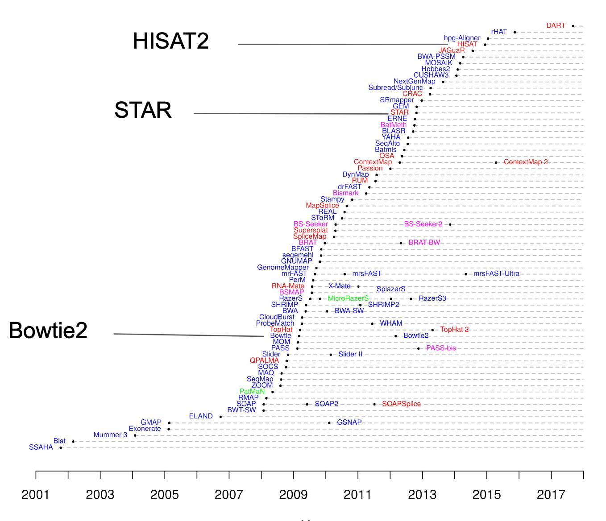

<p style="text-align: right; font-size: 0.9rem;">
  <a href="https://www.bowo.digital/" style="font-weight: bold;">← Beranda</a>
  &nbsp;&nbsp;|&nbsp;&nbsp;
  <a href="https://www.bowo.digital/docs/part2.html" style="font-weight: bold;">Pilih materi →</a>
</p>

<h1 style="text-align: center; font-size: 2.5rem; font-weight: bold; margin-bottom: 0.5rem;">
  <a href="https://www.bowo.digital/docs/work-RNA-seq.html" style="text-decoration: none; color: inherit;">
    RNA-Seq: Dari reads ke ekspresi gen
  </a>
</h1>

<p style="text-align: center; font-size: 1.2rem;">
  Oleh <a href="https://www.bowo.digital/docs/bio.html" target="_blank">Agus Wibowo</a>
</p>

<div style="text-align: center; margin-bottom: 1.5rem;">
  
</div>

<br>

# Daftar isi

-   [Apa itu studi RNA-seq?](#apa-itu-studi-rna-seq)
-   [Tentang data yang digunakan dan persiapannya](#tentang-data-yang-digunakan-dan-persiapannya)
-   [*Quality control* data *sequencing*](#quality-control-data-sequencing)
-   [Memilih tools bioinformatika](#memilih-tools-bioinformatika)
-   [Menyiapkan index referensi dengan HISAT2](#menyiapkan-index-referensi-dengan-hisat2)
-   [Alignment dan konversi dari SAM ke BAM](#alignment-dan-konversi-dari-sam-ke-bam)
-   [Merakit transkrip dan menghitung level ekspresi gen menggunakan StringTie](#merakit-transkrip-dan-menghitung-level-ekspresi-gen-menggunakan-stringtie)
-   [Analisis korelasi antar sampel](#analisis-korelasi-antar-sampel)
-   [Analisis perbedaan ekspresi](#analisis-perbedaan-ekspresi)
-   [Analisis fungsi gen - GO dan KEGG *pathway*](#analisis-fungsi-gen---go-dan-kegg-pathway)
-   [Apa yang perlu dipertimbangkan sebelum studi RNA-seq](#apa-yang-perlu-dipertimbangkan-sebelum-studi-rna-seq)

> **Catatan**: Jika Anda mengikuti tutorial ini dari awal hingga akhir, perlu diketahui bahwa proses alignment dan kuantifikasi ekspresi memerlukan sumber daya komputasi yang cukup dan waktu yang tidak singkat. Sebagai gambaran, ketika saya menjalankan proses ini di *laptop dengan RAM 12 GB dan prosesor Intel i5 gen 10 pada LINUX UBUNTU*, ini memerlukan waktu sekitar *4 jam*. Sehingga, tutorial ini mungkin masih *achievable*.
> 
> Pastikan juga Anda memiliki ruang penyimpanan data yang cukup, minimal 50 - 100 GB disertai dengan koneksi internet yang stabil untuk mendownload data FASTQ.
>
> Namun jangan khawatir, bagi Anda yang tidak memiliki akses ke komputer dengan spesifikasi tinggi, saya telah menyediakan file hasil preproses dalam format `*.rds` yang siap dianalisis, tapi setidaknya Anda memahami *workflow* umum dalam studi RNA-seq. 
>
> Dalam tutorial ini, kita akan menggunakan bahasa pemrograman Bash dan R dalam lingkungan Linux. Anda bisa menggunakan VS Code baik untuk mengedit skrip maupun menjalankannya melalui terminal secara langsung. Script bash dan R untuk menangani data dalam tutorial ini sudah saya sediakan.

# Apa itu studi RNA-Seq?

## Menyelami percakapan genetik

RNA sequencing (RNA-seq) adalah teknologi sekuensing generasi baru yang memungkinkan kita “mendengar” aktivitas gen dalam sel untuk mengetahui gen mana yang aktif, seberapa besar ekspresinya, dan bagaimana ekspresi itu berubah dalam berbagai kondisi biologis. Tidak seperti microarray yang hanya mendeteksi gen yang telah diketahui sebelumnya, RNA-seq memetakan seluruh transkriptom (semua RNA yang aktif dalam sel pada waktu tertentu), termasuk RNA langka dan varian splicing baru yang belum pernah teridentifikasi.

Teknologi ini telah merevolusi biologi molekuler dengan menghadirkan gambaran menyeluruh tentang dinamika ekspresi gen, baik pada level jaringan maupun, lebih baru lagi, pada level sel tunggal melalui pendekatan *single-cell* RNA-seq. Pendekatan ini membuka jendela terhadap keragaman seluler yang sebelumnya tersembunyi, memungkinkan identifikasi tipe sel baru, jalur diferensiasi, dan respons sel spesifik terhadap lingkungan.

## Mengapa penting untuk akuakultur?

Dalam konteks akuakultur, RNA-seq menjadi alat yang strategis dan canggih untuk memahami bagaimana respon organisme budidaya terhadap suatu kondisi tertentu, misalnya stres, penyakit, pakan, serta kondisi lingkungan secara molekuler. Sehingga kita dapat mengungkap gen-gen yang terlibat dalam imunitas, pertumbuhan, metabolisme, hingga adaptasi terhadap budidaya intensif.

Penerapannya mencakup identifikasi biomarker untuk deteksi dini penyakit, seleksi genomik berbasis ekspresi gen, optimalisasi pakan, pengembangan strain unggul, hingga penerapan *gene editing* (CRISPR). Misalnya, dengan menggunakan *single-cell* RNA-seq, kita bisa mengeksplorasi peran masing-masing sel dalam organ penting seperti hati, usus, insang atau organ lain untuk menghadirkan wawasan yang jauh lebih tajam untuk manajemen kesehatan dan nutrisi.

## Dari gen ke keputusan produksi

RNA-seq menjembatani dunia molekuler dan praktik budidaya. Dengan memahami "bahasa" genetik secara mendalam, kita tak hanya menjawab pertanyaan biologis, tetapi juga membuat keputusan produksi yang lebih presisi, efisien, dan berkelanjutan. RNA-seq bukan sekadar teknologi, melainkan fondasi untuk membangun akuakultur yang cerdas, yang tidak lagi menebak, tapi memahami langsung apa yang sebenarnya dibutuhkan oleh organisme budidaya.

<figure style="text-align: center;">
  
  <figcaption style="font-size: 0.95em; margin-top: 8px; text-align: left;">
    <strong>Integrasi RNA-Seq dan data serologi untuk prediksi alergi ikan.</strong> Dengan menganalisis ekspresi dan konservasi gen alergen, terutama parvalbumin (PV), studi kita bisa mengaitkan data molekuler ikan dengan respons imun seseorang. Hasilnya digunakan untuk merancang strategi diagnosis alergi ikan yang lebih spesifik dan personal untuk meningkatkan akurasi deteksi alergi antarspesies.
    <br><em>Sumber gambar:</em> <a href="https://www.mdpi.com/1422-0067/25/19/10784" target="_blank">Liu et al 2024</a>
  </figcaption>
</figure>

# Tentang data yang digunakan dan persiapannya

## Studi analisis ekspresi gen pada ikan Turbot

Dalam tutorial ini, kita menggunakan data dari studi oleh [Robledo et al. (2014)](https://bmcgenomics.biomedcentral.com/articles/10.1186/1471-2164-15-1149) yang meneliti respons transkriptomik ikan sebelah (*Scophthalmus maximus*) terhadap infeksi *Enteromyxum scophthalmi*, penyebab enteromikosis. Penelitian ini menganalisis perubahan ekspresi gen di ginjal, limpa, dan usus menggunakan RNA-seq berbasis *short reads sequencing* (Illumina HiSeq 2000 - *paired-end reads*) untuk melihat bagaimana jaringan merespons infeksi pada tingkat molekuler. Melalui analisis ini, kita bisa memperoleh wawasan baru mengenai mekanisme patogenesis enteromikosis melalui identifikasi sejumlah besar gen yang terekspresi berbeda (DE genes)sebagai langkah penting menuju pengembangan strategi pengendalian penyakit yang lebih efektif.

<figure style="text-align: center;">
  
  <figcaption style="font-size: 0.95em; margin-top: 8px; text-align: left;">
    <strong>Ikan sebelah dengan infeksi parasit</strong>
    <br><em>Sumber gambar:</em> <a href="https://www.necropsymanual.net/en/additional-info/fpa/" target="_blank">Fish pathology</a>
  </figcaption>
</figure>

## Persiapan data hasil sekuensing

Dataset lengkap dapat diakses melalui [ENA (European Nucleotide Archive)](https://www.ebi.ac.uk/ena/browser/view/PRJNA269386) dengan kode proyek PRJNA269386. Untuk melihat detail eksperimen, kita bisa klik pada bagian "*Sample Accession*", di sana terdapat informasi seperti perlakuan dan organ yang digunakan. 

Pada database, kita akan mengunduh semua data performat `*.fastq.gz` (sekitar 27 GB). Untuk memudahkan, Anda dapat mengklik tombol “*Download All*” pada bagian “*Generated FASTQ files*: FTP”. Tindakan ini akan mengunduh sebuah file `.sh`, yaitu skrip otomatis yang dapat dijalankan menggunakan `wget` untuk mengunduh semua file *paired-end reads* FASTQ secara langsung.

Setelah mengunduh file `.sh`, jalankan perintah bash berikut satu persatu di terminal.

```bash
#bash
# buat folder tempat menyimpan data fastq.gz
mkdir -p raw_data

# pindahkan script .sh ke raw_data
mv file_script_download_ena.sh raw_data/file_script_download_ena.sh

# download semua file fastq.gz
bash raw_data/file_script_download_ena.sh
```

Tunggu proses pengunduhan data, mungkin akan memakan waktu cukup lama tergantung kecepatan internet yang Anda miliki, "*so, be chill and take your coffee*. Setelah selesai, semua file *.fastq.gz akan berada di dalam folder `raw_data`.

Perhatikan penamaan filenya:

-   `SRR`: singkatan dari *Sequence Read Run* yang merupakan ID akses unik (*run accession*) dari satu unit percobaan sekuensing.
-   7 digit angka setelah `SRR`: merepresentasikan kode percobaan yang mana 2 angka terakhir merepresentasikan detail perlakuan. Misalnya "48" merepresentasikan organ ginjal dengan perlakuan "terinfeksi".
-   `_1.fastq.gz` dan `_2.fastq.gz`: menunjukkan bahwa data ini berasal dari *paired-end sequencing*, artinya satu fragmen DNA dibaca dari dua arah, *forward* (_1) dan *reverse* (_2). Semua file pada dasarnya berformat FASTQ, namun dikompresi dengan gunzip.

Memahami penamaan file ini sangat penting karena membantu kita mengelola dan mengidentifikasi data sekuensing dengan benar, terutama saat bekerja dengan banyak sampel.

## Menyiapkan *reference genome*

Selain data *reads* hasil *sequencing*, kita juga membutuhkan genom referensi yang valid untuk *alignment*. Untuk Turbot, kita dapat menunduh 2 jenis file dari NCBI, yaitu:

-   Genom referensi dengan format: `_genomic.fna.gz`
-   Anotasi genom dengan format: `_genomic.gff.gz`

Download kedua data ini dengan menggunakan `wget`:

```bash
# bash
# buat folder untuk menyimpan genom referensi
mkdir -p reference

# download genom referensi dan anotasinya dan simpan ke folder reference
wget -O reference/GCF_022379125.1_ASM2237912v1_genomic.fna.gz https://ftp.ncbi.nlm.nih.gov/genomes/all/GCF/022/379/125/GCF_022379125.1_ASM2237912v1/GCF_022379125.1_ASM2237912v1_genomic.fna.gz
wget -O reference/GCF_022379125.1_ASM2237912v1_genomic.gff.gz https://ftp.ncbi.nlm.nih.gov/genomes/all/GCF/022/379/125/GCF_022379125.1_ASM2237912v1/GCF_022379125.1_ASM2237912v1_genomic.gff.gz

# ekstrak file genom referensi dan anotasi
gunzip reference/GCF_022379125.1_ASM2237912v1_genomic.fna.gz
gunzip reference/GCF_022379125.1_ASM2237912v1_genomic.gff.gz
```

Sekarang kita sudah memiliki semua data yang dibutuhkan. 

1.  File *reads* hasil sequencing yang disimpan di: `raw_data/*.fastq.gz`
2.  Genom referensi dan anotasinya yang disimpan di: `reference/`


# *Quality control* data *sequencing*

## Inspeksi awal file sequencing

Cara paling sederhana untuk melihat seperti apa hasil sequencing adalah melalui terminal bash. 

Pertama, kita bisa lihat terlebih dahulu bagaimana struktur file `.fastq.gz` menggunakan `head`.

```bash
# bash
# lihat struktur file SRR1695148_1.fastq.gz
gunzip -c SRR1695148_1.fastq.gz | head
```

Perintah di atas akan menghasilkan 3 sekuen yang kodenya selalu diawali dengan `@`, di bawahnya secara berturut-turut adalah urutan basa DNA dan skor kualitas:

```bash
@SRR1695148.1 1/1
GTGTGCTCCAGCAGCCTAACCGGATCCTAATTTTTGACTTCCCAGCGTCTTCTACAGTTCCTTTCTCATCAATGGGCTGCAGACGATCATCCTTCTCCAG
+
@@@BDEFFHHHHGJJIJGGJJJI@FHIGGGIIJJJFGCHIGIFGGGIJJIJJJIIEHDEGHHHHHGGCDEDFFECACEDDDCDDDDDDDDDDDDDDDDDC
@SRR1695148.2 2/1
GGGACTTCTATCTTGAGTTACTACGAGTGAATCCAGGCTAACCTTACAGAAAGTGGAAACAGTATATTTATAGCACATCTGGCAGGGCAGCCTTCTTTG
+
1:B=ADDHFFFHIIGEIHIDHFCFEEGHCHGIIFGFG?DHIIIHH<FEHCDEHHGIGGGI<FFHGIIIIIIIEEEHHE@EHEEEECC?@BB=?>CCCC@
@SRR1695148.3 3/1
TGTGTTGTACTTCATGTCCACTGGCAAGCCGTTGTCAGAAACCTGACGGAGGACCCAGGCACCACGACGAGTGCTCAGATAAACCTCCTCAGCTACTCT
```

Untuk penjelasan detail tentang format file FASTQ, bisa lihat pada artikel: [Mengenal berbagai format file NGS](https://www.bowo.digital/docs/teknis-file-format.html#fasta--fastq-format-dasar-ngs-dan-kualitasnya)

Kemudian, jika kita ingin mengetahui seberapa panjang setiap *reads* dan berapa banyak *reads* yang dihasilkan, kita bisa menggunakan `gunzip` yang dikombinasikan dengan `tail`, `wc`, dan `awk`.

```bash
# bash
# melihat seberapa panjang sekuen untuk 50 reads dan melihat konsitensinya
gunzip -c SRR1695148_1.fastq.gz | head -n 100 | tail -n 1 | wc -c

# melihat ada berapa banyak reads
gunzip -c SRR1695148_1.fastq.gz | awk 'END {print NR/4}'
```

Secara berturut-turut, output dari perintah di atas akan menghasilkan:

```php
# panjang urutan basa nukleotida
101

# jumlah reads
17260721
```

Penjelasan perintah:
-   `gunzip -c`: membuka file `.gz` tanpa perlu meng-ekstrak nya karena menggunakan option `-c`.
-   `head -n 100`: mengambil informasi untuk 50 nukleotida (baris pertama adalah header reads dan baris kedua adalah urutan sekuen nukleotida).
-   `tail -n 1`: mengambil baris ke-2 saja (urutan basa nukleotida)
-   `wc -c`: menghitung berapa banyak karakter (banyaknya basa nukleotida)
-   `awk 'END {print NR/4}'`: menghitung total baris (NR - Number of Reads), lalu membaginya dengan 4 (karena setiap read FASTQ terdiri dari 4 baris).
-   Antar perintah selalu dihubungkan dengan *pipe* (`|`), artinya --> gunakan hasil dari perintah "x" untuk perintah "y".

Jadi secara umum, proses *sequencing paired-ends* berhasil membaca sekitar **17 juta** *reads* dengan masing-masing *reads* berisi **101 basa nukleotida**.

## *Quality control* data FASTQ

Sampai tahap ini, kita hanya mengetahui bagaimana struktur hasil sekuensing dan berapa banyak *reads* yang dihasilkan, tapi belum mengetahui bagaimana kualitas keseluruhan data hasil *sequencing* dan perlukah data yang diperoleh "diolah" sehingga siap untuk proses berikutnya. Di sinilah tahap *quality control* (QC) diperlukan.

Sebelumnya, perlu diketahui bahwa setiap data yang di-*publish* di database seperti ENA atau NCBI-SRA, semuanya adalah data yang "bersih" dan siap analisis, sehingga pada dasarnya kita bisa lewati tahap QC. Namun jika Anda melakukan penelitian RNA-seq dan menerima hasil sekuensing dari Illumina misalnya, proses QC adalah tahapan WAJIB. Untuk mengetahui bagaimana proses ini dilakukan, Anda bisa pelajari pada artikel berjudul: [Quality control hasil *sequencing*](https://www.bowo.digital/docs/teknis-quality-control.html).

# Memilih tools bioinformatika

Pemilihan tools bioinformatika dalam studi RNA-seq sebaiknya disesuaikan dengan kebutuhan spesifik dari studi dan pertanyaan biologis yang ingin dijawab. Hal ini penting karena hingga saat ini, telah dikembangkan ratusan tools dengan fungsi, kelebihan, dan kekurangan masing-masing, mulai dari tahap *preprocessing*, *alignment*, kuantifikasi, hingga analisis diferensial.

Misalnya, jika fokus penelitian hanya *screening* awal ekspresi gen dengan memprioritaskan kecepatan dan efisiensi komputasi, maka tools *pseudo-alignment* seperti [Salmon](https://www.nature.com/articles/nmeth.4197) atau [Kallisto](https://doi.org/10.1038/nbt.3519) bisa menjadi pilihan yang tepat. Namun, jika studi memerlukan informasi posisi genomik secara akurat, seperti mendeteksi *splice junction* dan mencari variasi gen baru, maka pendekatan *full alignment* ke genom seperti [STAR](https://doi.org/10.1093/bioinformatics/bts635), [HISAT2](https://doi.org/10.1038/s41587-019-0201-4), atau [Bowtie2](https://doi.org/10.1038/nmeth.1923) lebih disarankan.

<figure style="text-align: center;">
  
  <figcaption style="font-size: 0.95em; margin-top: 8px; text-align: left;">
    <strong>Perkembangan tools alignment dari tahun ke tahun</strong> 
    <br><em>Sumber gambar:</em> <a href="https://bioinformatics.ccr.cancer.gov/docs/b4b/RNASeq_Overview/05.Alignment/" target="_blank">bioinformatics.ccr.cancer.gov</a>
  </figcaption>
</figure>

Pada tutorial ini misalnya, karena tujuannya selain untuk mengetahui perbedaan ekspresi gen dari dua kondisi (normal vs infeksi), penemuan varian gen baru (*alternative splicing*) juga menjadi prioritas. Maka, HISAT2 sebagai *aligner*, [StringTie](https://doi.org/10.1186/s13059-019-1910-1) sebagai *quantifier*, dan [DESeq2](https://doi.org/10.1186/s13059-014-0550-8) sebagai *differential expression analyzer* dipilih karena kombinasi ini memberikan keseimbangan optimal antara akurasi deteksi dan kemampuan penemuan varian baru.

HISAT2 unggul dalam menangani karakteristik unik RNA-seq dengan *algoritma splice-aware* yang dapat mengidentifikasi *novel splice junctions* secara akurat sambil mempertahankan kecepatan *alignment* yang *reasonable* untuk dataset besar. StringTie kemudian melakukan *transcript assembly* dan kuantifikasi secara simultan, memungkinkan penemuan isoform baru yang tidak ada dalam anotasi referensi. DESeq2 dipilih karena menyediakan framework statistik yang robust untuk analisis differential expression dengan normalisasi yang tepat untuk *count data* RNA-seq.

Di sisi lain, tutorial ini juga menyediakan data hasil dari pipeline Bowtie2 + [RSEM](https://doi.org/10.1186/1471-2105-12-323) untuk perbandingan. Pipeline Bowtie2 + RSEM lebih cepat dan memberikan estimasi *abundance* yang akurat untuk *transcript* yang sudah teranotasi, namun terbatas dalam menemukan *alternative splicing* baru karena Bowtie2 bukan *splice-aware aligner* dan RSEM hanya mengkuantifikasi *transcript* yang sudah ada dalam referensi.

Perbandingan kedua pipeline ini penting untuk memahami *trade-off* antara kecepatan komputasi dan kemampuan *discovery*. Dengan menyajikan kedua pendekatan, tutorial ini memberikan pemahaman praktis tentang bagaimana pilihan tools dapat mempengaruhi hasil analisis dan membantu peneliti menentukan strategi yang sesuai dengan tujuan penelitian mereka.

> ***Catatan:*** Karena proses analisis RNA-Seq cukup panjang dan kompleks, terutama jika dikerjakan untuk banyak sampel satu per satu, di akhir tutorial ini saya sudah menyiapkan *script* dan konfigurasi yang bisa langsung digunakan. Semua sudah dirancang agar dapat menangani banyak sampel sekaligus menggunakan pipeline: HISAT2 - StringTie - DESeq2, selama data berasal dari *paired-end reads*, apapun jenis sampelnya.

# Instalasi tools untuk RNA-Seq

Dalam tutorial ini, kita membutuhkan 4 tools utama, yaitu; `HISAT2` untuk *alignment*, `Samtools` untuk konversi file `.sam` ke `.bam`, `StringTie` untuk kuantifikasi ekspresi, `DESeq2` untuk analisis perbedaan ekspresi gen, serta beberapa paket R lainnya.

Karena HISAT2, Samtools, dan StringTie tersedia melalui conda, maka kita dapat menjalankan perintah sebagai berikut.

```bash
# bash
# buat dan aktifkan environment baru (opsional namun disarankan)
conda create -n rna_seq -y
conda activate rna_seq

# instalasi tools utama
conda install -c bioconda hisat2 samtools stringtie -y
```

Install paket-paket dari R dengan perintah berikut

```bash
# masuk ke R console melalui terminal dengan mengetikkan R
R
```

Jalankan proses instalasinya satu-persatu mulai dari instalasi paket dari Bioconductor dan dilanjutkan dengan instalasi paket dari CRAN:

```r
# r
# install paket dari Bioconductor
BiocManager::install(c("DESeq2", "limma", "ComplexHeatmap"))

# install paket dari CRAN
install.packages(c(
  "tidyverse", "ggrepel", "RColorBrewer", "viridis", "pheatmap",
  "VennDiagram", "patchwork", "corrplot", "ggcorrplot", 
  "grid", "reshape2", "circlize", "stringr", "dplyr"
))

# terakhir, keluar dari console R dengan perintah
q() # y --> Enter
```

# Menyiapkan index referensi dengan HISAT2

Index referensi adalah langkah awal yang penting dalam analisis RNA-seq, di mana komputer membangun “peta navigasi” genom untuk memandu proses *alignment* (pencocokan fragmen RNA ke lokasi asalnya di DNA). Tanpa index, *alignment* akan seperti penyusunan puzzle tanpa melihat gambar aslinya. Proses ini mencakup ekstraksi informasi dari anotasi genom (seperti exon dan *splice sites*), lalu menyusunnya bersama urutan genom menjadi struktur data yang dioptimalkan agar *alignment* bisa dilakukan secara cepat dan presisi.

Sebelum membuat index, kita perlu mengekstraksi *splice site* dan daerah exon dari file `.gtf`. Gunakan perintah berikut.

```bash
# bash
# buat direktori kerja HISAT-StringTie
mkdir -p HISAT-StringTie

hisat2_extract_splice_sites.py reference/GCF_022379125.1_ASM2237912v1_genomic.gff.gz > HISAT-StringTie/splice_sites.txt
hisat2_extract_exons.py reference/GCF_022379125.1_ASM2237912v1_genomic.gff.gz > HISAT-StringTie/exons.txt
```

Kemudian kita bisa membuat index dengan menggunakan `hisat2-build`:

```bash
# bash
# buat direktori untuk menyimpan index di dalam folder HISAT-StringTie
mkdir -p HISAT-StringTie/index

# jalankan indexing
hisat2-build -p 4 \
    --ss HISAT-StringTie/splice_sites.txt \
    --exon HISAT-StringTie/exons.txt  \
    references/GCF_022379125.1_ASM2237912v1_genomic.fna \
    HISAT-StringTie/index/ASM2237912v1_hisat2_index
```

Ketika proses pembuatan index selesai, maka di dalam direktori `HISAT-StringTie/index/` akan ada 8 file index dengan format `.ht2` untuk digunakan sebagai input pada proses *alignment*.

# Alignment dan konversi dari SAM ke BAM

Proses *alignment* dilakukan untuk **semua sampel**, dengan input data diantaranya:

- File-file index: `HISAT-StringTie/index/ASM2237912v1_hisat2_index` dengan format `.ht2`
- Raw data sequencing (*paired-end reads*): misal kita mengerjakan untuk file `raw_data/SRR1695148_1.fastq.gz` dan `raw_data/SRR1695148_2.fastq.gz`

Jalankan proses *alignment* untuk **semua sampel** dengan perintah dasar sebagai berikut:

```bash
# bash
# buat direktori hasil alignment
mkdir -p HISAT-StringTie/aligned_data

# jalankan alignment
hisat2 -p 4 --dta \
    -x HISAT-StringTie/index/ASM2237912v1_hisat2_index \
    --rna-strandness --rf \
    -1 raw_data/SRR1695148_1.fastq.gz \
    -2 raw_data/SRR1695148_2.fastq.gz \
    -S HISAT-StringTie/aligned_data/SRR1695148.sam
```

> **Catatan:** *option* `-p 4` berarti kita menggunakan 4 core processor, sehingga anda dapat menyesuaikan dengan kapabilitas komputasi yang anda miliki, misal `-p 6` jika ingin menggunakan 6 core processor untuk *alignment* yang lebih cepat. *Option* `--rna-strandness --rf` digunakan karena data yang kita kerjakan berasal dari *strand-specific* (*stranded*) RNA-seq dengan orientasi *reverse-forward* (library dibangun dari untai RNA negatif).

Hasil dari perintah di atas adalah file-file dengan format `.sam` yang berisi hasil alignment, yakni informasi detail tentang bagaimana setiap pasangan fragmen RNA (`read pair`) dipetakan ke lokasi tertentu di genom referensi. File ini mencatat posisi, orientasi, kualitas pencocokan, dan status `splice site` dari tiap read, sehingga menjadi dasar penting untuk analisis ekspresi gen selanjutnya. Karena file `.sam` biasanya berukuran sangat besar (>15 GB), maka ini perlu dikonversi ke format `.bam` yang lebih ringkas dan efisien untuk diproses lebih lanjut, terutama untuk perakitan transkrip (*transcript assembly*) menggunakan `StringTie`.

Konversi file dari `.sam` ke `.bam` dapat dilakukan melalui perintah dasar sebagai berikut:

```bash
# bash
# buat direktori untuk menyimpan file .bam
mkdir -p HISAT-StringTie/bam_data

# lakukan konversi menggunakan samtools
samtools view -@ 6 -bS HISAT-StringTie/aligned_data/SRR1695148.sam > HISAT-StringTie/bam_data/SRR1695148.bam

# Sorting BAM file
samtools sort -@ 6 HISAT-StringTie/bam_data/SRR1695148.bam -o HISAT-StringTie/bam_data/SRR1695148.sorted.bam

# Indeks BAM file
samtools index HISAT-StringTie/bam_data/SRR1695148.sorted.bam

# Hapus file BAM untuk menghemat ruang penyimpanan
rm HISAT-StringTie/bam_data/SRR1695148.bam
```

Perintah-perintah di atas merupakan perintah dasar, dan Anda dapat menggunakan teknik *looping* sehingga proses *alignment* dan konversi dapat berjalan secara simultan untuk semua sampel dengan cara sebagai berikut:

```bash
# bash

# buat direktori untuk hasil alignment dan file .bam
mkdir -p HISAT-StringTie/aligned_data
mkdir -p HISAT-StringTie/bam_data

# daftar nama sampel
samples=(
  "SRR1695148" "SRR1695149" "SRR1695150" "SRR1695151"
  "SRR1695152" "SRR1695153" "SRR1695154" "SRR1695155"
  "SRR1695156" "SRR1695157" "SRR1695158" "SRR1695159"
)

# loop untuk proses alignment dan konversi untuk setiap sampel
for sample in "${samples[@]}"; do
  echo "Memproses sampel: $sample"

  # Langkah 1: Alignment dengan HISAT2
  hisat2 -p 4 --dta \
    -x HISAT-StringTie/index/ASM2237912v1_hisat2_index \
    --rna-strandness RF \
    -1 raw_data/${sample}_1.fastq.gz \
    -2 raw_data/${sample}_2.fastq.gz \
    -S HISAT-StringTie/aligned_data/${sample}.sam

  # Langkah 2: Konversi SAM ke BAM
  samtools view -@ 6 -bS HISAT-StringTie/aligned_data/${sample}.sam > HISAT-StringTie/bam_data/${sample}.bam

  # Langkah 3: Sorting BAM file
  samtools sort -@ 6 HISAT-StringTie/bam_data/${sample}.bam -o HISAT-StringTie/bam_data/${sample}.sorted.bam

  # Langkah 4: Indexing BAM file
  samtools index HISAT-StringTie/bam_data/${sample}.sorted.bam

  # Langkah 5: Hapus file SAM dan BAM mentah untuk menghemat ruang
  rm HISAT-StringTie/aligned_data/${sample}.sam
  rm HISAT-StringTie/bam_data/${sample}.bam

  echo "Selesai memproses $sample"
  echo "------------------------------------------"
done
```

# Merakit transkrip dan menghitung level ekspresi gen menggunakan StringTie

# Analisis korelasi antar sampel

# Analisis perbedaan ekspresi

# Analisis fungsi gen - GO dan KEGG *pathway*

# Apa yang perlu dipertimbangkan sebelum studi RNA-seq